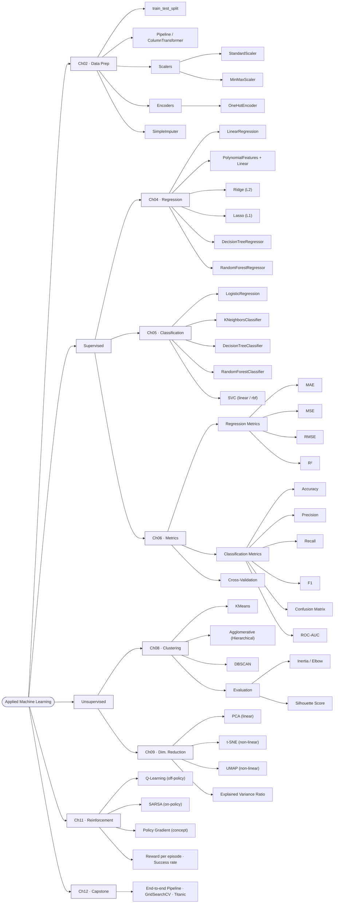
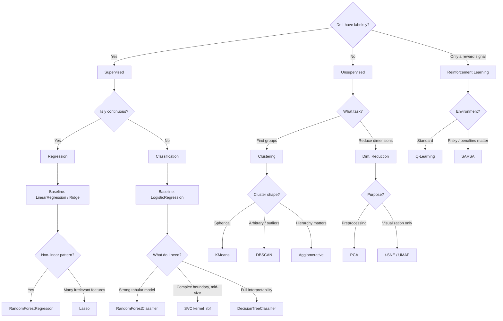

# APML Cheatsheet — The Map

> An overview of **every model, variation, and metric** used in this course.
> Designed for quick reference during exercises and before exams.

---

## The Big Map

```mermaid
graph TD
    Root(["Applied Machine Learning"])

    Root --> Data["1 — Data (Ch02)<br/>Pipeline · Cleaning · Split"]
    Root --> Sup["2 — Supervised (Ch03–06)<br/>learn f(X) → y"]
    Root --> Unsup["3 — Unsupervised (Ch07–09)<br/>find structure in X"]
    Root --> RL["4 — Reinforcement (Ch11)<br/>learn from reward"]
    Root --> Cap["5 — Capstone (Ch12)<br/>end-to-end (Titanic)"]

    Sup --> Reg["Regression (Ch04)<br/>y is continuous"]
    Sup --> Cls["Classification (Ch05)<br/>y is discrete"]
    Sup --> Met["Metrics (Ch06)<br/>how good is f?"]

    Reg --> R_LIN["LinearRegression"]
    Reg --> R_POLY["Polynomial Regression"]
    Reg --> R_RIDGE["Ridge (L2)"]
    Reg --> R_LASSO["Lasso (L1)"]
    Reg --> R_DT["DecisionTreeRegressor"]
    Reg --> R_RF["RandomForestRegressor"]

    Cls --> C_LOG["LogisticRegression"]
    Cls --> C_KNN["KNeighborsClassifier"]
    Cls --> C_DT["DecisionTreeClassifier"]
    Cls --> C_RF["RandomForestClassifier"]
    Cls --> C_SVM["SVC (linear / rbf)"]

    Met --> M_REG["MAE · MSE · RMSE · R²"]
    Met --> M_CLS["Accuracy · Precision · Recall<br/>F1 · ROC-AUC · Confusion Matrix"]

    Unsup --> Clu["Clustering (Ch08)<br/>find groups"]
    Unsup --> DR["Dim. Reduction (Ch09)<br/>reduce dimensions"]

    Clu --> CL_KM["KMeans"]
    Clu --> CL_AG["Agglomerative"]
    Clu --> CL_DB["DBSCAN"]

    DR --> D_PCA["PCA (linear)"]
    DR --> D_TSNE["t-SNE (non-linear)"]
    DR --> D_UMAP["UMAP (non-linear)"]

    RL --> Q_L["Q-Learning (off-policy)"]
    RL --> Q_S["SARSA (on-policy)"]
    RL --> Q_PG["Policy Gradient (concept)"]

    classDef cat fill:#eef,stroke:#447,stroke-width:1px;
    classDef sub fill:#f7f7ff,stroke:#667;
    class Data,Sup,Unsup,RL,Cap cat;
    class Reg,Cls,Met,Clu,DR sub;
```



---

## The Model Navigation Map

> Every model, variation, and metric in the course at a glance — click or jump to the section for details.



**How to use this map:**
- **Orange path** (Data → Supervised → Metrics) = the flow you'll follow in most real projects.
- Each leaf node corresponds to an `sklearn` class or metric function documented in the sections below.
- If you're stuck on "which model?" jump to section 7 (Quick Decision Tree).

---

## 1 · Data Preparation (Ch02)

The foundation of **every** model. `fit` only on training, `transform` on train + test.

| Tool | Purpose | sklearn |
|---|---|---|
| `train_test_split` | Split data into train/test | `sklearn.model_selection` |
| `StandardScaler` | Mean 0, variance 1 (required for KNN, SVM, PCA, regularized linear models) | `sklearn.preprocessing` |
| `MinMaxScaler` | Rescale to [0, 1] | `sklearn.preprocessing` |
| `OneHotEncoder` | Categorical → binary columns | `sklearn.preprocessing` |
| `SimpleImputer` | Fill missing values (mean / median / most_frequent) | `sklearn.impute` |
| `Pipeline` | Chain steps, prevents data leakage | `sklearn.pipeline` |
| `ColumnTransformer` | Different transforms per column | `sklearn.compose` |

**Golden rule:** anything that "learns" (scaler, imputer, PCA) belongs inside a `Pipeline`. Otherwise → data leakage.

---

## 2 · Supervised Learning

### 2.1 Regression (Ch04) — `y` is a number

| Model | Idea | Hyperparameters | Scale? | Strengths / caveats |
|---|---|---|---|---|
| **Linear Regression** | Straight line: `y = w·x + b` | — | no (inherently) | interpretable; not outlier-robust |
| **Polynomial Regression** | Linear regression on polynomial features | `degree` | yes | overfits fast at high degree |
| **Ridge** (L2) | Linear + penalty on Σ `w²` | `alpha` | **yes** | shrinks all coefficients |
| **Lasso** (L1) | Linear + penalty on Σ \|w\| | `alpha` | **yes** | drives coefficients to 0 → feature selection |
| **Decision Tree Regressor** | Splits that reduce variance | `max_depth`, `min_samples_split` | no | captures non-linearity; overfits easily |
| **Random Forest Regressor** | Many trees, average | `n_estimators`, `max_depth` | no | robust, `feature_importances_` |

**Imports:**
```python
from sklearn.linear_model import LinearRegression, Ridge, Lasso
from sklearn.preprocessing import PolynomialFeatures
from sklearn.tree import DecisionTreeRegressor
from sklearn.ensemble import RandomForestRegressor
```

**Rule of thumb:** start with Linear/Ridge as baseline → if non-linearity is suspected, try Random Forest → if many irrelevant features, use Lasso.

---

### 2.2 Classification (Ch05) — `y` is a class

| Model | Idea | Hyperparameters | Scale? | Notes |
|---|---|---|---|---|
| **Logistic Regression** | Sigmoid on linear combination | `C` (inverse regularization) | **yes** | gives probabilities, interpretable |
| **K-Nearest Neighbors** | Vote of the `k` closest points | `n_neighbors` | **yes** (distance-based!) | no training, slow at prediction |
| **Decision Tree Classifier** | Splits that minimize Gini/Entropy | `max_depth` | no | fully interpretable (plot_tree) |
| **Random Forest Classifier** | Ensemble of trees | `n_estimators`, `max_depth` | no | strong baseline, `feature_importances_` |
| **Support Vector Machine** (`SVC`) | Maximum margin, with kernel | `C`, `kernel`, `gamma` | **yes** | `rbf` for non-linear; slow on large data |

**Imports:**
```python
from sklearn.linear_model import LogisticRegression
from sklearn.neighbors import KNeighborsClassifier
from sklearn.tree import DecisionTreeClassifier
from sklearn.ensemble import RandomForestClassifier
from sklearn.svm import SVC
```

**Rule of thumb:** Logistic as baseline (interpretable) → Random Forest for tabular → SVM for mid-sized, complex boundaries → KNN as a simple reference.

---

## 3 · Metrics & Evaluation (Ch06)

> **"A model can only be as good as your definition of good."**

### 3.1 Regression metrics

| Metric | Formula | Unit | Ideal | When? |
|---|---|---|---|---|
| **MAE** | `(1/n) · Σ\|y − ŷ\|` | like `y` | low | robust, equal weighting |
| **MSE** | `(1/n) · Σ(y − ŷ)²` | `y²` | low | punishes large errors |
| **RMSE** | `√MSE` | like `y` | low | same, but interpretable |
| **R²** | `1 − SS_res / SS_tot` | — | → 1 | explained variance; `< 0` = worse than mean |

```python
from sklearn.metrics import mean_absolute_error, mean_squared_error, r2_score
```

### 3.2 Classification metrics

**Confusion matrix** — the core:

```
                    Pred: Neg    Pred: Pos
Actual: Neg           TN            FP
Actual: Pos           FN            TP
```

| Metric | Formula | Optimize when… | Example |
|---|---|---|---|
| **Accuracy** | `(TP+TN)/N` | classes are balanced | digit recognition |
| **Precision** | `TP/(TP+FP)` | FP is costly | spam filter (don't lose good email) |
| **Recall** | `TP/(TP+FN)` | FN is costly | disease screening (don't miss a patient) |
| **F1** | `2·P·R/(P+R)` | both matter | general classification |
| **ROC-AUC** | area under the ROC curve | threshold-independent | overall quality of a probabilistic model |

```python
from sklearn.metrics import (
    accuracy_score, precision_score, recall_score, f1_score,
    confusion_matrix, ConfusionMatrixDisplay,
    roc_curve, roc_auc_score, classification_report
)
```

**Threshold tuning:** `y_proba = model.predict_proba(X)[:, 1]` → `y_pred = (y_proba > 0.3).astype(int)` (lower threshold = more recall, less precision).

### 3.3 Cross-validation

```python
from sklearn.model_selection import cross_val_score
scores = cross_val_score(model, X, y, cv=5, scoring='f1')
print(f'{scores.mean():.3f} ± {scores.std():.3f}')
```

Always look at **mean AND standard deviation** — consistency matters.

---

## 4 · Unsupervised Learning

### 4.1 Clustering (Ch08) — finding groups

| Algorithm | Idea | Key parameters | Needs k? | Outliers | Cluster shapes |
|---|---|---|---|---|---|
| **K-Means** | Minimize distance to centroids | `n_clusters` | **yes** | no | spherical |
| **Agglomerative (Hierarchical)** | Bottom-up merging, dendrogram | `n_clusters`, `linkage` | yes (or cut the dendrogram) | no | arbitrary |
| **DBSCAN** | Density-based | `eps`, `min_samples` | **no** | **yes — flags them** | arbitrary |

```python
from sklearn.cluster import KMeans, AgglomerativeClustering, DBSCAN
```

**How do I choose k?**
- **Elbow method:** plot `inertia_` over `k`, look for the kink.
- **Silhouette score:** `[-1, 1]`, higher = better separation.
```python
from sklearn.metrics import silhouette_score
silhouette_score(X, labels)
```

**Rule of thumb:** K-Means first → if clusters aren't spherical or outliers annoy you, switch to DBSCAN → if hierarchy matters, Agglomerative.

### 4.2 Dimensionality Reduction (Ch09)

| Method | Type | Purpose | Can distances be interpreted? |
|---|---|---|---|
| **PCA** | linear | preprocessing **and** visualization; finds directions of max variance | yes (global) |
| **t-SNE** | non-linear | **visualization only**; preserves local neighborhoods | ❌ no — cluster sizes/distances are meaningless |
| **UMAP** | non-linear | visualization + preprocessing; faster than t-SNE | limited |

```python
from sklearn.decomposition import PCA
from sklearn.manifold import TSNE
```

**PCA evaluation:** `explained_variance_ratio_` — how much variance do I keep?
```python
pca = PCA(n_components=0.95)   # keep 95% of variance
```

**Rule:** PCA for preprocessing, t-SNE/UMAP for the poster. **Always scale before PCA.**

---

## 5 · Reinforcement Learning (Ch11)

**The loop:** Agent ↔ Environment


| Algorithm | Type | Update rule | Character |
|---|---|---|---|
| **Q-Learning** | off-policy, TD | `Q(s,a) ← Q(s,a) + α · [r + γ·maxₐ' Q(s',a') − Q(s,a)]` | optimistic, "bold" |
| **SARSA** | on-policy, TD | `Q(s,a) ← Q(s,a) + α · [r + γ·Q(s',a') − Q(s,a)]` | more cautious in risky environments |
| **Policy Gradient** | policy-based | directly tune policy parameters | conceptual; foundation of Deep RL |

**Hyperparameters:**
- `α` (learning rate): how strongly to update
- `γ` (discount): how much the future is worth (0 = myopic, 1 = far-sighted)
- `ε` (exploration): how often to act randomly instead of choosing the best Q-value

**Evaluation:**
- **Cumulative reward per episode** (learning curve — grows over time)
- **Success rate** (e.g. FrozenLake: % of episodes that reach the goal)

---

## 6 · Capstone (Ch12) — The Workflow

1. **Load & explore data** (EDA)
2. **Clean** (missing values, types, outliers)
3. **Feature engineering + encoding + scaling** → inside a `Pipeline`
4. **Train/test split** — **before** everything else
5. **Baseline model** (Logistic/Linear)
6. **Stronger models** (RF, SVM) + cross-validation
7. **Pick a metric that matches the problem**
8. **Hyperparameter tuning** (`GridSearchCV` / `RandomizedSearchCV`)
9. **Final evaluation on the test set** (exactly once!)
10. **Interpret & communicate**

---

## 7 · Quick Decision Tree



---

## 8 · Task-to-Metric Cheat Sheet

| Task | Primary metric | Why |
|---|---|---|
| Predicting house prices | RMSE (or MAE) | error in CHF is interpretable |
| Comparing regression models | R² | unit-independent |
| Spam filter | Precision | FP = losing a good email |
| Disease screening | Recall | FN = missing a patient |
| Imbalanced classification (general) | F1 or ROC-AUC | accuracy is misleading |
| Balanced multi-class (e.g. digits) | Accuracy | simple and fair |
| Clustering quality | Silhouette score | no labels available |
| PCA quality | Explained variance ratio | how much information is kept |
| RL training | Reward per episode (learning curve) | shows progress over time |

---

## 9 · Anti-Patterns — Red Flags

- Calling `fit_transform` on the test set → **data leakage**
- Forgetting `StandardScaler` for KNN / SVM / PCA / regularized Logistic
- Reporting accuracy on imbalanced classes
- Peeking at the test set repeatedly and tuning against it
- Interpreting t-SNE cluster sizes or distances as "real"
- Running K-Means on unscaled data
- RL with `γ = 1` in an environment with no terminal state → diverging Q-values

---

*This cheatsheet covers Ch01–Ch12. For details, see the slides in `*/01-slides/chXX_slides.md`.*
