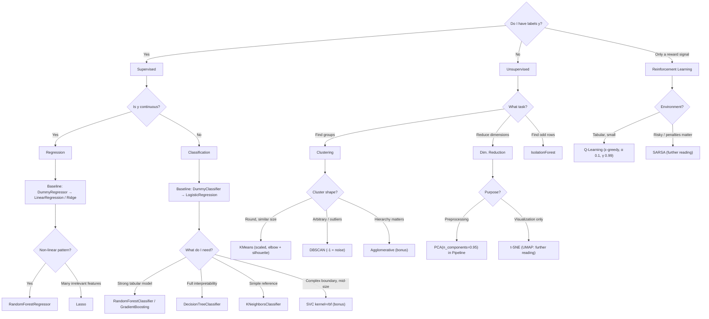

# APML Cheatsheet — The Map

> An overview of **every model, variation, and metric** used in this course.
> Designed for quick reference during exercises and before exams.
> *(bonus)* = appendix / bonus task · *(further reading)* = named only, not taught.

---

## The Big Map


```mermaid
graph TD
    Root(["Applied Machine Learning"])

    Root --> Data["1 — Data (Ch02)<br/>Pipeline · Cleaning · Split"]
    Root --> Sup["2 — Supervised (Ch03–06)<br/>learn f(X) → y"]
    Root --> Unsup["3 — Unsupervised (Ch07–09)<br/>find structure in X"]
    Root --> RL["4 — Reinforcement (Ch10–11)<br/>learn from reward"]
    Root --> Cap["5 — Capstone (Ch12)<br/>end-to-end (Titanic)"]

    Sup --> Reg["Regression (Ch04)<br/>y is continuous"]
    Sup --> Cls["Classification (Ch03, Ch05)<br/>y is discrete"]
    Sup --> Met["Metrics (Ch06)<br/>how good is f?"]

    Reg --> R_DUM["DummyRegressor (baseline)"]
    Reg --> R_LIN["LinearRegression"]
    Reg --> R_POLY["Polynomial Regression"]
    Reg --> R_RIDGE["Ridge (L2) / RidgeCV"]
    Reg --> R_LASSO["Lasso (L1)"]
    Reg --> R_DT["DecisionTreeRegressor"]
    Reg --> R_RF["RandomForestRegressor"]

    Cls --> C_DUM["DummyClassifier (baseline)"]
    Cls --> C_LOG["LogisticRegression"]
    Cls --> C_KNN["KNeighborsClassifier (Ch03)"]
    Cls --> C_DT["DecisionTreeClassifier"]
    Cls --> C_RF["RandomForestClassifier"]
    Cls --> C_GB["GradientBoostingClassifier (Ch12)"]
    Cls --> C_SVM["SVC (bonus)"]

    Met --> M_REG["MAE · MSE · RMSE · R²"]
    Met --> M_CLS["Accuracy · Precision · Recall<br/>F1 · ROC-AUC · PR curve · Confusion Matrix"]
    Met --> M_CV["KFold / StratifiedKFold CV"]

    Unsup --> Clu["Clustering (Ch08)<br/>find groups"]
    Unsup --> DR["Dim. Reduction (Ch09)<br/>reduce dimensions"]
    Unsup --> AN["Anomaly (Ch07)<br/>find the odd rows"]

    Clu --> CL_KM["KMeans"]
    Clu --> CL_DB["DBSCAN"]
    Clu --> CL_AG["Agglomerative (bonus)"]

    DR --> D_PCA["PCA (linear)"]
    DR --> D_TSNE["t-SNE (non-linear, viz only)"]
    DR --> D_UMAP["UMAP (further reading)"]

    AN --> AN_IF["IsolationForest"]

    RL --> Q_L["Q-Learning (off-policy)"]
    RL --> Q_S["SARSA (further reading)"]
    RL --> Q_PG["Policy Gradient / DQN (further reading)"]

    classDef cat fill:#eef,stroke:#447,stroke-width:1px;
    classDef sub fill:#f7f7ff,stroke:#667;
    class Data,Sup,Unsup,RL,Cap cat;
    class Reg,Cls,Met,Clu,DR,AN sub;
```

---

## The Model Navigation Map

> Every model, variation, and metric in the course at a glance — jump to the section for details.


```mermaid
graph LR
    APML(["Applied Machine Learning"])

    APML --> DATA["Ch02 · Data Prep"]
    APML --> SUP["Supervised"]
    APML --> UNS["Unsupervised"]
    APML --> RLB["Ch10–11 · Reinforcement"]
    APML --> CAP["Ch12 · Capstone"]

    %% --- DATA ---
    DATA --> D_SPLIT["train_test_split (stratify=y)"]
    DATA --> D_PIPE["Pipeline / make_pipeline"]
    DATA --> D_CT["ColumnTransformer"]
    DATA --> D_SCALE["Scalers"]
    DATA --> D_ENC["Encoders"]
    DATA --> D_IMP["SimpleImputer"]
    DATA --> D_OUT["Outliers: IQR rule · Z-score (bonus)"]

    D_SCALE --> D_STD["StandardScaler"]
    D_SCALE --> D_MM["MinMaxScaler"]
    D_ENC --> D_OHE["OneHotEncoder"]

    %% --- SUPERVISED ---
    SUP --> REG["Ch04 · Regression"]
    SUP --> CLS["Ch03/05 · Classification"]
    SUP --> MET["Ch06 · Metrics"]

    REG --> R_DUM["DummyRegressor"]
    REG --> R_LIN["LinearRegression"]
    REG --> R_POLY["PolynomialFeatures + Linear"]
    REG --> R_RIDGE["Ridge (L2) · RidgeCV"]
    REG --> R_LASSO["Lasso (L1)"]
    REG --> R_DT["DecisionTreeRegressor"]
    REG --> R_RF["RandomForestRegressor"]

    CLS --> C_DUM["DummyClassifier"]
    CLS --> C_LOG["LogisticRegression"]
    CLS --> C_KNN["KNeighborsClassifier"]
    CLS --> C_DT["DecisionTreeClassifier"]
    CLS --> C_RF["RandomForestClassifier"]
    CLS --> C_GB["GradientBoostingClassifier (Ch12)"]
    CLS --> C_SVM["SVC (bonus)"]

    MET --> M_REG["Regression Metrics"]
    MET --> M_CLS["Classification Metrics"]
    MET --> M_CV["Cross-Validation · Tuning"]

    M_REG --> M_MAE["MAE"]
    M_REG --> M_RMSE["MSE / RMSE"]
    M_REG --> M_R2["R²"]

    M_CLS --> M_ACC["Accuracy"]
    M_CLS --> M_PREC["Precision"]
    M_CLS --> M_REC["Recall"]
    M_CLS --> M_F1["F1 (macro)"]
    M_CLS --> M_CM["Confusion Matrix"]
    M_CLS --> M_ROC["ROC-AUC · PR curve"]
    M_CLS --> M_THR["Threshold (predict_proba)"]

    M_CV --> M_KF["KFold / StratifiedKFold (shuffle=True)"]
    M_CV --> M_CVS["cross_val_score / cross_validate"]
    M_CV --> M_GS["GridSearchCV"]

    %% --- UNSUPERVISED ---
    UNS --> ANO["Ch07 · Anomaly"]
    UNS --> CLU["Ch08 · Clustering"]
    UNS --> DIM["Ch09 · Dim. Reduction"]

    ANO --> AN_IF["IsolationForest (fit_predict == -1)"]

    CLU --> CL_KM["KMeans"]
    CLU --> CL_DB["DBSCAN (-1 = noise)"]
    CLU --> CL_AG["Agglomerative (bonus)"]
    CLU --> CL_EVAL["Evaluation"]

    CL_EVAL --> CL_INE["Inertia / Elbow"]
    CL_EVAL --> CL_SIL["Silhouette Score"]

    DIM --> D_PCA["PCA (linear)"]
    DIM --> D_TSNE["t-SNE (viz only, no transform)"]
    DIM --> D_UMAP["UMAP (further reading)"]
    DIM --> D_EVR["explained_variance_ratio_ · components_"]

    %% --- RL ---
    RLB --> RL_MDP["MDP (S, A, P, R, γ)"]
    RLB --> RL_EPS["ε-greedy + decay"]
    RLB --> RL_QL["Q-Learning (TD update)"]
    RLB --> RL_ENV["FrozenLake · GridWorld"]
    RLB --> RL_FR["SARSA · DQN · Policy Gradient (further reading)"]
    RLB --> RL_EVAL["Reward per episode · Success rate"]

    %% --- CAPSTONE ---
    CAP --> CAP_WF["Split → features → ColumnTransformer Pipeline"]
    CAP --> CAP_MOD["Dummy · LogReg · RF · GradientBoosting"]
    CAP --> CAP_EVAL["cross_validate → 1× test → permutation_importance"]
    CAP --> CAP_BON["Bonus: GridSearchCV · joblib · PCA"]

    classDef cat fill:#eef,stroke:#447,stroke-width:1px;
    classDef model fill:#fff,stroke:#888;
    class APML,DATA,SUP,UNS,RLB,CAP,REG,CLS,MET,ANO,CLU,DIM cat;
```

**How to use this map:**
- **Data → Supervised → Metrics** = the flow you'll follow in most real projects (and in the capstone).
- Each leaf node corresponds to an `sklearn` class or metric function documented in the sections below.
- If you're stuck on "which model?" jump to section 7 (Quick Decision Tree).

---

## 1 · Data Preparation (Ch02)

The foundation of **every** model. `fit` only on training, `transform` on train + test.

| Tool | Purpose | sklearn |
|---|---|---|
| `train_test_split` | Split data into train/test; `stratify=y` for **classification only** (ValueError on continuous y) | `sklearn.model_selection` |
| `StandardScaler` | Mean 0, std 1 (required for KNN, SVM, PCA, K-Means, regularized linear models) | `sklearn.preprocessing` |
| `MinMaxScaler` | Rescale to [0, 1] | `sklearn.preprocessing` |
| `OneHotEncoder` | Categorical → binary columns; `handle_unknown='ignore'` (unlike `pd.get_dummies`, learns categories on train) | `sklearn.preprocessing` |
| `SimpleImputer` | Fill missing values: `strategy='mean' / 'median' / 'most_frequent'` — the statistic is learned on train | `sklearn.impute` |
| `Pipeline` / `make_pipeline` | Chain steps, prevents data leakage; the pipeline **is** the model (`fit / predict / score`) | `sklearn.pipeline` |
| `ColumnTransformer` | Different transforms per column group (numeric vs categorical) | `sklearn.compose` |
| IQR rule | Outliers: `Q1 − 1.5·IQR` / `Q3 + 1.5·IQR`, bounds from **train**; Z-score rule = *(bonus)* | pandas |

```python
from sklearn.model_selection import train_test_split
from sklearn.pipeline import Pipeline, make_pipeline
from sklearn.compose import ColumnTransformer
from sklearn.impute import SimpleImputer
from sklearn.preprocessing import StandardScaler, MinMaxScaler, OneHotEncoder

X_train, X_test, y_train, y_test = train_test_split(X, y, test_size=0.2, stratify=y, random_state=42)  # stratify: classification only

numeric_pipe     = Pipeline([('imputer', SimpleImputer(strategy='median')),        ('scaler', StandardScaler())])
categorical_pipe = Pipeline([('imputer', SimpleImputer(strategy='most_frequent')), ('onehot', OneHotEncoder(handle_unknown='ignore'))])
preprocess = ColumnTransformer([('num', numeric_pipe, num_cols), ('cat', categorical_pipe, cat_cols)])
model = Pipeline([('preprocess', preprocess), ('clf', LogisticRegression(max_iter=1000))])   # fit → predict → score
```

**Golden rule:** anything that "learns" a statistic (mean, median, min/max, std, IQR bounds, category list, PCA components) belongs inside a `Pipeline`, fit on train only. Otherwise → data leakage. **The right order:** clean/deduplicate → split → impute → encode → scale → model.

---

## 2 · Supervised Learning

### 2.0 The sklearn API (Ch03) — one interface for all models

```python
from sklearn.pipeline import Pipeline
from sklearn.preprocessing import StandardScaler
from sklearn.neighbors import KNeighborsClassifier

model = Pipeline([('scaler', StandardScaler()),
                  ('knn', KNeighborsClassifier(n_neighbors=5))])
model.fit(X_train, y_train)          # 1. train  (scaler AND knn fit on train only)
y_pred = model.predict(X_test)       # 2. predict
model.score(X_test, y_test)          # 3. evaluate (accuracy)
```

- **Hyperparameter** (`n_neighbors`, `alpha`, `max_depth`) = you choose · **parameter** (`coef_`, split thresholds) = learned by `fit`.
- Small `k` / deep tree / high degree → overfit (train ≫ test); large `k` / shallow → underfit. **Train accuracy ≠ model quality.**
- **Baseline first, always:** `DummyClassifier(strategy='most_frequent')`, `DummyRegressor(strategy='mean')` (`sklearn.dummy`).

### 2.1 Regression (Ch04) — `y` is a number

| Model | Idea | Hyperparameters | Scale? | Strengths / caveats |
|---|---|---|---|---|
| **DummyRegressor** | predict the mean → R² = 0 | `strategy='mean'` | no | the number to beat |
| **Linear Regression** | Straight line: `y = w·x + b` | — | only to compare β | interpretable; not outlier-robust |
| **Polynomial Regression** | Linear regression on polynomial features | `degree` | yes | overfits fast at high degree — pick degree by CV |
| **Ridge** (L2) / **RidgeCV** | Linear + penalty on Σ `w²` | `alpha` (`alphas=` grid for RidgeCV) | **yes** | shrinks all coefficients smoothly |
| **Lasso** (L1) | Linear + penalty on Σ \|w\| | `alpha` | **yes** | drives coefficients to exactly 0 → feature selection |
| **Decision Tree Regressor** | Splits that reduce variance | `max_depth`, `min_samples_split` | no | captures non-linearity; overfits easily |
| **Random Forest Regressor** | Many trees, average | `n_estimators`, `max_depth` | no | robust, `feature_importances_` |

**Imports:**
```python
from sklearn.dummy import DummyRegressor
from sklearn.linear_model import LinearRegression, Ridge, Lasso, RidgeCV
from sklearn.preprocessing import PolynomialFeatures
from sklearn.tree import DecisionTreeRegressor
from sklearn.ensemble import RandomForestRegressor
from sklearn.model_selection import GridSearchCV
```

```python
model = make_pipeline(StandardScaler(), RidgeCV(alphas=np.logspace(-3, 3, 30), cv=5)).fit(X_train, y_train)
model[-1].alpha_                                                        # the chosen alpha
GridSearchCV(RandomForestRegressor(), {'max_depth': [3, 5, 10]}, cv=5).fit(X_train, y_train)   # any hyperparameter, any model
```

- Loss = MSE; the model finds the minimum by **gradient descent** (learning rate too big → diverges, too small → slow).
- α → 0: plain OLS · α → ∞: all β = 0 = the baseline. **Never pick hyperparameters on the test set.**

**Rule of thumb:** baseline → Linear/Ridge → add a forest if you suspect non-linearity → Lasso if many irrelevant features → keep the simplest model that is *good enough*.

---

### 2.2 Classification (Ch03, Ch05) — `y` is a class

| Model | Idea | Hyperparameters | Scale? | Notes |
|---|---|---|---|---|
| **DummyClassifier** | always the majority class | `strategy='most_frequent'` | no | accuracy = majority share; F1 = 0 |
| **Logistic Regression** | Sigmoid on linear combination | `C` (inverse regularization), `max_iter=1000` | **yes** | gives probabilities, interpretable |
| **K-Nearest Neighbors** (Ch03) | Vote of the `k` closest points | `n_neighbors` | **yes** (distance-based!) | no training, slow at prediction; k=1 → 100 % train acc |
| **Decision Tree Classifier** | Splits that minimize Gini/Entropy | `max_depth` | no | fully interpretable (`plot_tree`), axis-parallel boundaries |
| **Random Forest Classifier** | Ensemble of deep trees **in parallel** (bootstrap) | `n_estimators`, `max_depth` | no | strong tabular default, `feature_importances_` |
| **Gradient Boosting Classifier** (Ch12) | Shallow trees **in sequence**, each fits the previous errors | `n_estimators`, `learning_rate`, `max_depth` | no | strong on tabular data; more hyperparameter-sensitive than RF |
| **SVC** *(bonus)* | Maximum margin, with kernel | `C`, `kernel='rbf'`, `gamma` | **yes** | non-linear via `rbf`; slow beyond ~50k rows |

**Imports:**
```python
from sklearn.dummy import DummyClassifier
from sklearn.linear_model import LogisticRegression
from sklearn.neighbors import KNeighborsClassifier
from sklearn.tree import DecisionTreeClassifier, plot_tree
from sklearn.ensemble import RandomForestClassifier, GradientBoostingClassifier
from sklearn.svm import SVC                     # bonus
from sklearn.inspection import DecisionBoundaryDisplay
```

```python
DecisionBoundaryDisplay.from_estimator(clf, X2, response_method='predict', alpha=0.3)   # 2 features → see the boundary
make_pipeline(StandardScaler(), SVC(kernel='rbf', C=1.0))                                # bonus
```

**Positive class:** in sklearn the positive class is `1` — **check that it is the thing you look for.** `load_breast_cancer` ships `1 = benign`; the course flips it: `y = 1 - target` → **malignant = 1 = positive** (Ch05/06/09). Precision/recall/F1 are computed for class 1.

**Rule of thumb:** Dummy → Logistic as baseline (interpretable) → Random Forest / Gradient Boosting for tabular → KNN as a simple reference → SVM only as bonus. More complex boundary ≠ better.

---

## 3 · Metrics & Evaluation (Ch06)

> **"A model can only be as good as your definition of good."**

### 3.1 Regression metrics

| Metric | Formula | Unit | Ideal | When? |
|---|---|---|---|---|
| **MAE** | `(1/n) · Σ\|y − ŷ\|` | like `y` | low | robust, equal weighting |
| **MSE** | `(1/n) · Σ(y − ŷ)²` | `y²` | low | punishes large errors |
| **RMSE** | `√MSE` (≥ MAE always; big gap = a few large errors) | like `y` | low | same, but interpretable |
| **R²** | `1 − SS_res / SS_tot` | — | → 1 | explained variance; `0` = DummyRegressor, `< 0` = worse than mean |

```python
from sklearn.metrics import mean_absolute_error, root_mean_squared_error, r2_score   # root_mean_squared_error replaces squared=False (sklearn ≥ 1.4)
```

Also check the **residual plot**: errors should be random noise around 0 — any pattern = the model misses something.

### 3.2 Classification metrics

**Confusion matrix** — the core (rows = truth, columns = prediction):

```
                    Pred: Neg    Pred: Pos
Actual: Neg           TN            FP
Actual: Pos           FN            TP
```

| Metric | Formula | Optimize when… | Example |
|---|---|---|---|
| **Accuracy** | `(TP+TN)/N` | classes are balanced | digit recognition |
| **Precision** | `TP/(TP+FP)` — "when I say X, am I right?" | FP is costly | spam filter (don't lose good email) |
| **Recall** | `TP/(TP+FN)` — "did I find all X?" | FN is costly | disease screening (don't miss a patient) |
| **F1** | `2·P·R/(P+R)` | both matter / imbalanced | general classification |
| **ROC-AUC** | area under TPR-vs-FPR curve; 1.0 perfect, 0.5 random | threshold-independent, balanced classes | ranking quality of a probabilistic model |
| **PR curve / PR-AUC** | precision vs recall per threshold | rare positives (ROC looks fine, PR exposes it) | 97/3 imbalance |

```python
from sklearn.metrics import (
    accuracy_score, precision_score, recall_score, f1_score,
    confusion_matrix, ConfusionMatrixDisplay, classification_report,
    roc_curve, roc_auc_score, precision_recall_curve
)
ConfusionMatrixDisplay.from_predictions(y_test, y_pred, display_labels=class_names)
print(classification_report(y_test, y_pred))     # per class + macro avg (equal weight) / weighted avg (by support)
```

**Threshold tuning:** `y_pred = (model.predict_proba(X_test)[:, 1] >= 0.3).astype(int)` (instead of `predict()` = 0.5; lower threshold = more recall, less precision).

**Imbalance toolbox:** `class_weight='balanced'` · lower threshold · `stratify=y` / `StratifiedKFold` · report recall / F1 / PR-AUC, not accuracy · multi-class → `scoring='f1_macro'`.

### 3.3 Cross-validation & tuning

```python
from sklearn.model_selection import cross_val_score, cross_validate, KFold, StratifiedKFold, GridSearchCV

cv = KFold(n_splits=5, shuffle=True, random_state=42)             # regression (shuffle! sorted data → biased folds)
cv = StratifiedKFold(n_splits=5, shuffle=True, random_state=42)   # classification: keeps the class ratio per fold
scores = cross_val_score(pipe, X, y, cv=cv, scoring='f1')          # 'r2', 'recall', 'roc_auc', 'f1_macro' …
print(f'{scores.mean():.3f} ± {scores.std():.3f}')
res = cross_validate(pipe, X_train, y_train, cv=cv, scoring=['f1', 'accuracy'])   # several metrics at once
search = GridSearchCV(pipe, {'clf__max_depth': [3, 5, 10]}, cv=cv, scoring='f1', n_jobs=-1).fit(X_train, y_train)
search.best_params_, search.best_score_
```

- Pass the **pipeline**, not a pre-scaled array → scaler/imputer re-fit inside every fold.
- Always look at **mean AND standard deviation** — a difference smaller than one std is not real.
- CV on the **training** part chooses hyperparameters; the test set is touched **once**, at the end.

---

## 4 · Unsupervised Learning

### 4.0 One-liners (Ch07)

```python
labels = KMeans(n_clusters=3, random_state=42).fit_predict(X)                     # clustering → cluster id per row
X_2d   = PCA(n_components=2).fit_transform(X)                                      # dim. reduction → new coordinates
is_outlier = IsolationForest(random_state=42).fit_predict(X) == -1                 # anomaly detection (sklearn.ensemble)
```

No `y` anywhere → evaluation is the hard part (internal scores + plots + domain knowledge; labels only for checking afterwards).

### 4.1 Clustering (Ch08) — finding groups

| Algorithm | Idea | Key parameters | Needs k? | Outliers | Cluster shapes |
|---|---|---|---|---|---|
| **K-Means** | Minimize distance to centroids | `n_clusters`, `init='k-means++'`, `n_init=10` | **yes** | pulled by them | round, similar size |
| **DBSCAN** | Density-based (core points within `eps`) | `eps`, `min_samples` | **no** | **yes — label −1 = noise** | arbitrary; struggles with mixed densities |
| **Agglomerative / Hierarchical** *(bonus)* | Bottom-up merging, dendrogram, cut the tree | `linkage='ward'`, `t` (scipy) | no (cut) | no | arbitrary; O(n²) → small data |

```python
from sklearn.cluster import KMeans, DBSCAN
from sklearn.metrics import silhouette_score
from sklearn.pipeline import make_pipeline
from sklearn.preprocessing import StandardScaler

pipe = make_pipeline(StandardScaler(), KMeans(n_clusters=2, n_init=10, random_state=42))   # scale first!
labels = pipe.fit_predict(X)
kmeans = pipe[-1]; kmeans.labels_; kmeans.cluster_centers_; kmeans.inertia_                     # ids · centroids · within-cluster SS
labels = DBSCAN(eps=0.25, min_samples=5).fit_predict(X_scaled)                            # -1 = noise
from scipy.cluster.hierarchy import linkage, dendrogram, fcluster                          # bonus: Z = linkage(X_scaled, 'ward'); fcluster(Z, t=3, criterion='maxclust')
```

**How do I choose k?**
- **Elbow method:** plot `inertia_` over `k`, look for the kink (inertia always decreases — often ambiguous).
- **Silhouette score** `silhouette_score(X_scaled, labels)`: `[-1, 1]`; **< 0.25 → no substantial structure · > 0.5 → reasonable**; favours few round clusters.
- **Clustering always returns k clusters — even on uniform noise.** Look at the data (PCA 2-D), check silhouette, ask whether the groups mean anything.

**Rule of thumb:** K-Means first (scaled) → check silhouette + plot → DBSCAN if shapes are odd or you want outliers → hierarchical only as bonus (dendrogram).

### 4.2 Dimensionality Reduction (Ch09)

| Method | Type | Purpose | Can distances be interpreted? | `transform()` for new data? |
|---|---|---|---|---|
| **PCA** | linear | preprocessing **and** visualization; directions of max variance; each PC = weighted sum of **all** features (`components_` = loadings) → **PCA ≠ feature selection** | yes (global) | yes → fits in a Pipeline |
| **t-SNE** | non-linear | **visualization only**; preserves local neighborhoods; `perplexity` + `random_state` change the picture | ❌ no — cluster sizes/distances are meaningless | **no** → never as model features |
| **UMAP** *(further reading)* | non-linear | similar to t-SNE, faster, has `transform` (`pip install umap-learn`) | limited | yes |

```python
from sklearn.decomposition import PCA
from sklearn.manifold import TSNE

pca_pipe = make_pipeline(StandardScaler(), PCA(n_components=2)); X_2d = pca_pipe.fit_transform(X)   # no y!
pca = pca_pipe['pca']; pca.explained_variance_ratio_; pca.explained_variance_ratio_.sum(); pca.components_   # share per PC · total kept · loadings
pipe = make_pipeline(StandardScaler(), PCA(n_components=0.95), RandomForestClassifier(random_state=42))   # float = keep 95 % variance
cross_val_score(pipe, X, y, cv=5)                              # PCA re-fit per fold → no leakage
X_tsne = TSNE(n_components=2, perplexity=30, random_state=42).fit_transform(X_scaled)
```

**Two regimes:** visualise → 2 PCs, judge the picture not the % (22 % can be fine) · preprocess → `PCA(n_components=0.95)`, then compare with the no-PCA pipeline + Dummy baseline (trade-off, not free lunch). **Always scale before PCA.** t-SNE only for the poster; no t-SNE silhouette scores.

---

## 5 · Reinforcement Learning (Ch10–11)

**The loop:** Agent ↔ Environment


```mermaid
graph LR
    A[Agent] -->|action aₜ| E[Environment]
    E -->|state sₜ₊₁, reward rₜ₊₁| A
```

**MDP** = (S, A, P, R, γ): states · actions · `P(s'|s,a)` transitions (deterministic vs stochastic, e.g. `is_slippery`) · reward `R(s,a)` · discount γ. Markov: the future depends only on the current state. **Policy** π: state → action; **Q(s,a)** = expected discounted return of taking a in s.

| Algorithm | Type | Update rule | Character |
|---|---|---|---|
| **Q-Learning** (Ch11) | off-policy, TD; derived from the Bellman optimality equation | `Q(s,a) ← Q(s,a) + α · [r + γ·maxₐ' Q(s',a') − Q(s,a)]` (terminal s': target = r) | learns the greedy policy while behaving ε-greedy |
| **SARSA** *(further reading)* | on-policy, TD | `Q(s,a) ← Q(s,a) + α · [r + γ·Q(s',a') − Q(s,a)]` | more cautious near cliffs |
| **DQN / Policy Gradient (PPO) / model-based** *(further reading)* | function approximation / policy-based | Q-table → neural net; learn π directly | Deep RL; not needed for the capstone |

```python
if rng.random() < epsilon: action = random_action()      # explore
else:                      action = argmax(Q[state])     # exploit
epsilon = max(epsilon * 0.999, 0.01)                     # decay after every episode (1 → 0.01)
```

**Hyperparameters (ours):** `α = 0.1` (step size; large α collapses on stochastic worlds) · `γ = 0.99` (0 = myopic, 1 = far-sighted; propagates value backwards = **credit assignment**) · `ε` 1 → 0.01, ×0.999 / episode · 3 000–5 000 episodes.

**Environments:** unified GridWorld (`env_step(state, action)`; rewards −0.01 step / −1 hole / +1 goal) · gymnasium `FrozenLake-v1` (16 states, 4 actions, +1 only at goal → sparse; `is_slippery=False` ≈ 100 %, `True` ≈ 70 % — ceiling set by the environment). Reward shaping = Ch10 bonus.

**Evaluation:**
- **Cumulative reward per episode** (learning curve — grows over time)
- **Success rate** (% of episodes reaching the goal) — **training success (ε > 0) ≠ greedy success of the learned policy**; evaluate with ε = 0.

---

## 6 · Capstone (Ch12) — The Workflow (Titanic, `0-datasets/titanic.csv`)

1. **Load & explore** (EDA given): `Survived` 38 % → majority baseline 62 % accuracy, F1 = 0.
2. **Split FIRST:** `train_test_split(X, y, test_size=0.2, stratify=y, random_state=42)` — test set locked away.
3. **Feature engineering** (row-wise, no fitting): `FamilySize = SibSp + Parch + 1`, `IsAlone`, `Title` from `Name` (Mr/Mrs/Miss/Master/Rare); drop `Cabin`, `Ticket`, `PassengerId`.
4. **Preprocessing pipeline:** `ColumnTransformer` — numeric `SimpleImputer(median) → StandardScaler`, categorical `SimpleImputer(most_frequent) → OneHotEncoder(handle_unknown='ignore')` — inside `Pipeline([('preprocess', …), ('clf', model)])`.
5. **Baseline + 3 models with CV:** `DummyClassifier(most_frequent)`, `LogisticRegression(max_iter=1000)`, `RandomForestClassifier(n_estimators=200)`, `GradientBoostingClassifier()`; `cross_validate(pipe, X_train, y_train, cv=StratifiedKFold(5, shuffle=True), scoring=['f1', 'accuracy'])`; primary metric **F1 for class 1 (survived)**.
6. **Final evaluation:** best-by-CV model, refit on all of train, **one** look at the test set → `classification_report` + `ConfusionMatrixDisplay`.
7. **Interpret:** `permutation_importance(best_pipe, X_test, y_test, scoring='f1', n_repeats=10)` (top: Sex, Title, Pclass) → error analysis (5 misclassified rows) → fairness reflection (dropping a sensitive column ≠ fair: proxies).
8. **Bonus:** `GridSearchCV(pipe, {'clf__…': […]}, cv=cv, scoring='f1')` · `joblib.dump / load` of the whole pipeline · PCA of the preprocessed passengers.

```python
from sklearn.inspection import permutation_importance
perm = permutation_importance(best_pipe, X_test, y_test, scoring='f1', n_repeats=10, random_state=42)
pd.Series(perm.importances_mean, index=X_test.columns).sort_values()
```

---

## 7 · Quick Decision Tree


```mermaid
graph TD
    Start{Do I have labels y?}
    Start -->|Yes| Sup[Supervised]
    Start -->|No| Unsup[Unsupervised]
    Start -->|Only a reward signal| RL[Reinforcement Learning]

    Sup --> Ycont{Is y continuous?}
    Ycont -->|Yes| Reg[Regression]
    Ycont -->|No| Cls[Classification]

    Reg --> RegBase["Baseline: DummyRegressor → LinearRegression / Ridge"]
    RegBase --> RegNL{Non-linear pattern?}
    RegNL -->|Yes| RFR[RandomForestRegressor]
    RegNL -->|Many irrelevant features| Lasso[Lasso]

    Cls --> ClsBase["Baseline: DummyClassifier → LogisticRegression"]
    ClsBase --> ClsNeed{What do I need?}
    ClsNeed -->|Strong tabular model| RFC["RandomForestClassifier / GradientBoosting"]
    ClsNeed -->|Full interpretability| DT[DecisionTreeClassifier]
    ClsNeed -->|Simple reference| KNN[KNeighborsClassifier]
    ClsNeed -->|Complex boundary, mid-size| SVM["SVC kernel=rbf (bonus)"]

    Unsup --> UTask{What task?}
    UTask -->|Find groups| Clust[Clustering]
    UTask -->|Reduce dimensions| DR[Dim. Reduction]
    UTask -->|Find odd rows| IF[IsolationForest]

    Clust --> Shape{Cluster shape?}
    Shape -->|Round, similar size| KM["KMeans (scaled, elbow + silhouette)"]
    Shape -->|Arbitrary / outliers| DB["DBSCAN (-1 = noise)"]
    Shape -->|Hierarchy matters| AG["Agglomerative (bonus)"]

    DR --> Purpose{Purpose?}
    Purpose -->|Preprocessing| PCA["PCA(n_components=0.95) in Pipeline"]
    Purpose -->|Visualization only| TSNE["t-SNE (UMAP: further reading)"]

    RL --> RLChoice{Environment?}
    RLChoice -->|Tabular, small| QL["Q-Learning (ε-greedy, α 0.1, γ 0.99)"]
    RLChoice -->|Risky / penalties matter| SARSA["SARSA (further reading)"]
```

---

## 8 · Task-to-Metric Cheat Sheet

| Task | Primary metric | Why |
|---|---|---|
| Predicting house prices | RMSE (or MAE) | error in CHF/$ is interpretable |
| Comparing regression models | R² | unit-independent; 0 = dummy |
| Spam filter | Precision | FP = losing a good email |
| Disease screening (malignant = 1) | Recall | FN = missing a patient |
| Imbalanced binary classification | F1, PR-AUC (or ROC-AUC if only mildly imbalanced) | accuracy is misleading |
| Imbalanced multi-class | macro F1 (`scoring='f1_macro'`) | equal weight per class |
| Balanced multi-class (e.g. digits) | Accuracy | simple and fair |
| Titanic capstone | F1 for class 1 (+ accuracy) | find survivors AND be right when saying "survived" |
| Clustering quality | Silhouette score (+ plot) | no labels available |
| PCA quality | Explained variance ratio (preprocessing) / the picture (viz) | how much information is kept |
| RL training | Reward per episode (learning curve) + greedy success rate | shows progress; ε = 0 for the real policy |

---

## 9 · Anti-Patterns — Red Flags

- Calling `fit_transform` on the test set (or imputing/scaling/PCA before the split) → **data leakage**
- `stratify=y` on a continuous target → ValueError; forgetting it on imbalanced classification
- Forgetting `StandardScaler` for KNN / SVM / PCA / K-Means / DBSCAN / regularized linear models
- Trusting training accuracy (KNN k=1 = 100 %) — evaluate on test / CV
- Reporting accuracy on imbalanced classes; no Dummy baseline row in the table
- Assuming positive class 1 is the thing you look for without checking (breast cancer: flipped to malignant = 1)
- Peeking at the test set repeatedly and tuning against it (use CV / GridSearchCV on train)
- Comparing two models whose CV means differ by less than one std
- A feature that secretly contains the target (target leakage)
- Interpreting t-SNE cluster sizes or distances as "real"; using t-SNE coordinates as features
- Running K-Means on unscaled data; trusting k clusters without silhouette + a plot (K-Means never says "no structure")
- "Low explained variance → PCA failed" (2-D shadow of 64-D data can still show the structure)
- Reporting the RL training success rate as the quality of the learned policy (evaluate greedy, ε = 0)
- Deleting a sensitive column and calling the model fair (proxies remain)

---

*This cheatsheet covers Ch01–Ch12. For details, see the slides in `*/01-slides/chXX_slides.md`.*
