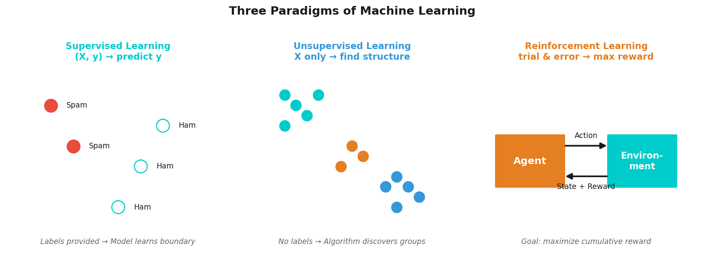

# Introduction to Machine Learning
## & Data Science Workflows

**Applied Machine Learning — Session 1, Chapter 1**

<!--
~50 min total. No exercises — overview chapter. Ask: 'Who has used ML today?' — everyone has (Spotify, Google Maps, Netflix).
-->

---

# What Is Machine Learning?

**Traditional programming**
Rules + Data → Output

**Machine Learning**
Data + Output → Rules

> _"A computer program is said to learn from experience E with respect to some task T and performance measure P..."_
> — Tom Mitchell, 1997

<!--
Use the analogy: teaching a child to recognize dogs — show examples, not a rulebook.
Traditional = explicit rules; ML = learn from data.
-->

---

# Why Machine Learning?

- Email spam → millions of patterns, impossible to hand-code
- Image recognition → pixels to meaning
- Medical diagnosis → beyond human attention span
- Recommendations → individual preferences at scale

**Key insight:** When rules are too complex to write — let data write them.

<!--
Keep it motivational. These examples show ML is everywhere, not just in research.
-->

---

# Three Paradigms of ML



<!--
High-level overview only — each paradigm gets its own session later.
-->

---

# Supervised Learning

- Training data has **labels**
- Model learns: X → y
- Two flavors:
  - **Regression** → continuous output (price, temperature)
  - **Classification** → discrete output (spam/not spam, disease/no disease)

<!--
Two flavors: regression (continuous) and classification (discrete). Will be covered in Sessions 1-2.
-->

---

# Unsupervised Learning

- **No labels** — only raw data
- Model finds hidden structure
- Applications:
  - Customer segmentation
  - Anomaly detection
  - Dimensionality reduction
  - Topic modeling

<!--
No labels — the machine finds structure on its own. Session 3 topic.
-->

---

# Reinforcement Learning

- **Agent** interacts with **Environment**
- Takes **Actions** → receives **Rewards**
- Goal: maximize cumulative reward

```
Agent → Action → Environment
  ↑                    ↓
  ←←← Reward + State ←←←
```

<!--
Agent learns by trial and error. Session 4 topic. Mention AlphaGo as a hook.
-->

---

# The Data Science Workflow


**This is a cycle, not a pipeline.**

<!--
Emphasize: this is a CYCLE, not a pipeline. Expect at least 3 full loops.
Steps 2-4 consume ~80% of project time.
-->

---

# Step ① — Define the Problem

- What are we trying to predict/discover?
- Who uses the result?
- What is a "good enough" answer?

> Most ML project failures happen here, not in the model.

<!--
Most ML failures happen here, not in modeling. Ask: 'What are we really trying to predict?'
-->

---

# Step ② — Data

- Where does it come from?
- Is it representative?
- How much do we have?
- What are the legal/ethical constraints?

**Garbage in → Garbage out.**

<!--
Garbage in, garbage out. This gets its own chapter next (Ch02).
-->

---

# Steps ③④ — EDA & Preprocessing

- Explore distributions, relationships, outliers
- Handle missing values
- Encode categorical features
- Scale numerical features
- Split: train / validation / test

> ~80% of project time lives here.

<!--
~80% of project time lives here. Students will experience this in Ch02.
-->

---

# Steps ⑤⑥ — Train & Evaluate

- Choose algorithm(s)
- Fit on training data
- Measure performance on held-out data
- Avoid overfitting

<!--
The 'fun part' — but only works if previous steps are solid.
-->

---

# Step ⑦ — Deploy & Iterate

- A model in a notebook helps no one
- Deployment = value creation
- Monitor: data drifts, model degrades
- Retrain, improve, repeat

<!--
A model in a notebook helps no one. Deployment creates value.
-->

---

# Why Iteration Matters

**Most projects fail not because of bad algorithms — but because of bad iterations.**

| What goes wrong | How iteration fixes it |
|----------------|----------------------|
| Wrong problem definition | Early feedback from stakeholders |
| Dirty / biased data | EDA catches this before training |
| Model doesn't generalize | Evaluation reveals overfitting |
| Features miss signal | Domain experts improve features |
| Production drift | Monitoring triggers retraining |

> **The cycle is the method. Expect at least 3 full loops.**

<!--
Drive home: the cycle IS the method. No perfect first attempt.
-->

---

# The Python ML Ecosystem

| Tool | Role |
|------|------|
| `numpy` | Arrays & math |
| `pandas` | Data wrangling |
| `matplotlib` / `seaborn` | Visualization |
| `scikit-learn` | Algorithms & pipelines |
| `gymnasium` | RL environments |

<!--
If students are comfortable with pandas, speed through this. Gymnasium is optional (RL only).
-->

---

# Now: Examples!

→ Open `ch01_introduction_examples.ipynb`

We will:
1. Load the famous **Iris dataset**
2. Inspect its structure
3. Visualize features
4. Build first intuitions — **before any model**

<!--
Open the notebook live. ~15 min for the demo. Let students follow along.
-->

---

# Key Takeaways

- ML = learning patterns from data automatically
- Three paradigms: supervised / unsupervised / reinforcement
- Workflow is a **cycle** — expect iteration
- Great ML starts with **understanding the data**

<!--
Quick recap. Transition: 'Now that we know what ML is, let's get our hands dirty with real data.'
-->

---
layout: end
---

# Next: Chapter 2

## Data Selection, Cleaning & Preparing

> _"Real-world data is messy, incomplete, and full of surprises. Let's learn how to tame it."_
