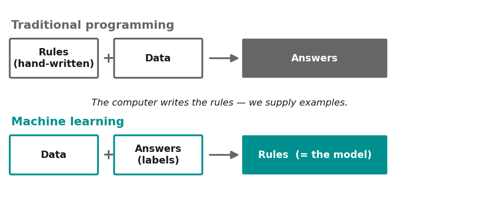
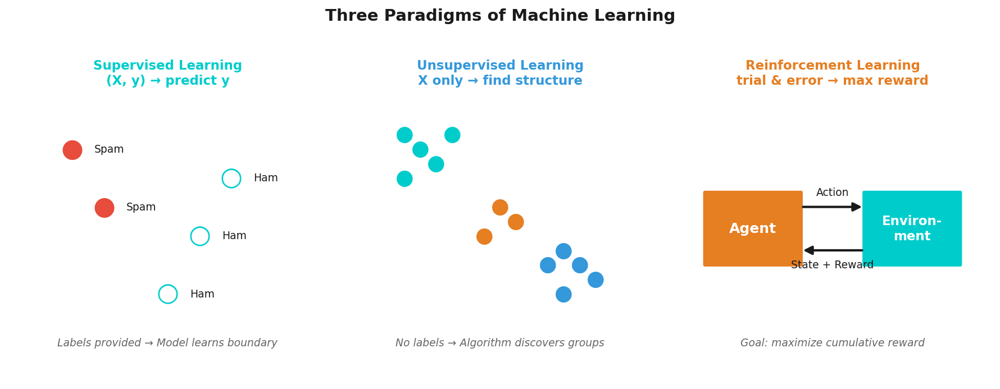
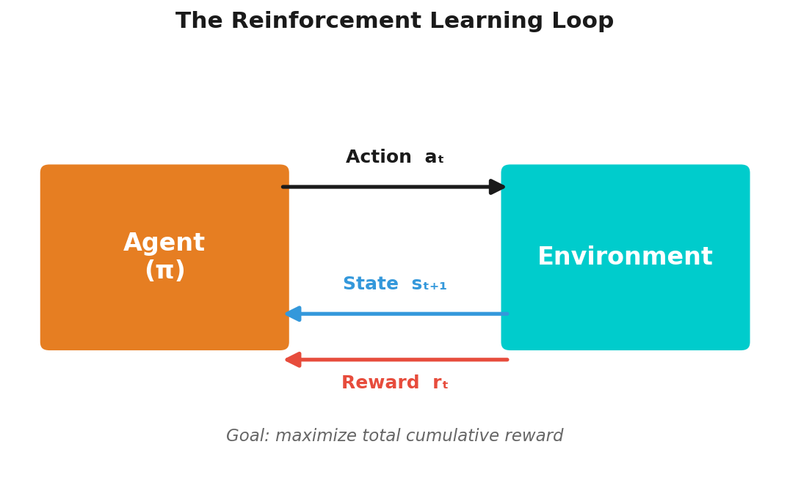
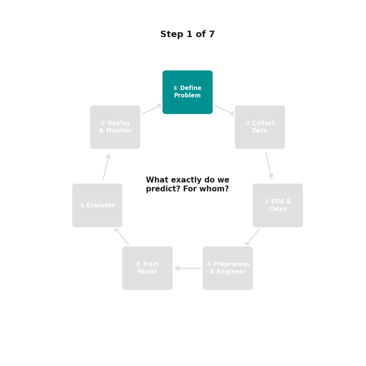
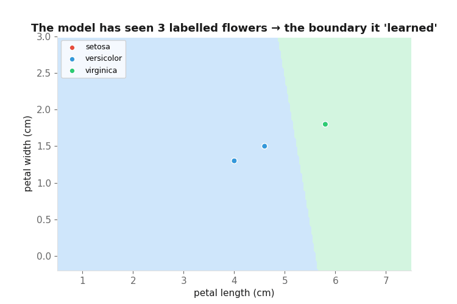

# Introduction to Machine Learning
## & Data Science Workflows

**Applied Machine Learning — Session 1, Chapter 1**

<!--
~50 min: 8 min what/why · 8 min paradigms · 8 min workflow · 3 min tools · 12 min live notebook · 3 min quiz + wrap-up = 42 min + buffer.
Opener (before the first slide): "Who has used ML today?" — Spotify, Google Maps ETA, phone camera, spam filter. Everyone has. Collect 3–4 answers, then: "Today you learn what is behind that."
No mandatory exercise in this chapter — the Penguins notebook is a bonus for fast students / homework.
-->

---

# What Is Machine Learning?

> _"A computer program is said to learn from experience E with respect to some task T and performance measure P, if its performance at T, as measured by P, improves with experience E."_ — Tom Mitchell, 1997

<!--
~4 min. Analogy: teaching a child to recognise dogs — you show examples, not a rulebook.
Ask: "How would you write the rules for 'is this email spam'?" → students realise it is hopeless by hand. That is the motivation for the second row.
Mitchell's definition: map E = data, T = task, P = metric. We will meet all three again (data → Ch02, tasks → Ch03, metrics → Ch06).
-->

---

# Why Machine Learning?

- Email spam → millions of patterns, impossible to hand-code
- Image recognition → pixels to meaning
- Medical diagnosis → beyond human attention span
- Recommendations → individual preferences at scale

**Key insight:** When rules are too complex to write — let data write them.

<!--
~3 min. Keep it motivational. Ask for one example from the students' own field (economics, biology, linguistics …). Pitfall to mention: ML is NOT magic — it needs data that contains the pattern.
-->

---

# Three Paradigms of ML

<!--
~2 min overview, then one slide each. Course map: supervised = Sessions 1–2, unsupervised = Session 3, reinforcement = Session 4.
-->

---

# Supervised Learning

- Training data has **labels**
- Model learns: X → y
- Two flavors:
  - **Regression** → continuous output (price, temperature)
  - **Classification** → discrete output (spam/not spam, disease/no disease)

<!--
~2 min. Quick check: "House price — regression or classification? Spam? Star rating 1–5?" (star rating: could be either — nice discussion point about problem definition).
-->

---

# Unsupervised Learning

- **No labels** — only raw data
- Model finds hidden structure
- Applications:
  - Customer segmentation
  - Anomaly detection
  - Dimensionality reduction
  - Topic modeling

<!--
~2 min. "Nobody tells the algorithm what a 'customer segment' is — it groups by similarity." Session 3.
-->

---

# Reinforcement Learning

- **Agent** interacts with **Environment**
- Takes **Actions** → receives **Rewards**
- Goal: maximize cumulative reward

<!--
~2 min. Trial and error, delayed feedback (you only know at the end of the game whether you won). Hook: AlphaGo, robot walking. Session 4.
-->

---

# The Data Science Workflow

<!--
~4 min. Let the GIF run once while narrating each step (1 s per step). Then stop on the last frame: "cycle, not pipeline".
Emphasise: steps 2–4 (data) take ~80 % of real project time — Ch02 is entirely about that.
Static fallback: workflow_cycle.png.
-->

---

# Step ① — Define the Problem

- What are we trying to predict/discover?
- Who uses the result?
- What is a "good enough" answer?

> Most ML project failures happen here, not in the model.

<!--
~1 min. Example: "predict churn" — churn within 30 days? 1 year? Voluntary only? Different answers → different datasets → different models.
-->

---

# Steps ②③④ — Data, EDA & Preprocessing

- Where does the data come from? Is it representative? Legal/ethical constraints?
- Explore distributions, relationships, outliers
- Handle missing values, encode categories, scale features
- Split: train / test (validation → later)

> Garbage in → garbage out. ~80% of project time lives here.

<!--
~2 min. Do NOT explain the techniques yet — that is Ch02. Just name them so students recognise them in 50 minutes.
-->

---

# Steps ⑤⑥⑦ — Train, Evaluate, Deploy

- Choose algorithm(s), fit on training data
- Measure performance on **held-out** data — always compare with a simple **baseline**
- A model in a notebook helps no one → deploy, monitor drift, retrain

**The cycle is the method. Expect at least 3 full loops.**

<!--
~2 min. "Held-out data" and "baseline" are the two words to remember — both come back in the demo in 5 minutes.
-->

---

# The Python ML Ecosystem

| Tool | Role |
|------|------|
| `numpy` | Arrays & math |
| `pandas` | Data wrangling |
| `matplotlib` / `seaborn` | Visualization |
| `scikit-learn` | Algorithms & pipelines |
| `gymnasium` | RL environments |

<!--
~2 min. If students know pandas: 30 seconds. All of this is in requirements.txt / the course .venv.
-->

---

# Now: Live Demo!

→ Open `ch01_introduction_examples.ipynb`

We will:
1. Load the famous **Iris dataset**
2. Inspect its structure
3. Visualize features → **see the pattern before any model**
4. Sneak preview: a baseline and a first model

<!--
~12 min. Let students follow along. Stop at the pairplot and ask: "Which two features would YOU use to tell the species apart?" (petal length/width).
The GIF: the model has seen more and more flowers → the coloured regions ("rules") get learned. This is the notebook's last cell in motion.
Point out: only 30 test flowers → 1 flower = 3.3 % accuracy → don't over-interpret 100 %.
-->

---

# Quick Check

**Which paradigm is it?**

1. Predicting tomorrow's electricity demand from the last 5 years
2. Grouping news articles into topics nobody defined beforehand
3. A thermostat that learns to keep you comfortable from your reactions
4. Deciding whether a credit card transaction is fraud

<v-click>

1. Supervised (regression) · 2. Unsupervised (clustering) · 3. Reinforcement · 4. Supervised (classification)

</v-click>

<!--
~2 min. Let students shout answers, then reveal. Typical confusion: 3 vs 1 — the difference is the feedback loop (reward), not fixed labels.
-->

---

# Key Takeaways

- ML = learning patterns from data automatically
- Three paradigms: supervised / unsupervised / reinforcement
- Workflow is a **cycle** — expect iteration
- Great ML starts with **understanding the data**
- Judge models on **unseen data**, against a **baseline**

<!--
~1 min. Transition: "Now that we know what ML is, let's get our hands dirty with real, messy data."
Bonus for fast students / homework: 03-exercises/ch01_introduction_exercises.ipynb (Penguins EDA, offline CSV included).
-->

---
layout: end
---

# Next: Chapter 2

## Data Selection, Cleaning & Preparing

> _"Real-world data is messy, incomplete, and full of surprises. Let's learn how to tame it."_
