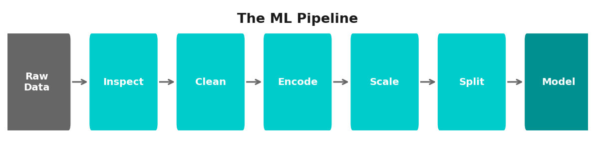
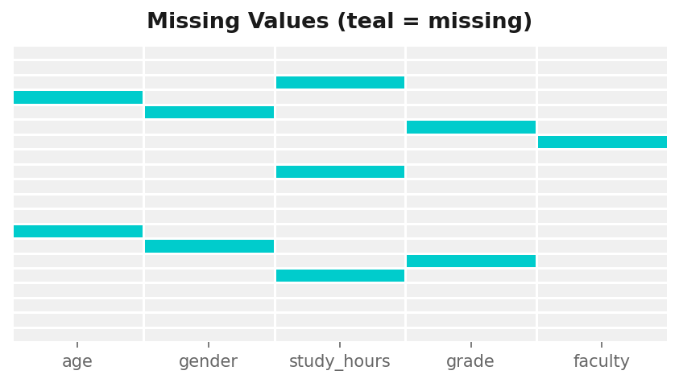
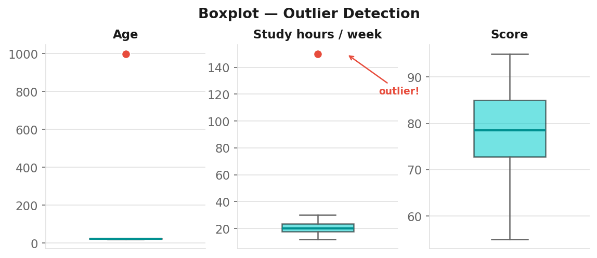
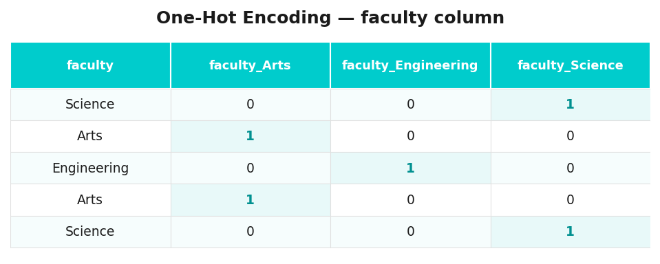
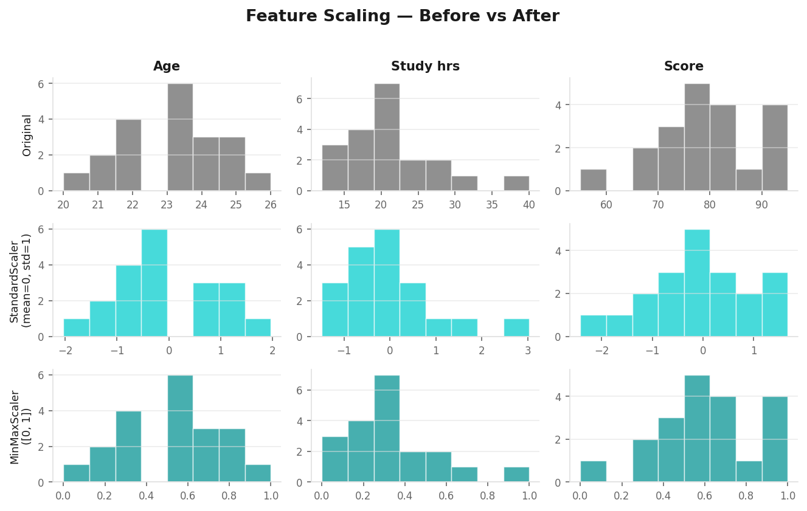
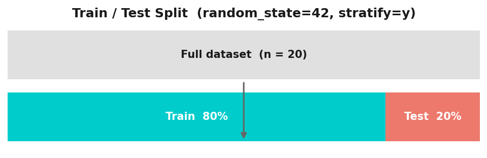
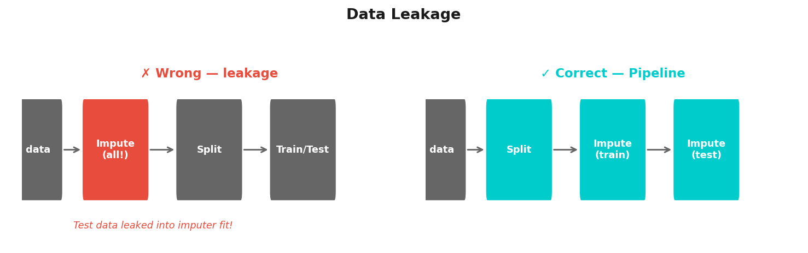

# Data Selection, Cleaning & Preparing

**Applied Machine Learning — Session 1, Chapter 2**

<!--
~50 min. 10 min exercises at end. Central message: 'Data quality bounds model quality.'
-->

---

# The ML Pipeline



**Garbage in — garbage out.** This chapter = the data cleaning step.

<!--
Garbage in — garbage out. Use messy dataset to make students FEEL the pain of bad data.
-->

---

# What Can Go Wrong?

- Missing values (`NaN`, empty strings, `-999`)
- Wrong data types (age as string)
- Inconsistent categories (`"Male"`, `"male"`, `"M"`)
- Outliers (age = `999`, salary = `-1`)
- Duplicate rows
- Mixed scales (salary in thousands vs. age in years)

<!--
Ask students if they've seen these problems. Real examples are powerful.
-->

---

# Missing Values — Detection

```python
df.isnull().sum()          # count per column
df.isnull().mean()         # proportion per column
```



**Rule of thumb:** < 5% missing → drop rows · > 50% in a column → drop column

<!--
~8 min for missing values block. Rule of thumb: <5% drop rows, >50% drop column.
-->

---

# Missing Values — Strategies

| Strategy | When to use |
|---------|------------|
| Drop rows | Few missing, random missingness |
| Drop column | More than 50% missing |
| Fill with **mean** | Numerical, no outliers |
| Fill with **median** | Numerical, with outliers |
| Fill with **mode** | Categorical |
| Fill with constant | Domain knowledge (e.g. "Unknown") |

⚠️ **Always impute AFTER train/test split** — otherwise data leakage!

<!--
CRITICAL: 'Always impute AFTER train/test split!' Repeat this multiple times.
Data leakage is the central concept of this chapter.
-->

---

# Outliers



**Detection:** boxplot · IQR rule (`Q1 − 1.5·IQR` / `Q3 + 1.5·IQR`) · Z-score `|z| > 3`

**Treatment:** Remove · Cap/clip · Log-transform · Keep (if real signal)

<!--
Context matters! A $1M salary is an outlier in general population but normal in a CEO dataset.
-->

---

# Feature Types

| Type | Example | Ready for ML? |
|------|---------|--------------|
| Numerical continuous | Age, salary | After scaling |
| Numerical discrete | # children | Usually yes |
| Categorical nominal | City, color | Need encoding |
| Categorical ordinal | S / M / L / XL | Need ordered encoding |
| Binary | Yes / No | Encode as 0 / 1 |

<!--
~7 min for encoding block. One-hot encoding can be shown visually on the board.
-->

---

# Encoding Categorical Features



```python
pd.get_dummies(df, columns=['city'])   # pandas
# or: sklearn OneHotEncoder
```

⚠️ With 100 cities → 100 new columns. Consider target encoding for high-cardinality features.

<!--
Warning: 100 cities → 100 columns. Mention target encoding for high-cardinality.
-->

---

# Feature Scaling



**StandardScaler** → mean=0, std=1 · **MinMaxScaler** → [0, 1]

**Tree-based models** (Decision Tree, Random Forest) → no scaling needed.

<!--
Key: tree-based models don't need scaling. Distance/gradient-based models do.
-->

---

# Train / Test Split



```python
from sklearn.model_selection import train_test_split
X_train, X_test, y_train, y_test = train_test_split(
    X, y, test_size=0.2, random_state=42, stratify=y
)
```

**Always set `random_state`** — makes results reproducible.

<!--
Always set random_state for reproducibility. Stratify for imbalanced classes.
-->

---

# Data Leakage ⚠️



**Fix:** Use sklearn Pipelines — `fit()` only on train, `transform()` on both.

```python
from sklearn.pipeline import Pipeline
from sklearn.impute import SimpleImputer
from sklearn.preprocessing import StandardScaler

pipe = Pipeline([('imputer', SimpleImputer()), ('scaler', StandardScaler())])
pipe.fit(X_train)
X_test_clean = pipe.transform(X_test)
```

<!--
This is the KEY slide. Use sklearn Pipelines — fit() on train only, transform() on both.
Plant this seed now, reinforce in Ch06.
-->

---

# The Preprocessing Checklist

```
✅ Inspect shape, dtypes, head
✅ Check missing values & outliers (visual inspection)
✅ Fix obvious errors (typos, wrong dtypes)
✅ Train / test split ← BEFORE any fitting!
✅ Impute missing values (fit on train, transform both)
✅ Detect and treat outliers (based on train statistics)
✅ Encode categorical features
✅ Scale numerical features (fit on train, transform both)
```

**Golden rule:** Everything that computes statistics (mean, median, IQR, scaler params) must be **fit on train only**.

<!--
Golden rule: everything that computes statistics must be fit on train only.
-->

---

# Now: Exercises!

→ Open `03-exercises/ch02_data_cleaning_exercises.ipynb`

**You will:**
- Work with a messy dataset
- Apply all today's techniques step by step
- ~10 minutes

<!--
~10 min. Students work with a messy housing dataset. Walk around and help.
-->

---

# Key Takeaways

- Real data is always messy — cleaning is non-negotiable
- Impute missing values (after the split!)
- Encode all categories to numbers
- Scale features when using distance or gradient-based algorithms
- **Always split first, then preprocess**

<!--
Transition: 'Now that our data is clean, let's teach a machine to learn from it.'
-->

---
layout: end
---

# Next: Chapter 3

## Introduction to Supervised Learning

> _"Now that our data is clean, let's teach a machine to learn from it."_
