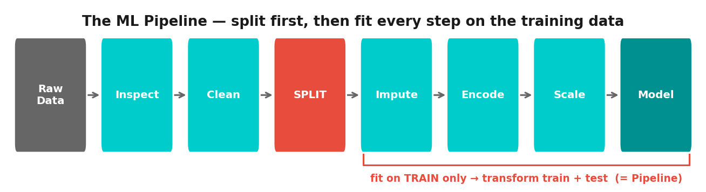
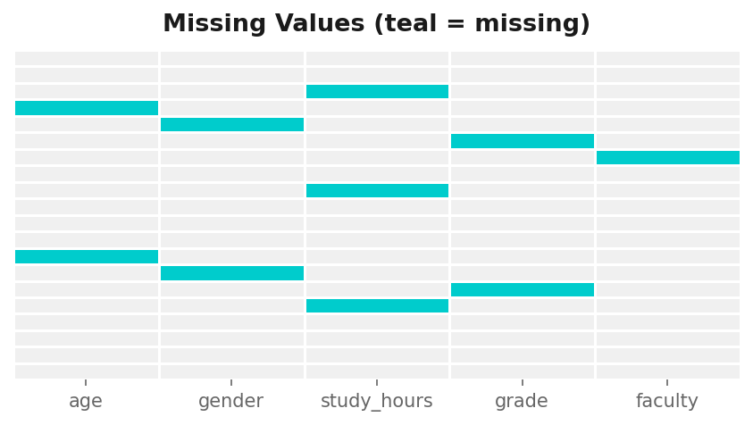
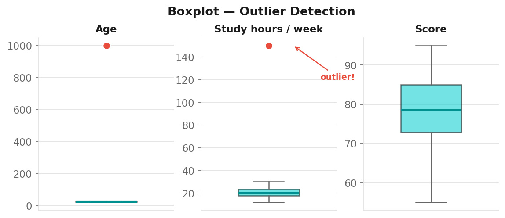
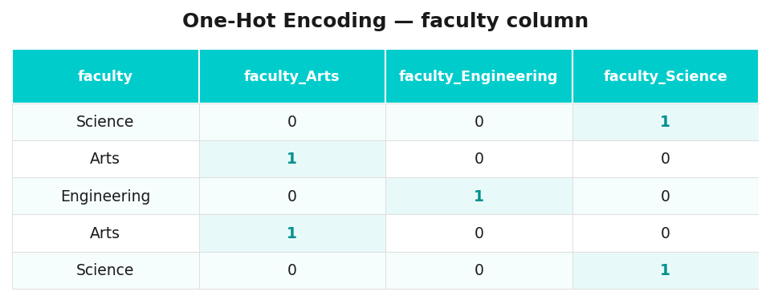
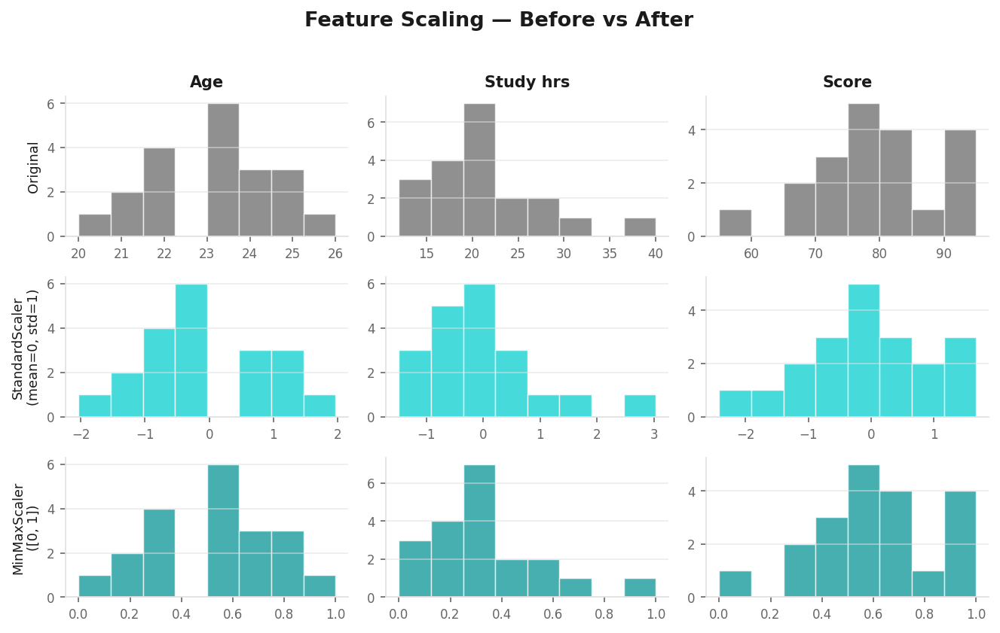
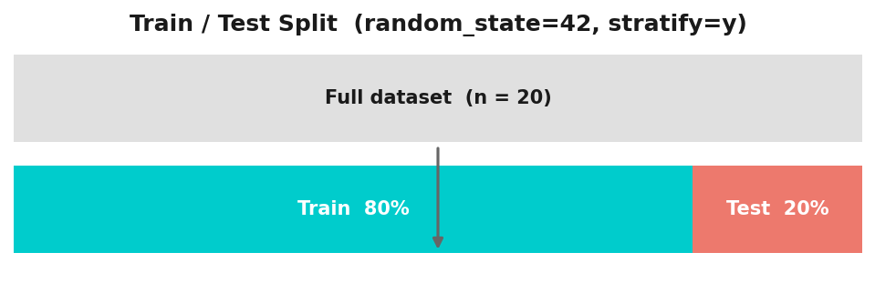
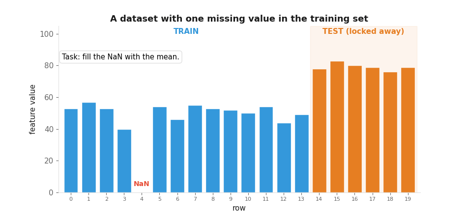
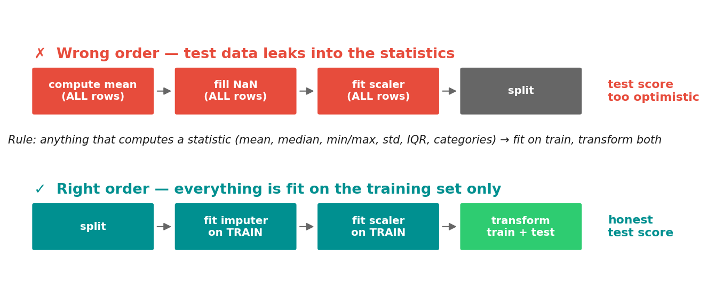

# Data Selection, Cleaning & Preparing

**Applied Machine Learning — Session 1, Chapter 2**

<!--
~50 min: 3 min why · 6 min missing values · 3 min outliers · 5 min encoding · 3 min scaling · 6 min split + leakage (KEY) · 2 min quiz · 8 min live demo · 10 min exercises = 46 min; solution discussion in the buffer / start of Ch03.
Central message: "Split first. Fit on train. Transform both." — say it at least three times.
-->

---

# The ML Pipeline



**Garbage in — garbage out.** This chapter = the data cleaning step.

<!--
~1 min. Point at the step in the workflow ring from Ch01 (steps ②–④). "This is where 80 % of the time goes."
-->

---

# What Can Go Wrong?

- Missing values (`NaN`, empty strings, `-999`)
- Wrong data types (age as string)
- Inconsistent categories (`"Male"`, `"male"`, `"M"`)
- Impossible values (age = `999`, salary = `-1`)
- Duplicate rows
- Mixed scales (salary in thousands vs. age in years)
- A feature that secretly *is* the answer (**target leakage**)

<!--
~2 min. Ask: "Who has seen one of these in a spreadsheet?" — collect 2 anecdotes. The last bullet is new for most: e.g. predicting hospital re-admission with a feature "discharge letter mentions readmission" — that only exists AFTER the event.
-->

---

# Missing Values — Detection

```python
df.isnull().sum()          # count per column
df.isnull().mean()         # proportion per column
df.duplicated().sum()      # while we're at it: duplicate rows
```



<!--
~2 min. The heatmap makes structure visible: is a column missing at random or in blocks? Ask WHY a value is missing (sensor broken? people refusing to answer? — the second is informative and should not just be averaged away).
-->

---

# Missing Values — Strategies

| Strategy | When to use |
|---------|------------|
| Drop rows | Few missing (< 5 %), random missingness |
| Drop column | Mostly missing (> 50 %) |
| Fill with **mean** | Numerical, no outliers |
| Fill with **median** | Numerical, with outliers (robust) |
| Fill with **mode** | Categorical |
| Fill with constant | Domain knowledge (e.g. `"Unknown"`) |

⚠️ The fill value is a **statistic** → compute it on the **training set** only (`SimpleImputer` does exactly that).

<!--
~4 min. Quick check: "Salary column, one CEO with 5 M in it — mean or median?" (median). Preview: SimpleImputer(strategy='median').fit(X_train) learns the value, .transform() applies it to train AND test.
-->

---

# Outliers



**Detection:** boxplot · IQR rule (`Q1 − 1.5·IQR` / `Q3 + 1.5·IQR`) — bounds from **train**
**Treatment:** Remove (if clearly an error) · Cap/clip · Log-transform · **Keep** (if real signal)

<!--
~3 min. Two different things: an IMPOSSIBLE value (age 999) is an error → set to NaN and impute. A LARGE value (200 m² house) may be real → don't delete blindly. Ask: "Is a 1 M salary an outlier?" — in the general population yes, in a CEO dataset no. Z-score rule → bonus slide at the end.
-->

---

# Feature Types & Encoding

| Type | Example | Ready for ML? |
|------|---------|--------------|
| Numerical continuous | age, salary | after scaling |
| Numerical discrete | # children | usually yes |
| Categorical nominal | city, colour | **one-hot** encoding |
| Categorical ordinal | S / M / L / XL | ordered integer encoding |
| Binary | yes / no | 0 / 1 |



<!--
~3 min. Draw one-hot on the board if needed. Quick check: "Is 'grade A/B/C' nominal or ordinal?" (ordinal). "Zip code?" (nominal — although numeric!).
-->

---

# One-Hot in Practice

```python
pd.get_dummies(df, columns=['city'])                 # quick & dirty (pandas)
OneHotEncoder(handle_unknown='ignore')               # sklearn — learns the categories on TRAIN,
                                                     # unseen test category → all zeros, no crash
```

⚠️ 100 cities → 100 new columns. High cardinality → target encoding / embeddings (not in this course).

<!--
~2 min. get_dummies on train and test separately can give DIFFERENT columns (a category missing in test) → misaligned matrices. That is why we use OneHotEncoder inside a ColumnTransformer in the demo.
-->

---

# Feature Scaling



**StandardScaler** → mean 0, std 1 · **MinMaxScaler** → [0, 1]

Needed for **distance- and gradient-based** models (KNN — next chapter!, linear/logistic regression, SVM, neural nets).
**Tree-based models** (Decision Tree, Random Forest) → no scaling needed.

<!--
~3 min. Motivation for KNN in Ch03: distance between (age 30, income 90 000) and (age 60, income 90 100) is dominated by income. Mean/std are statistics → fit the scaler on train only.
-->

---

# Train / Test Split



```python
from sklearn.model_selection import train_test_split
X_train, X_test, y_train, y_test = train_test_split(
    X, y, test_size=0.2, random_state=42,
    stratify=y)      # ← classification only! keeps class proportions. Omit for regression.
```

**Always set `random_state`** — reproducible splits. **The test set is locked away until the very end.**

<!--
~2 min. Golden rule: never evaluate on data the model has seen. stratify=y with a continuous target raises an error — students WILL copy this into the housing exercise, so say it explicitly.
-->

---

# Data Leakage ⚠️ — the #1 beginner mistake



<!--
~2 min. Let the GIF run through once (7 s). Narrate: the mean over ALL rows is pulled up by the test rows → the filled value carries test information into training → the test score is too optimistic. Right: split, mean over TRAIN, fill both with it.
-->

---

# The Right Order



```python
pipe = Pipeline([('imputer', SimpleImputer(strategy='median')), ('scaler', StandardScaler())])
pipe.fit(X_train)                       # statistics from TRAIN only
X_test_ready = pipe.transform(X_test)   # same statistics applied to test
```

<!--
~2 min. KEY slide. Rule to repeat: "Everything that computes a statistic — mean, median, min/max, std, IQR, category list — is fit on train and transformed on both." Pipelines make this automatic; ColumnTransformer routes numeric vs categorical columns. Both appear in the demo.
-->

---

# Quick Check — Which of These Steps Leak?

You have `df` with 1 000 rows. Steps, in this order:

1. `df['city'] = df['city'].str.lower()`
2. `df['age'] = df['age'].fillna(df['age'].median())`
3. `train_test_split(...)`
4. `scaler.fit(X_train); scaler.transform(X_test)`
5. `df.drop_duplicates()` before the split
6. Dropping the column `"final_invoice_amount"` when predicting `"will_customer_buy"`

<v-click>

**Leaks:** 2 (median over all rows — must be after the split, fit on train). **Safe:** 1, 3, 4, 5. **6 is *removing* target leakage** — the invoice only exists after the purchase.

</v-click>

<!--
~2 min. Let students vote per step with hands. Common wrong answer: "5 leaks" — no, dropping exact duplicates uses no statistic (though it changes the split, that's fine). Discuss 6 briefly: what would the model learn if you kept it? A useless 100 %.
-->

---

# Now: Live Demo, Then Exercises

**Demo (~8 min):** `02-examples/ch02_data_cleaning_examples.ipynb`
messy student survey → duplicates, text fixes, target leakage (`grade`), split, `SimpleImputer`, IQR, encoding, scaling → **`ColumnTransformer` + `Pipeline` in 10 lines**

**Exercises (~10 min):** `03-exercises/ch02_data_cleaning_exercises.ipynb`
messy housing data · Task 1 fixes → Task 2 split → Task 3 impute → Task 4 `ColumnTransformer` · Bonus: IQR, mean vs median, Z-score, correlation

<!--
Demo: sections 6–9 by hand, section 10 = pipeline. Do not spend >8 min — skip the boxplot cell if late.
Exercises: walk around. Typical errors: fit_transform on X_test (leak!), stratify=y on price (ValueError), forgetting .reset_index after drop_duplicates.
Fast students: bonus B (mean vs median with the 9999 still in) is the most instructive.
-->

---

# Key Takeaways

- Real data is always messy — cleaning is non-negotiable
- Deterministic fixes (text, duplicates, impossible values) → before the split
- **Split first**, then impute / clip / encode / scale — **fit on train, transform both**
- Ask: does any feature secretly contain the answer? (target leakage)
- `Pipeline` + `ColumnTransformer` make the right order automatic

<!--
~1 min. Transition: "Now that our data is clean and in a pipeline, let's put a model at the end of it."
-->

---

# Bonus — Z-Score Outlier Rule

- Standardise: `z = (x − mean) / std` (mean/std from **train**)
- Flag `|z| > 3` as outliers (≈ 0.3 % of a normal distribution)
- Sensitive to the very outliers it looks for (they inflate the std) → the IQR rule is usually the more robust default
- Try it: exercise **Bonus C**

<!--
Appendix — only if a student asks or as homework pointer.
-->

---
layout: end
---

# Next: Chapter 3

## Introduction to Supervised Learning

> _"Now that our data is clean, let's teach a machine to learn from it."_
