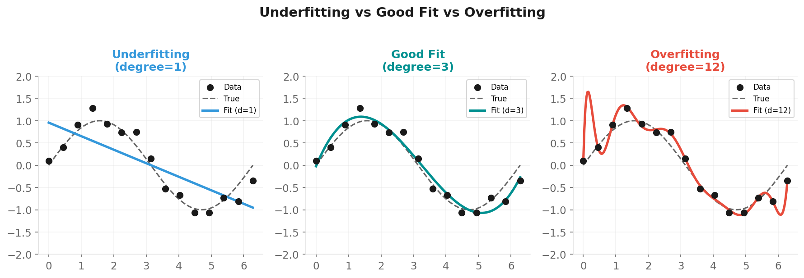
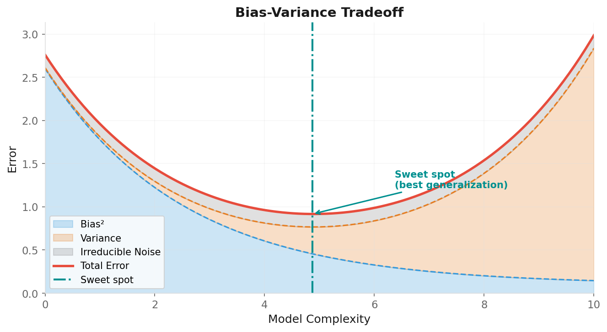
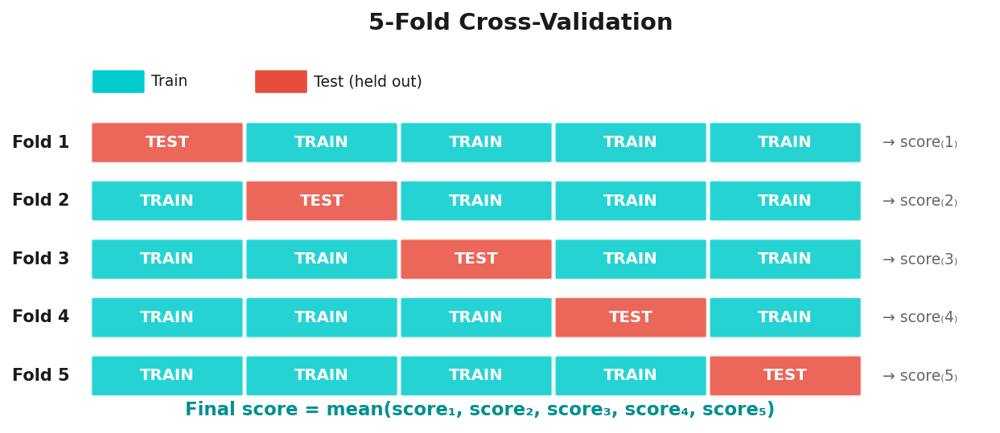

# Introduction to Supervised Learning

**Applied Machine Learning — Session 1, Chapter 3**

<!--
~50 min. 10 min exercises. This chapter is foundational — bias/variance and cross-validation.
-->

---

# Supervised Learning

**Learning from labeled examples to predict new cases.**

```
Input:  { (X₁, y₁), (X₂, y₂), ..., (Xₙ, yₙ) }
                  ↓
           Model Training
                  ↓
Output: f(X_new) → ŷ_new
```

- **X** = features (what we know)
- **y** = label / target (what we want to predict)
- **ŷ** = prediction (what the model says)

<!--
X = features (what we know), y = label (what we want to predict).
The model learns the mapping.
-->

---

# Regression vs Classification

| Task | Target | Example |
|------|--------|---------|
| **Regression** | Continuous number | House price: €285,000 |
| **Classification** | Discrete category | Spam / Not Spam |

<!--
Simple distinction: continuous number vs. discrete category.
-->

---

# The Learning Process

```
① Collect labeled data
② Choose a model
③ Train: minimize error between ŷ and y
④ Evaluate on held-out data
⑤ Deploy or iterate
```

**Training error** = error on data the model has already seen  
**Test error** = error on new, unseen data ← **what we actually care about**

<!--
Training error is always low — it's the test error we care about. Emphasize generalization.
-->

---

# Loss Functions

**How we measure "how wrong" the model is:**

Regression:
```
MSE = (1/n) Σ(yᵢ - ŷᵢ)²
```

Classification:
```
Cross-Entropy Loss = -Σ yᵢ · log(ŷᵢ)
```

Training = finding parameters that **minimize** the loss.

<!--
Don't go deep into math. Key: MSE penalizes large errors more. Cross-entropy for classification.
Note: The cross-entropy formula shown is simplified (multi-class form). The full binary cross-entropy
is: -Σ[yᵢ·log(ŷᵢ) + (1-yᵢ)·log(1-ŷᵢ)]. No need to show this — just be aware if a student asks.
-->

---

# Underfitting vs Overfitting



- **Underfitting:** High bias, high train error AND high test error
- **Overfitting:** Low bias, low train error BUT high test error

<!--
~8 min. Draw on board: line (underfit), good curve, wiggly curve (overfit).
This is the most important concept.
-->

---

# The Bias-Variance Tradeoff



**Goal:** Find the sweet spot where total error is minimized.

<!--
The U-curve: increasing complexity reduces bias but increases variance. Sweet spot in the middle.
-->

---

# Cross-Validation

**Problem:** Single train/test split gives noisy performance estimates.



```python
from sklearn.model_selection import cross_val_score
scores = cross_val_score(model, X, y, cv=5)
```

<!--
~5 min. Analogy: studying with different 80/20 splits of material each time.
More robust than single split.
-->

---

# The sklearn API

**One interface to rule them all:**

```python
# 1. Create
model = SomeModel(hyperparameter=value)

# 2. Train
model.fit(X_train, y_train)

# 3. Predict
y_pred = model.predict(X_test)

# 4. Score
model.score(X_test, y_test)
```

Every sklearn model works exactly this way. ✅

<!--
This is a selling point: once you know fit/predict/score, you know ALL models. Emphasize consistency.
-->

---

# Now: Examples!

→ Open `02-examples/ch03_supervised_intro_examples.ipynb`

We'll see overfitting and underfitting live,  
then fix it with cross-validation.

<!--
Show overfitting/underfitting live with polynomial regression. Very visual and impactful.
-->

---

# Key Takeaways

- Supervised learning = learning from (X, y) pairs
- Goal = generalize to **new, unseen data** (not memorize training data)
- Underfitting: model too simple
- Overfitting: model memorizes noise
- Cross-validation: robust performance estimation
- sklearn API: fit → predict → score

<!--
Transition: 'Now let's meet the actual algorithms — starting with regression.'
-->

---
layout: end
---

# Next: Chapter 4

## Regression Models

> _"Time to meet the algorithms. Starting with the classics."_
