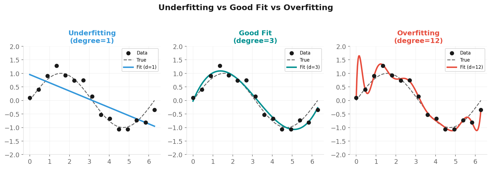
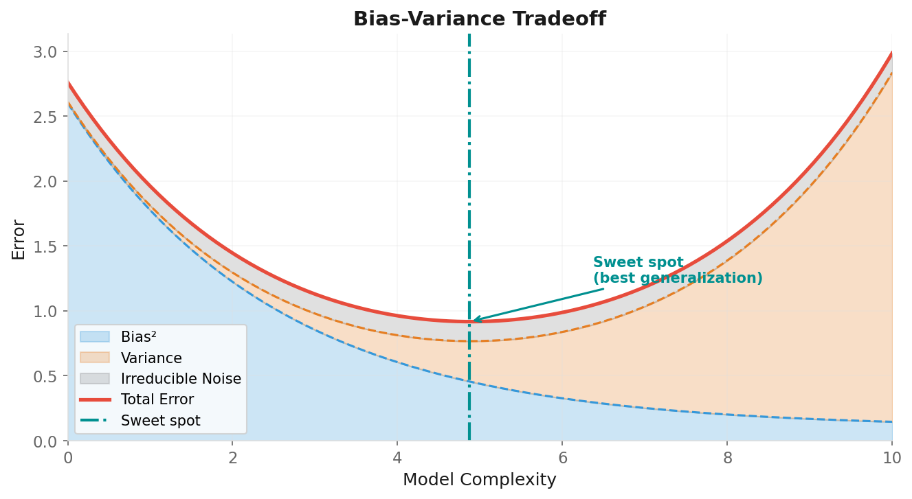
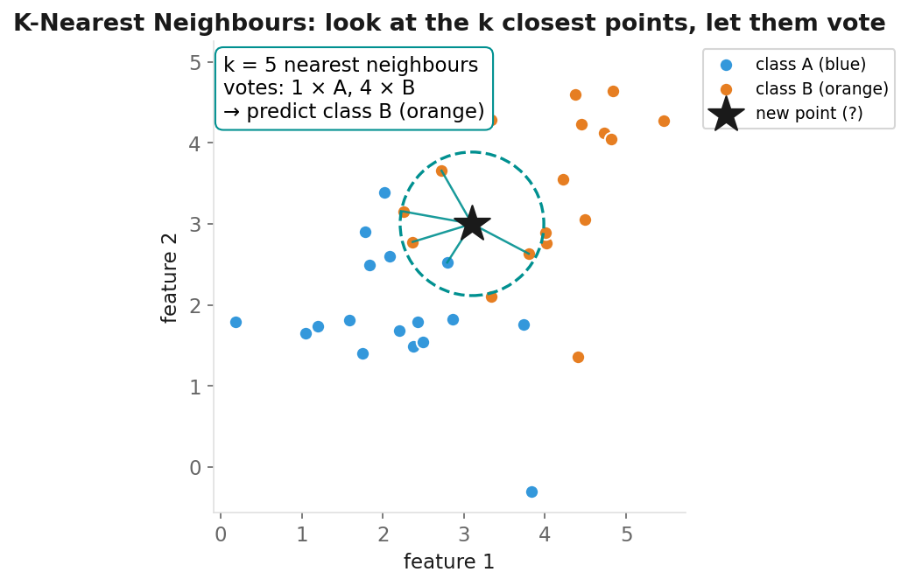
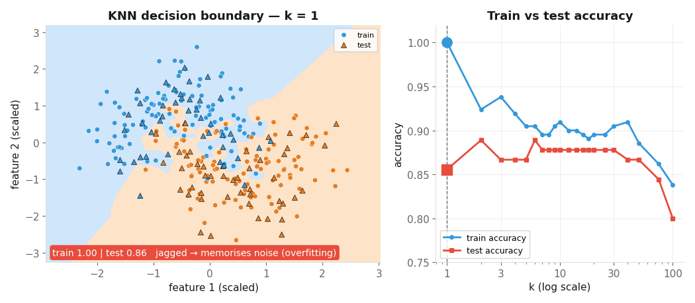
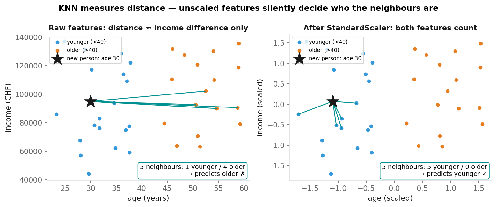
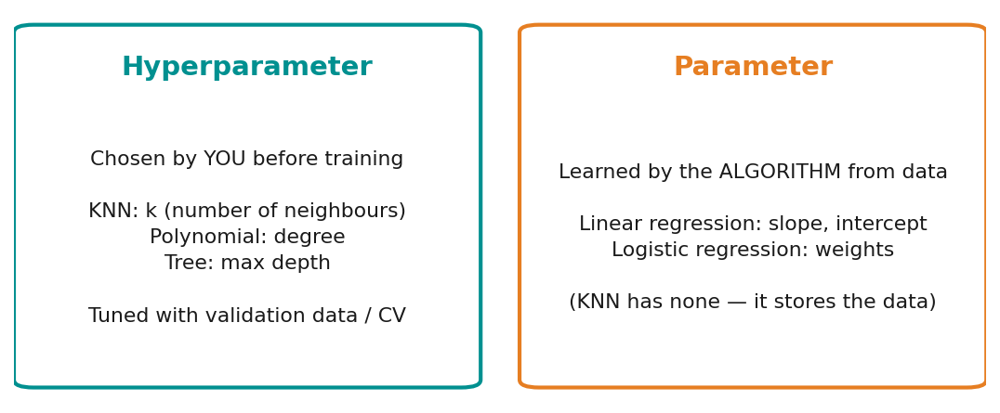
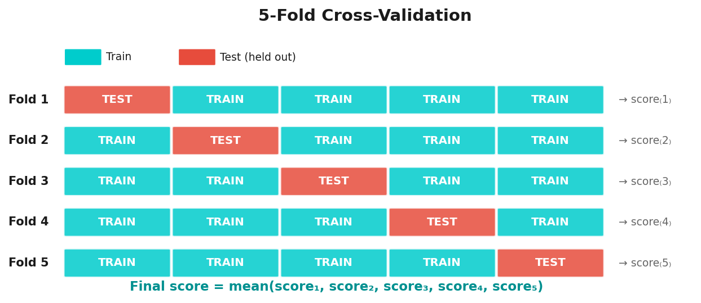

# Introduction to Supervised Learning

**Applied Machine Learning — Session 1, Chapter 3**

<!--
~50 min: 5 min what is supervised learning · 4 min train/test protocol + baseline · 6 min generalisation, over/underfitting · 8 min KNN (algorithm, GIF, k, scaling) · 3 min hyperparameter vs parameter + sklearn API · 2 min CV preview · 2 min quiz · 10 min live demo · 10 min exercises = 50 → keep the demo to 8 min if the previous chapter ran over. Buffer comes from skipping the CV preview slide (Ch04 covers it).
Red thread: ONE algorithm (KNN) all the way — slide → GIF → demo → exercise. Polynomial regression / CV in practice are Ch04.
-->

---

# Supervised Learning

**Learning from labeled examples to predict new cases.**

- **X** = features (what we know) — e.g. petal length & width
- **y** = label / target (what we want to predict) — e.g. species
- **ŷ** = the model's prediction for a new X

| Task | Target | Example |
|------|--------|---------|
| **Regression** | Continuous number | House price: €285 000 |
| **Classification** | Discrete category | Spam / not spam · Iris species |

<!--
~3 min. Tie back to Ch01 (Iris preview) and Ch02 (X = the cleaned feature matrix, y = the target we kept out of the pipeline). Quick check: "Predicting tomorrow's temperature?" (regression) "Predicting whether it rains?" (classification). Today: classification with the simplest algorithm there is.
-->

---

# The Protocol: Train, Then Test on Unseen Data

```
① Split                 train  |  test  (test locked away — Ch02)
② Baseline              "always predict the majority class" — the bar to beat
③ Train                 model.fit(X_train, y_train)
④ Evaluate              model.score(X_test, y_test)   ← the number we care about
```

**Training accuracy** = how well the model repeats what it has seen
**Test accuracy** = how well it **generalises** to new data ← what matters

<!--
~4 min. Analogy: exam questions identical to the homework → 100 % says nothing about understanding. Baseline: on a 90/10 imbalanced dataset "always majority" already scores 90 % — a model with 91 % is barely better than nothing. We compute a DummyClassifier baseline in every chapter from now on.
-->

---

# Underfitting vs Overfitting



- **Underfitting:** model too simple → train **and** test error high (high bias)
- **Overfitting:** model memorises noise → train error low, test error high (high variance)

<!--
~3 min. Draw on the board if the projector is small: straight line through a curve (underfit), a reasonable curve, a wiggly line through every point (overfit). Ask: "Which one would you trust for a new point?" We will SEE both extremes with KNN in five minutes.
-->

---

# The Bias–Variance Tradeoff



**Goal:** the sweet spot where test error is minimal — neither too simple nor too flexible.

<!--
~3 min. Complexity axis: for KNN it runs from large k (simple, smooth) to k = 1 (most flexible). Keep it intuitive; the formula (bias² + variance + noise) is not needed today.
-->

---

# K-Nearest Neighbours (KNN)



**No formula, no training** — to predict a new point: ① measure the distance to all training points, ② take the **k closest**, ③ **majority vote**.

<!--
~3 min. Simplest possible classifier — "you are like your neighbours". Ask: "What is stored in the trained model?" — the whole training set. That is why prediction is slow for big data (aside). k is chosen by us → hyperparameter (next slides).
-->

---

# The Effect of k



<!--
~3 min. Let the GIF loop (k = 1 → 100, ~12 s). k = 1: every training point gets its own island → train 100 %, test lower = overfitting. k ≈ 5–30: smooth boundary following the moons. k = 100: almost a straight line, train AND test drop = underfitting. The right panel is the bias–variance curve, live. Static: knn_k_sweep.png. Same experiment in the notebook animation 0-animations/02_knn_decision_boundary.ipynb.
-->

---

# KNN Needs Scaled Features



Distances are dominated by the feature with the largest range → **`StandardScaler` before KNN — inside the pipeline.**

<!--
~2 min. Callback to Ch02 scaling slide. Left: income (CHF) decides everything, the 30-year-old gets "older" neighbours. Right: scaled → correct neighbours. Demo shows it on Penguins: 0.77 vs 0.99 test accuracy.
-->

---

# Hyperparameter vs Parameter



<!--
~2 min. Hyperparameter = a knob YOU set before training (k, degree, depth). Parameter = what the algorithm learns (slope, weights). KNN has no parameters — it just stores the data. Choosing hyperparameters honestly needs data the model has not been trained on → validation split / cross-validation (next slide, Ch04).
-->

---

# The sklearn API — One Interface for All Models

```python
from sklearn.pipeline import Pipeline
from sklearn.preprocessing import StandardScaler
from sklearn.neighbors import KNeighborsClassifier

model = Pipeline([('scaler', StandardScaler()),          # Ch02 preprocessing ...
                  ('knn', KNeighborsClassifier(n_neighbors=5))])   # ... + a model at the end

model.fit(X_train, y_train)          # 1. train  (scaler AND knn fit on train only)
y_pred = model.predict(X_test)       # 2. predict
model.score(X_test, y_test)          # 3. evaluate (accuracy)
```

Every sklearn model works exactly this way — swap `KNeighborsClassifier` for any other estimator. ✅

<!--
~2 min. The pipeline IS the model: fit/predict/score on the whole thing, and leakage is impossible by construction. Selling point: learn this once, use it for regression (Ch04), trees, SVMs (Ch05), clustering (Ch08) …
-->

---

# Preview: Cross-Validation (Ch04)



One split = one noisy number. **k-fold CV** repeats the split k times and averages → more reliable estimate, used to *choose* hyperparameters. **We will use it in Ch04.**

<!--
~1 min, concept only. Do not implement today. Just plant: "how do I choose k without peeking at the test set? → CV on the training part". Skip this slide entirely if behind schedule.
-->

---

# Quick Check

A KNN model reaches **100 % training accuracy** and **72 % test accuracy**. Baseline is 65 %.

1. Is this over- or underfitting?
2. Should you **increase** or **decrease** k?
3. Your colleague suggests reporting the 100 % — what do you say?

<v-click>

1. Overfitting (train ≫ test). 2. **Increase** k → smoother boundary, less variance. 3. Training accuracy is not evidence of anything — report test accuracy, and mention it is only 7 points above the baseline.

</v-click>

<!--
~2 min. Hands up for "increase" vs "decrease" before revealing. Follow-up if time: "and if train = test = 66 %?" → underfitting, decrease k / better features.
-->

---

# Now: Live Demo, Then Exercises

**Demo (~10 min):** `02-examples/ch03_supervised_intro_examples.ipynb`
two moons → baseline → `Pipeline(scaler, KNN)` fit/predict/score → boundaries for k = 1 / 7 / 51 → k sweep (train vs test) → Penguins with/without scaler → CV taste

**Exercises (~10 min):** `03-exercises/ch03_supervised_intro_exercises.ipynb`
Task 1 split → Task 2 baseline + KNN → Task 3 k sweep → Task 4 plot & interpret · Bonus: Penguins pipeline with `SimpleImputer` (Ch02 skills), scaler on/off, CV taste

<!--
Demo: if short on time skip section 6 (CV) and the boxplot; the k-sweep plot is the must-show.
Exercises: typical errors — forgetting the scaler in the pipeline, calling fit on X_test, appending score(X_test) into train_accs. Ask fast students to explain WHY k = 1 gives exactly 1.0 on train.
-->

---

# Key Takeaways

- Supervised learning = learn a mapping X → y from labelled examples
- Protocol: split → **baseline** → fit on train → score on **test**
- Underfitting (too simple) vs. overfitting (memorises noise) — judged by the train/test gap
- KNN: distance + majority vote; **k** is a hyperparameter; **scale first**
- sklearn: `Pipeline(...).fit / .predict / .score` — same for every model
- Cross-validation → Ch04

<!--
~1 min. Transition to Session 2: "Next time: regression — the same protocol, a model with real parameters, and cross-validation to choose hyperparameters."
-->

---

# Bonus — Further Reading

- **Loss functions** (what `fit` actually minimises): MSE for regression, cross-entropy for classification → Ch04 / Ch05
- **Distance metrics** for KNN: Euclidean (default), Manhattan, cosine — `KNeighborsClassifier(metric=...)`
- **Weighted KNN:** `weights='distance'` lets closer neighbours count more
- **KNN for regression:** `KNeighborsRegressor` averages the neighbours' values

<!--
Appendix — pointer only.
-->

---
layout: end
---

# Next: Chapter 4

## Regression Models

> _"Time to meet the algorithms. Starting with the classics."_
