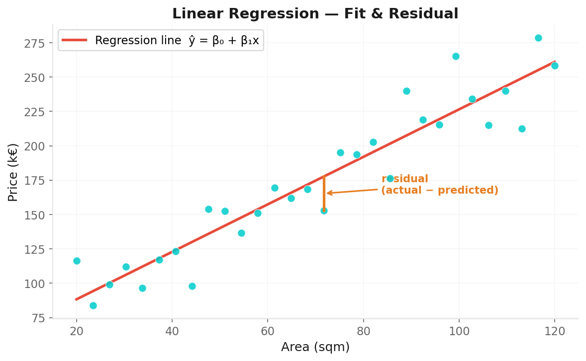
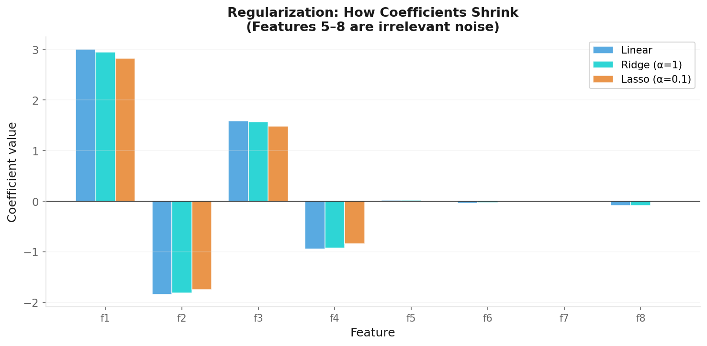

# Regression Models

**Applied Machine Learning — Session 2, Chapter 1**

<!--
~50 min. 10 min exercises. Session 2 starts here.
-->

---

# Regression: What We're Doing

**Predicting a continuous number.**

Examples:
- House price given area, location, rooms
- Energy consumption given temperature, day of week
- Patient recovery time given treatment, age, biomarkers

**How we measure success:**
- MAE: average absolute error
- RMSE: penalizes large errors
- R²: how much variance we explain

<!--
Ask: 'How would you estimate a house price?' — intuitive entry point.
-->

---

# Linear Regression

**Model:** ŷ = β₀ + β₁x₁ + β₂x₂ + ... + βₙxₙ

**Learning:** Minimize sum of squared residuals (OLS)



---

# Linear Regression

**Model:** ŷ = β₀ + β₁x₁ + β₂x₂ + ... + βₙxₙ

```python
from sklearn.linear_model import LinearRegression
model = LinearRegression()
model.fit(X_train, y_train)

print(model.coef_)       # feature weights
print(model.intercept_)  # bias
```

**Strengths:** Fast, interpretable, great baseline  
**Weakness:** Assumes linear relationship

<!--
~10 min. Make students interpret coefficients in plain language: 'each extra sqm → +X in price.'
-->

---

# Interpreting Coefficients

```python
for feature, coef in zip(feature_names, model.coef_):
    print(f'{feature}: {coef:.2f}')
```

**Reading:** If `area_sqm` has coefficient 3.5:  
→ Each additional square meter → +€3,500 in predicted price  
(all other features held constant)

This is the power of linear models: **interpretability**.

<!--
This is the power of linear models: interpretability. Business stakeholders love this.
-->

---

# Polynomial Regression

**What if the relationship is curved?**

Add polynomial features: x, x², x³, ...

```python
from sklearn.preprocessing import PolynomialFeatures
from sklearn.pipeline import Pipeline

model = Pipeline([
    ('poly', PolynomialFeatures(degree=2)),
    ('linear', LinearRegression())
])
```

⚠️ Higher degree → risk of overfitting  
→ Always cross-validate!

<!--
~7 min. Higher degree → overfitting risk. Degree 2 is often enough. Always cross-validate.
-->

---

# Regularization: Why?

With many features, linear models can overfit.

**Idea:** Penalize large coefficients.

| | Ridge (L2) | Lasso (L1) |
|-|-----------|-----------|
| Penalty | α × Σβᵢ² | α × Σ\|βᵢ\| |
| Effect | Shrinks β toward 0 | Sets some β to exactly 0 |
| Use when | All features useful | Many irrelevant features |

```python
from sklearn.linear_model import Ridge, Lasso
ridge = Ridge(alpha=1.0)   # alpha = regularization strength
lasso = Lasso(alpha=0.1)
```

<!--
~8 min. Penalty analogy: we want simple explanations, not overly complex ones.
-->

---

# Regularization Intuition



**With Ridge (L2):** Keeps all features but smaller weights.  
**With Lasso (L1):** Removes irrelevant features entirely → automatic feature selection.  
**α (alpha):** Higher = stronger regularization = simpler model.

<!--
Ridge: shrinks all coefficients (keeps all features).
Lasso: can zero out features (automatic feature selection).
-->

---

# Decision Tree Regression

**Idea:** Split the feature space into regions, predict the mean in each region.

```
Is area_sqm > 100?
   YES → Is rooms > 3? → predict 420k / predict 280k
   NO  → predict 195k
```

```python
from sklearn.tree import DecisionTreeRegressor
dt = DecisionTreeRegressor(max_depth=3)
```

- No feature scaling needed
- Captures non-linearity and interactions
- ⚠️ Prone to overfitting → limit `max_depth`

<!--
No scaling needed! Captures non-linearity and interactions. But overfits easily — limit max_depth.
-->

---

# Random Forest

**Wisdom of crowds — for models.**

- Train many decision trees on random subsets of data + features
- Predict = average of all trees

```python
from sklearn.ensemble import RandomForestRegressor
rf = RandomForestRegressor(n_estimators=100, random_state=42)
rf.fit(X_train, y_train)

# Bonus: feature importance!
importances = rf.feature_importances_
```

**Almost always better than a single tree.** ✅

<!--
'Wisdom of crowds' for models. Almost always better than a single tree.
-->

---

# Choosing a Regression Model

| Model | Interpretable | Non-linear | Scaling needed | Handles outliers |
|-------|:---:|:---:|:---:|:---:|
| Linear Regression | ✅ | ❌ | ✅ | ❌ |
| Ridge / Lasso | ✅ | ❌ | ✅ | ⚠️ |
| Decision Tree | ✅ | ✅ | ❌ | ✅ |
| Random Forest | ⚠️ | ✅ | ❌ | ✅ |

<!--
Ridge/Lasso: ⚠️ for outliers — regularization reduces overfitting but does NOT make the model outlier-robust.
The loss function is still squared error, so outliers still dominate. Only tree-based models are truly outlier-robust
because they use threshold-based splits, not distance calculations.
-->

**Rule of thumb:** Start with Linear/Ridge as baseline. Add tree models if non-linearity suspected.

<!--
Rule of thumb: start with Linear/Ridge as baseline, add tree models if non-linearity suspected.
-->

---

# Now: Exercises!

→ Open `03-exercises/ch04_regression_exercises.ipynb`

**Task:** Predict diabetes disease progression using four regression models.  
Compare their performance. Which model wins?

~10 minutes

<!--
~10 min. Diabetes dataset — different from examples (California housing). Forces transfer.
-->

---

# Key Takeaways

- Linear regression: interpretable, powerful baseline
- Polynomial regression: handles curves, watch for overfitting
- Ridge/Lasso: regularization prevents overfitting
- Random Forest: robust, non-linear, feature importances
- Always compare multiple models with cross-validation

<!--
Transition: 'What if the answer is a category, not a number? → Classification.'
-->

---
layout: end
---

# Next: Chapter 5

## Classification Models

> _"What if the answer is a category, not a number?"_
