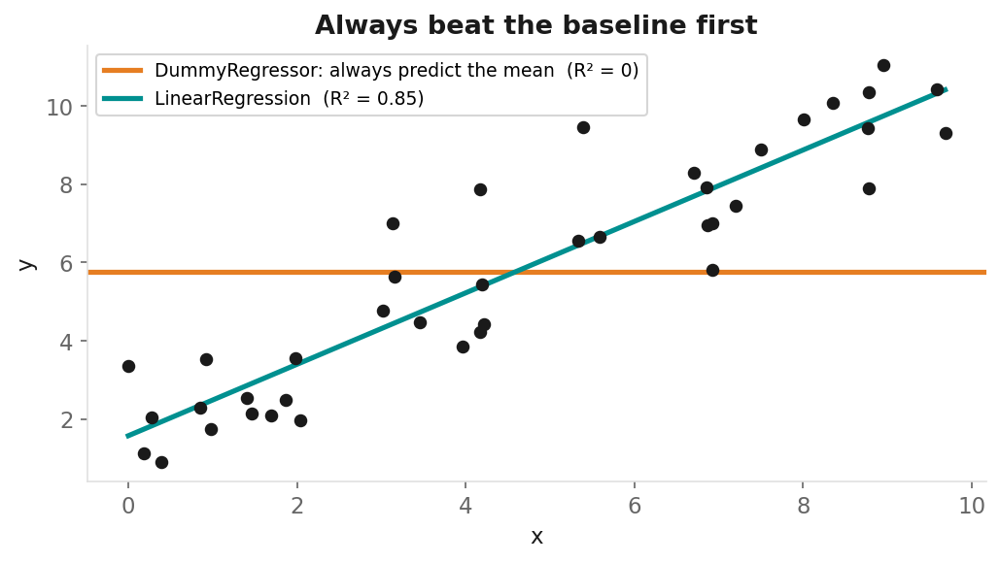
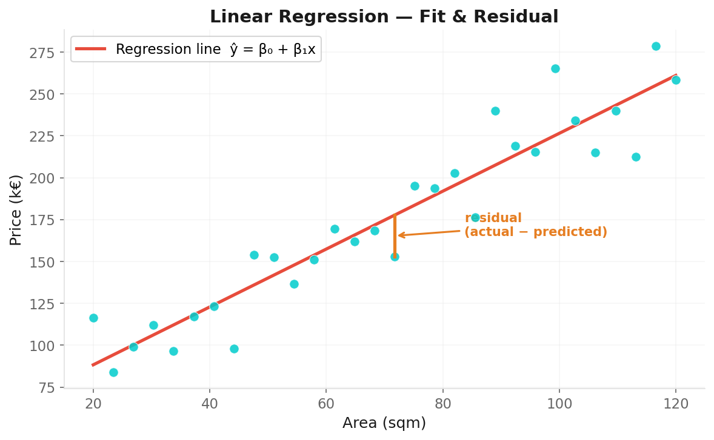
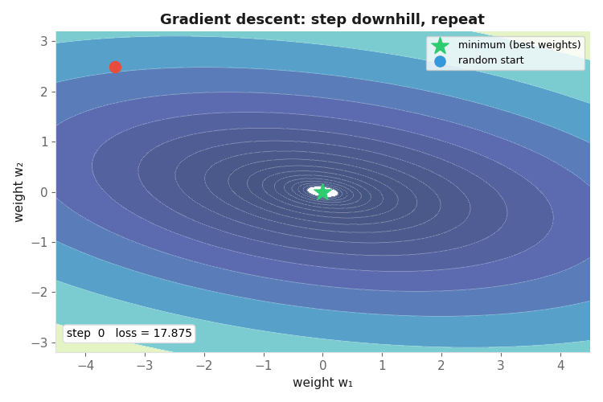
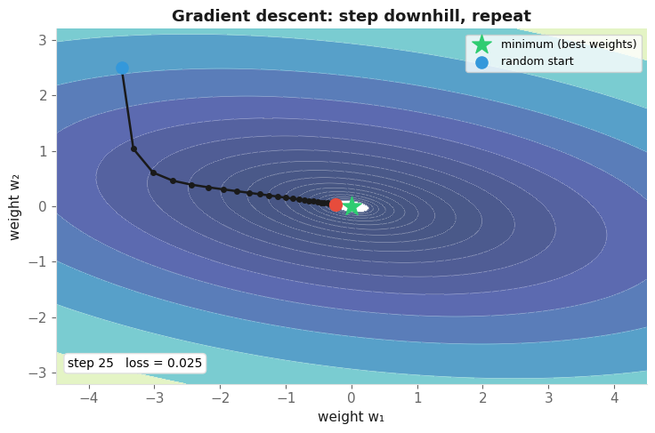
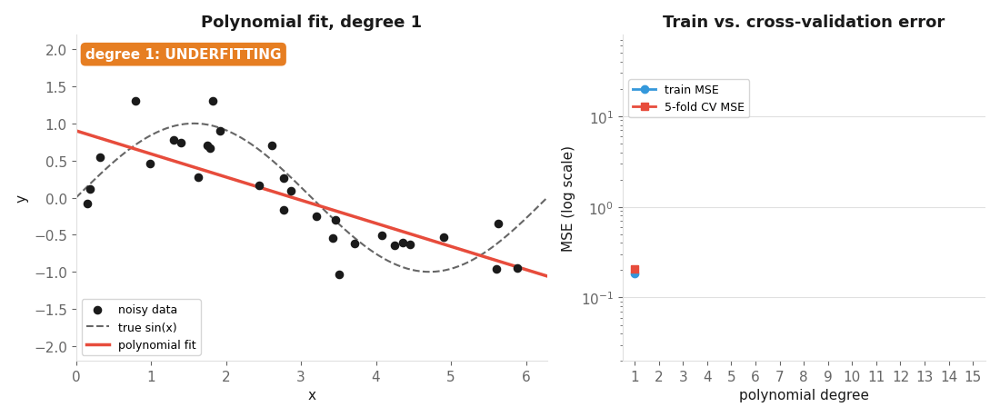
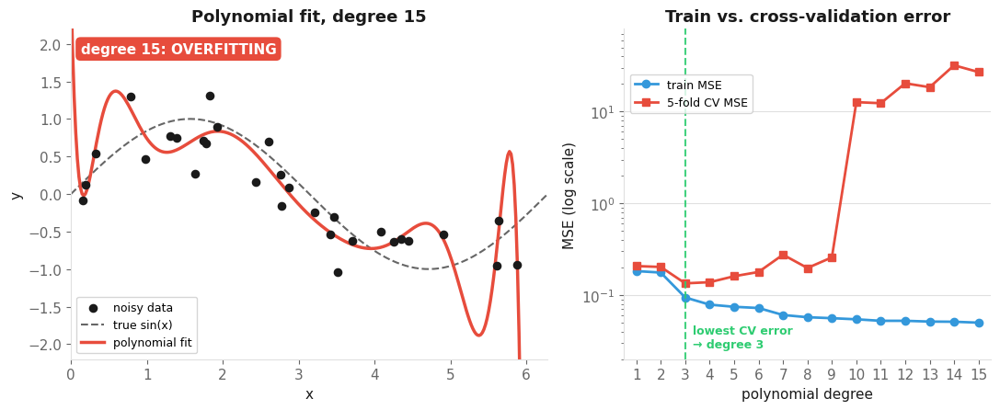
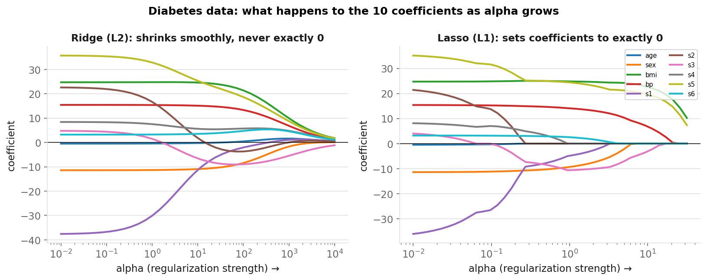

# Regression Models

**Applied Machine Learning — Session 2, Chapter 1**

<!--
~50 min total: 33 min slides + demo (interleaved), 2 min quiz, 10 min exercises, ~5 min buffer.
Session 2 starts here. Ch03 gave: train/test split, under/overfitting, KNN, CV as a concept.
Ch04 picks up overfitting (polynomial degree) and makes CV concrete — that is the "spiral".
Demo notebook: 02-examples/ch04_regression_examples.ipynb — open it now, run cell 1.
-->

---

# Regression: What We're Doing

**Predicting a continuous number.**

- House price given area, location, rooms
- Energy consumption given temperature, day of week
- Patient recovery time given treatment, age, biomarkers

**How we measure success** *(details in Ch06)*:

| Metric | Meaning | Units |
|--------|---------|-------|
| MAE | average absolute error | same as y |
| RMSE | like MAE, but big errors count more | same as y |
| R² | share of variance explained; 1 = perfect, 0 = "just predict the mean" | none |

<!--
~3 min. Ask: 'How would YOU estimate a house price?' → students name features (size, location) and a rule of thumb
("about 8k CHF per m²") — that IS a linear model. Write ŷ = a + b·area on the board.
Then: 'How would you know your rule is any good?' → you compare against actual prices → metrics.
Keep metrics to the table; do not derive them here.
-->

---

# Baseline First



```python
from sklearn.dummy import DummyRegressor
DummyRegressor(strategy='mean').fit(X_train, y_train)   # R² = 0 by definition
```

**Any model that is not clearly better than "predict the average" has learned nothing.**

<!--
~2 min. New habit for the whole course: every evaluation table starts with a dummy row.
On California housing the dummy is off by ~$90k on average — that is the number to beat.
Ask: 'What is R² of the baseline?' → 0. 'Can R² be negative?' → yes, if you are worse than the mean (Ch06).
-->

---

# Linear Regression

**Model:** ŷ = β₀ + β₁x₁ + β₂x₂ + ... + βₙxₙ

**Learning:** find the βs that make the squared residuals as small as possible (OLS)



<!--
~3 min. Point at the picture: residual = vertical distance from point to line. Squared, summed = the loss (next slide).
Ask: 'Why squared and not absolute?' → smooth, one unique best line, closed-form solution; big errors punished more.
-->

---

# Linear Regression in sklearn — and Reading β

```python
from sklearn.linear_model import LinearRegression
model = LinearRegression().fit(X_train, y_train)
model.coef_        # β₁ … βₙ
model.intercept_   # β₀
```

**Reading a coefficient:** target in **k€**, feature `area_sqm` with β = 3.5

→ each additional m² adds **+3.5 k€ = +3 500 €** to the predicted price, *all other features held constant*

**Careful:** raw coefficients depend on the units of the feature. To ask *"which feature matters most?"* standardize
first (`StandardScaler` in a pipeline) → β = change per **one standard deviation**.

<!--
~3 min. Do the unit arithmetic out loud — students routinely mix "3.5" with "3 500".
Pitfall to name: coefficient size ≠ importance unless features are on the same scale. That is why the demo pipelines
put a StandardScaler in front of every linear model (Ridge/Lasso NEED it, LinearRegression predictions do not change).
Business stakeholders love this slide — 'interpretability' is the selling point of linear models.
-->

---

# What Does "Best Line" Mean? — The Loss Function

**Mean Squared Error** — the training loss of linear regression:

```
MSE(β) = (1/n) Σ (yᵢ − ŷᵢ)²        with  ŷᵢ = β₀ + β₁x₁ᵢ + …
```

Training = **finding the β that minimizes the loss.**

- Linear regression: closed-form solution (one matrix formula) ✅
- Almost everything else (logistic regression, neural nets, boosting): iterative → **gradient descent**

<!--
~2 min. (Moved here from Ch03.) The loss is a function of the parameters, not of the data — the data is fixed.
Draw the bowl: x-axis = β₁, y-axis = loss. 'Where is the best β?' → bottom of the bowl → next slide shows how to get there.
Cross-entropy for classification comes in Ch05 as a mention only.
-->

---

# How Do Models Find the Minimum? Gradient Descent

<div class="flex justify-center">
  
  
</div>

**Rule:** w ← w − η · ∇L(w) — step downhill, repeat. η = learning rate: too small = slow, too big = overshoot.

<!--
~2 min hook only — no math beyond the one-liner. Full animation with 3 learning rates: 0-animations/03_gradient_descent.ipynb.
Say: sklearn's LinearRegression does NOT do this (closed form). LogisticRegression, SGDRegressor and every neural net do.
Ask: 'Why does the path go steeply down first, then crawl?' → the bowl is elongated; that is why scaling features helps
gradient-based training (Ch02 callback).
-->

---

# Overfitting Revisited: Polynomial Regression

**What if the relationship is curved?** Add powers of x, then fit a *linear* model on them.

```python
from sklearn.preprocessing import PolynomialFeatures, StandardScaler
from sklearn.pipeline import make_pipeline
model = make_pipeline(StandardScaler(),        # scale x BEFORE powering!
                      PolynomialFeatures(degree=3),
                      LinearRegression())
```

Ch03 showed you degree 1 vs 15 on the sine wave. **Which degree is right — and how do we know?**

<!--
~2 min. Callback to Ch03 (underfit / overfit pictures). Now we answer the open question with numbers.
Pitfall: PolynomialFeatures on unscaled x → numerically unstable at high degree. Hence the scaler in front.
Also mention: with several features, degree 3 creates x₁x₂, x₁²x₃, … — feature count explodes → overfitting risk.
-->

---

# Train Error Lies — Cross-Validation Error Tells the Truth

<div class="flex justify-center">
  
  
</div>

<!--
~3 min. Let the GIF run once in silence, then narrate the second loop:
blue (train MSE) only ever goes down → picking degree by train error always says "15".
red (CV MSE) has a minimum → that is the degree to choose (here 3-4).
Ask BEFORE it reaches degree 10: 'What will the red curve do?' Most predict "go up" — good, then they see it explode.
Full animation: 0-animations/05_polynomial_overfitting.ipynb. Same figure lives in the demo notebook, section 1.
-->

---

# Cross-Validation in Practice

```python
from sklearn.model_selection import cross_val_score, KFold

cv = KFold(n_splits=5, shuffle=True, random_state=42)     # shuffle! sorted data → biased folds
scores = cross_val_score(model, X, y, cv=cv, scoring='r2')
print(f'{scores.mean():.3f} ± {scores.std():.3f}')
```

- Every sample is test data **exactly once** → 5 scores instead of 1
- Report **mean ± std** — the std tells you whether a difference between two models is real
- The whole `Pipeline` goes into `cross_val_score` → scaling is re-fit inside every fold (no leakage)

<!--
~2 min. Ch03 introduced the picture of 5 folds; this is the code students will use in the exercise.
Two rules to repeat: (1) shuffle=True unless the data is a time series, (2) pass the pipeline, not the scaled array
(Ch02 leakage callback: 'impute/scale after split' — CV does the split for you, so the scaler must be inside).
'Model A: 0.48 ± 0.08, Model B: 0.47 ± 0.08 — which is better?' → cannot say; difference ≪ std.
-->

---

# Regularization: Why?

With many (correlated) features and little data, linear models overfit: **huge coefficients that cancel each other out.**

**Idea:** add a penalty for large coefficients to the loss.

| | Ridge (L2) | Lasso (L1) |
|-|-----------|-----------|
| Loss | MSE + α · Σβᵢ² | MSE + α · Σ\|βᵢ\| |
| Effect | shrinks all β smoothly toward 0 | sets some β to **exactly 0** |
| Use when | all features somewhat useful, correlated | you suspect many irrelevant features |

```python
from sklearn.linear_model import Ridge, Lasso
Ridge(alpha=1.0)      # alpha = regularization strength (needs scaled features!)
Lasso(alpha=0.1)
```

<!--
~3 min. Analogy: 'Occam's razor as a fine' — every unit of coefficient costs α; the model keeps only what pays for itself.
Ask: 'What happens as α → 0? As α → ∞?' → plain OLS / all β = 0 (predict the mean = the baseline!).
Must scale: otherwise a feature measured in mm gets a huge β and is punished for its unit, not its importance.
-->

---

# Watch the Coefficients Shrink



**Ridge** never reaches zero — **Lasso** kills features one by one → automatic feature selection.

<!--
~2 min. Diabetes data, 10 features (used again in the exercise). Read left to right = stronger regularization.
Point at Lasso: around alpha ≈ 1 several features are already gone (age, s2, …); that is the model students fit in Task 2.
Note: on the 20k-row California data (demo) alpha=1 does nothing visible — the penalty is tiny vs. the data.
That is a feature, not a bug: regularization matters when data is scarce.
-->

---

# "Always Cross-Validate to Choose α" — Here Is How

```python
from sklearn.linear_model import RidgeCV
model = make_pipeline(StandardScaler(),
                      RidgeCV(alphas=np.logspace(-3, 3, 30), cv=5))   # tries 30 alphas × 5 folds
model.fit(X_train, y_train)
model[-1].alpha_          # the winner
```

Same idea for any hyperparameter of any model:

```python
from sklearn.model_selection import GridSearchCV
GridSearchCV(RandomForestRegressor(), {'max_depth': [3, 5, 10]}, cv=5).fit(X_train, y_train)
```

**Never pick hyperparameters on the test set — the test set is for the final answer only.**

<!--
~2 min. This closes the loop: slides used to say "cross-validate alpha" without ever showing it.
RidgeCV / LassoCV are the fast, built-in versions; GridSearchCV is the general tool (Ch12 capstone will use it).
Ask: 'Why not just try alphas and look at test R²?' → then the test set was used for choosing → it is no longer unseen.
-->

---

# Decision Tree Regression

**Idea:** split the feature space into boxes; predict the **mean of the training targets** in each box.

```
area_sqm > 100 ?
   yes → rooms > 3 ?  → 420 k€ / 280 k€
   no  → 195 k€
```

```python
from sklearn.tree import DecisionTreeRegressor
DecisionTreeRegressor(max_depth=3, random_state=42)
```

- No feature scaling needed · captures non-linearity and interactions
- ⚠️ Deep trees memorize → limit `max_depth` (that is *its* regularization knob)

<!--
~2 min. Trees will be the star of Ch05; here just the regression flavour.
Ask: 'What does a depth-1 tree predict?' → two constants — a step function. 'Depth 20?' → one leaf per house → overfit.
Connect: max_depth plays the same role as polynomial degree and 1/alpha — the model-complexity dial.
-->

---

# Random Forest: Wisdom of Crowds

- Train **many** trees, each on a random subset of rows **and** features
- Prediction = **average** of all trees → the individual trees' errors cancel out

```python
from sklearn.ensemble import RandomForestRegressor
rf = RandomForestRegressor(n_estimators=100, random_state=42).fit(X_train, y_train)
rf.feature_importances_       # bonus: which features does it use?
```

**Almost always better than a single tree** — at the cost of interpretability.

<!--
~2 min. 'Ask 100 mediocre experts and average' — averaging reduces variance, which is exactly the tree's weakness.
Feature importances: useful, but model-specific — in the exercise the forest and the linear model can disagree on
the top feature. That is a good discussion point, not an error.
Demo (notebook §6-8): RF beats linear on California housing (R² 0.78 vs 0.60); on diabetes (exercise) it does NOT.
-->

---

# Choosing a Regression Model

| Model | Interpretable | Non-linear | Needs scaling | Robust to outliers |
|-------|:---:|:---:|:---:|:---:|
| Linear Regression | ✅ | ❌ | ❌ (only for comparing β) | ❌ |
| Ridge / Lasso | ✅ | ❌ | ✅ | ❌ |
| Decision Tree | ✅ | ✅ | ❌ | ⚠️ (features yes, target no) |
| Random Forest | ⚠️ | ✅ | ❌ | ⚠️ |

**Rule of thumb:** baseline → Linear/Ridge → add a forest if you suspect non-linearity → keep the simplest model that is *good enough*.

<!--
~1 min. Corrected from the old version: OLS predictions do not change with scaling — scaling is for interpretability
and for Ridge/Lasso. Squared-error models (all four) are still hurt by outliers in y; trees only ignore outliers in X
because splits are thresholds.
-->

---

# Quick Check

**Your colleague reports:** *"Degree-12 polynomial: train R² = 0.99. Ship it!"*

1. What single number would you ask for?
2. RidgeCV picks α = 0.001 out of [0.001 … 1000]. What does that tell you?
3. Two models: 0.481 ± 0.085 and 0.478 ± 0.083 (5-fold R²). Which is better?

<v-click>

1. **CV (or test) R²** — train R² of a flexible model tells you nothing about new data
2. Regularization does not help here — the data is plentiful / the model does not overfit (or the grid should extend lower)
3. **Cannot tell** — the difference (0.003) is far smaller than the fold-to-fold noise (±0.08)

</v-click>

<!--
~2 min. Think-pair-share: 60 s in pairs, then cold-call one pair per question. Click to reveal.
Q3 is the diabetes exercise result — they will see these numbers in Bonus A.
-->

---

# Now: Exercises!

→ Open `03-exercises/ch04_regression_exercises.ipynb`

**Dataset:** diabetes progression (442 patients, 10 features) — *not* the housing data → transfer, not copy-paste.

| Task | Content |
|------|---------|
| Task 1 | baseline + linear regression (3 min) |
| Task 2 | Ridge vs Lasso, which features does Lasso drop? (3 min) |
| Task 3 | random forest + feature importances (4 min) |
| Bonus | CV comparison · RidgeCV · predicted-vs-actual |

A `score()` helper is provided — no metric boilerplate.

<!--
~10 min. Walk around. Typical stalls: forgetting .fit before .predict; Pipeline step tuple syntax; using X instead of X_test.
Fast finishers → Bonus A first (CV) — its result (linear ≈ RF, all within noise) is the discussion point for the debrief.
Debrief (1 min): 'Who got RF > linear on the test set? On CV?' → the forest does NOT win here. Why? small n, near-linear target.
-->

---

# Key Takeaways

- **Baseline first** — `DummyRegressor`; R² = 0 is the floor
- Linear regression: interpretable — β = change in y per unit (or per std) of x
- Training = minimizing a loss (MSE); gradient descent walks downhill
- **Model complexity** (degree, 1/α, depth) is a dial: train error always drops, **CV error tells you where to stop**
- Ridge shrinks, Lasso selects; choose α with `RidgeCV` / `GridSearchCV`, never on the test set
- Random Forest: robust non-linear default, feature importances

<!--
Transition: 'What if the answer is a category, not a number? → Classification.'
Spiral note for yourself: overfitting (Ch03) → quantified with CV here → the same complexity dial reappears in Ch05
as tree depth / k / C, and in Ch06 as the metric you optimize.
-->

---
layout: end
---

# Next: Chapter 5

## Classification Models

> _"What if the answer is a category, not a number?"_
