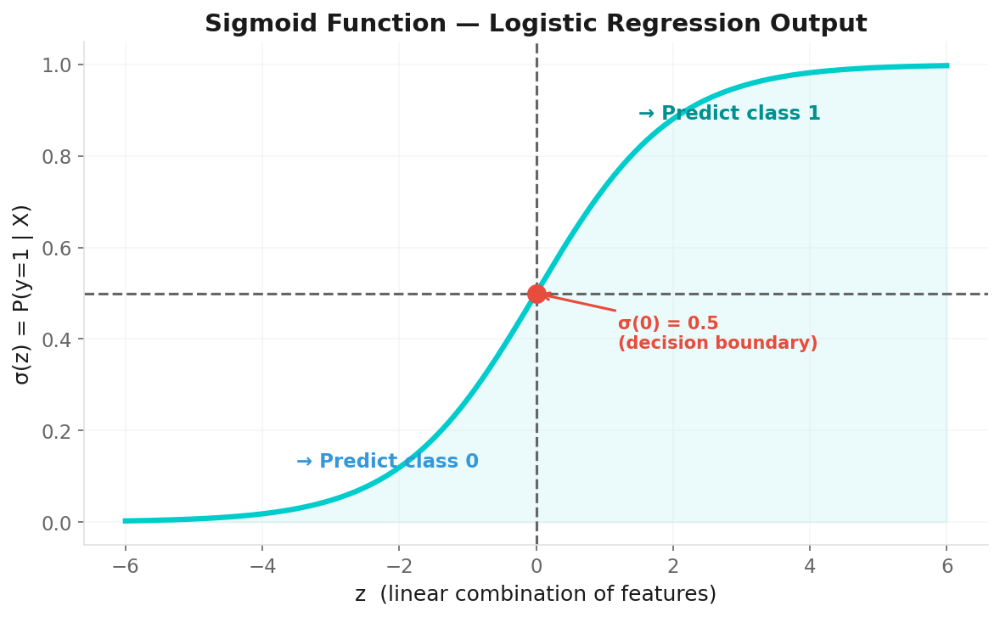
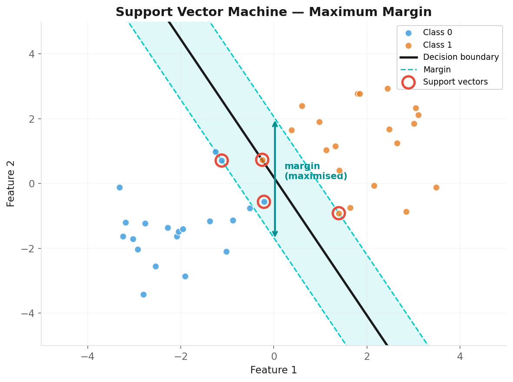
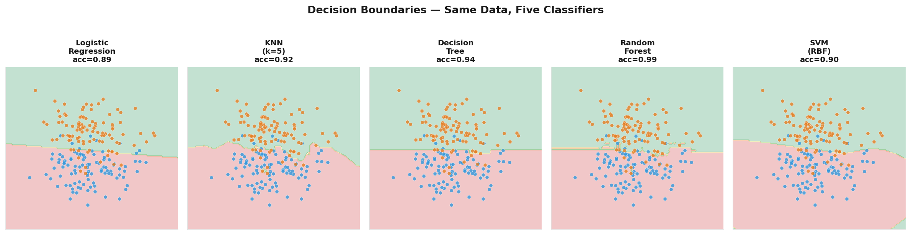

# Classification Models

**Applied Machine Learning — Session 2, Chapter 2**

<!--
~50 min. 12 min exercises (extra time — classification is complex).
-->

---

# Classification: What We're Doing

**Predicting a discrete category.**

- Binary: Spam / Not Spam; Disease / Healthy
- Multi-class: Iris species; Digit recognition (0–9)

**What the model outputs:**
- Hard prediction: `model.predict(X)` → class label
- Probability: `model.predict_proba(X)` → [P(class 0), P(class 1), ...]

<!--
Binary (2 classes) vs multi-class (3+). Model can output hard labels or probabilities.
-->

---

# Logistic Regression

**A classification model, not regression!**

Models the probability of class membership:
```
P(y=1 | X) = σ(β₀ + β₁x₁ + ... + βₙxₙ)
```

where σ is the sigmoid function: σ(z) = 1 / (1 + e^-z)

```python
from sklearn.linear_model import LogisticRegression
model = LogisticRegression(max_iter=1000)
model.fit(X_train, y_train)
proba = model.predict_proba(X_test)  # ← probabilities
```

**Linear decision boundary** — fast, interpretable, great baseline.

<!--
~8 min. Address the name confusion: 'Despite the name, this is a classification model!'
Linear decision boundary.
-->

---

# The Sigmoid Function



- σ(0) = 0.5 → decision boundary
- σ(very large) → 1
- σ(very negative) → 0

**Decision:** If P(y=1) > 0.5 → predict class 1

<!--
S-shape maps any number to [0,1]. Above 0.5 → class 1.
Threshold can be adjusted (Ch06).
-->

---

# K-Nearest Neighbors (KNN)

**"Tell me who your neighbors are, and I'll tell you what you are."**

Algorithm:
1. Find the k closest training samples (by distance)
2. Predict the majority class among those k neighbors

```python
from sklearn.neighbors import KNeighborsClassifier
knn = KNeighborsClassifier(n_neighbors=5)
```

⚠️ **Requires feature scaling** — distance is scale-sensitive!  
⚠️ Slow at prediction time for large datasets

<!--
~7 min. 'Vote among your neighbors.' Requires feature scaling — distance is scale-sensitive!
-->

---

# Choosing k in KNN

```
k = 1 → very complex, overfitting
k = large → very smooth, underfitting
k = √n → common rule of thumb
```

Always cross-validate to find the best k!

```python
from sklearn.model_selection import cross_val_score
for k in [1, 3, 5, 7, 10]:
    score = cross_val_score(KNeighborsClassifier(k), X, y, cv=5).mean()
    print(f'k={k}: {score:.3f}')
```

<!--
k=1 overfits (too complex). Large k underfits (too smooth). Always cross-validate.
-->

---

# Decision Tree Classifier

**Learns a series of yes/no questions.**

```
Is petal_length < 2.5?
   YES → Setosa ✓
   NO  → Is petal_width < 1.8?
              YES → Versicolor ✓
              NO  → Virginica ✓
```

```python
from sklearn.tree import DecisionTreeClassifier, plot_tree
dt = DecisionTreeClassifier(max_depth=3)
dt.fit(X_train, y_train)
plot_tree(dt, feature_names=feature_names, filled=True)
```

**Perfectly interpretable** — you can explain every decision.

<!--
~8 min. Perfectly interpretable — you can explain every decision.
Great for business contexts.
-->

---

# Random Forest Classifier

**Many trees → better, more robust predictions.**

```python
from sklearn.ensemble import RandomForestClassifier
rf = RandomForestClassifier(n_estimators=100, random_state=42)
rf.fit(X_train, y_train)

# Which features matter most?
importances = pd.Series(rf.feature_importances_, index=feature_names)
importances.sort_values().plot(kind='barh')
```

**Ensemble power:**
- Reduces variance (averaging reduces noise)
- More robust to outliers
- Less prone to overfitting than single DT

<!--
Ensemble power: reduces variance, more robust to outliers.
Feature importances are a bonus.
-->

---

# Support Vector Machines (SVM)

**Find the hyperplane with maximum margin.**



```python
from sklearn.svm import SVC
svm = SVC(kernel='rbf', C=1.0, probability=True)
```

- **C:** Smaller = wider margin (more regularization)
- **kernel='rbf':** Non-linear boundaries (very powerful)

<!--
~5 min. Keep intuitive — 'find the widest highway between classes.'
Kernel trick for non-linear boundaries.
-->

---

# Decision Boundaries: What Each Model Learns



→ See examples notebook for visual comparison!

<!--
This is a key visualization. Run it live — students see how each model draws different boundaries.
-->

---

# Now: Exercises!

→ Open `03-exercises/ch05_classification_exercises.ipynb`

**Task:** Classify wine types using multiple classifiers.  
Apply multiple models, compare performance.

~12 minutes

<!--
~12 min. Wine dataset (3 classes) — harder than binary examples.
Students apply multiple models.
-->

---

# Key Takeaways

- Logistic Regression: linear, interpretable, probabilistic
- KNN: simple, local, needs scaling
- Decision Tree: rule-based, interpretable, overfits easily
- Random Forest: robust ensemble, feature importances
- SVM: maximum margin, powerful with kernels

<!--
Transition: 'Which model is best? That depends on how you measure it — next: Metrics.'
-->

---
layout: end
---

# Next: Chapter 6

## Metrics & Evaluation

> _"Which model is actually better? It depends on how you measure it."_
