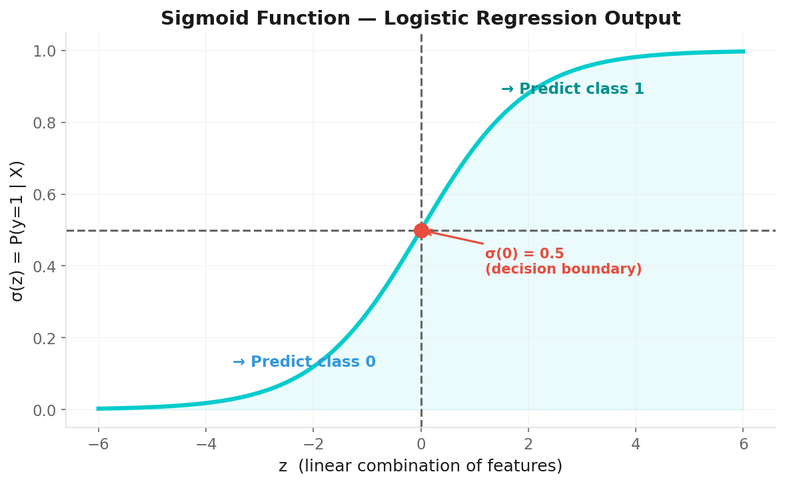
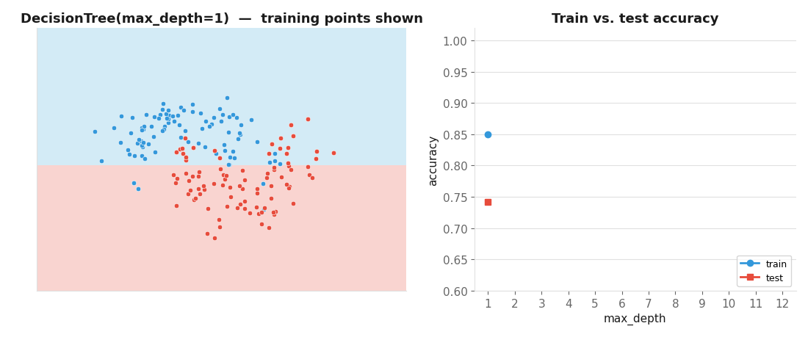
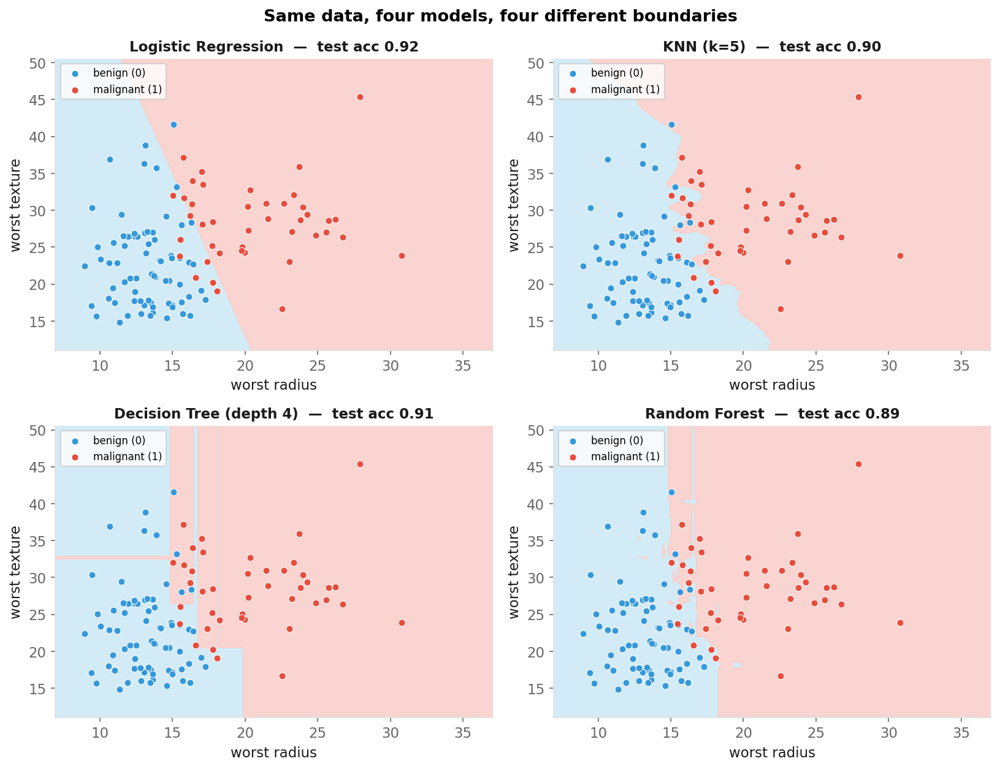
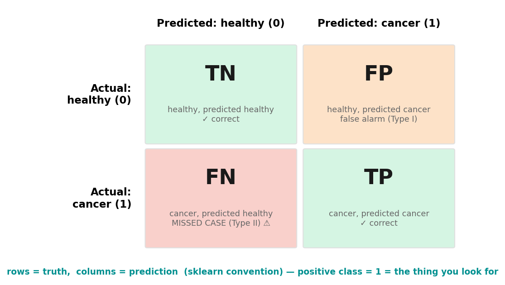
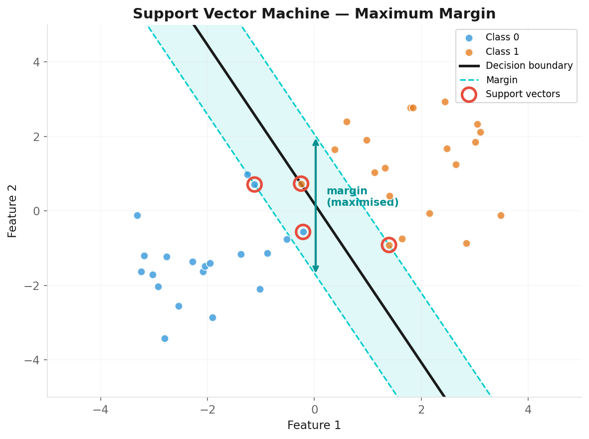

# Classification Models

**Applied Machine Learning — Session 2, Chapter 2**

<!--
~50 min total: 30 min slides + demo (interleaved), 2 min quiz, 12 min exercises, ~6 min buffer.
Demo notebook: 02-examples/ch05_classification_examples.ipynb — open now, run cell 1.
KNN was taught in Ch03 → 2-min recap only. SVM is an appendix slide + bonus task, not core.
-->

---

# Classification: What We're Doing

**Predicting a discrete category.**

- **Binary:** spam / not spam · malignant / benign · churn / stay
- **Multi-class:** iris species · digits 0–9 · which of 3 grape cultivars (today's exercise)

**Two kinds of output:**

```python
model.predict(X)         # hard label:   1
model.predict_proba(X)   # probabilities: [0.08, 0.92]  → row sums to 1
```

The probability is often the more useful thing (Ch06: we can move the 0.5 threshold).

<!--
~3 min. Opener: 'What does a spam filter do?' → looks at features (words, sender, links) → yes/no.
'Would you rather it says "spam" or "87 % spam"?' → the probability lets you set the cut-off yourself.
Same fit / predict API as regression — only the target type changes.
-->

---

# Baseline First: The Majority Class

```python
from sklearn.dummy import DummyClassifier
DummyClassifier(strategy='most_frequent').fit(X_train, y_train).score(X_test, y_test)
```

Breast cancer data: 63 % benign → **the dummy scores 63 % accuracy by always saying "benign".**

Every real model must beat that number — and (spoiler for Ch06) accuracy alone will not tell you *how* good it is.

<!--
~2 min. Same habit as Ch04. Ask: 'A model with 90 % accuracy on a 95/5 dataset — good?' → worse than the dummy!
Plants the seed for the accuracy paradox in Ch06; do not go further here.
-->

---

# Logistic Regression — a Classifier, Despite the Name

Models the **probability** of class 1 with a linear score squashed through the sigmoid:

```
P(y = 1 | x) = σ(β₀ + β₁x₁ + … + βₙxₙ),      σ(z) = 1 / (1 + e⁻ᶻ)
```

```python
from sklearn.linear_model import LogisticRegression
model = make_pipeline(StandardScaler(), LogisticRegression(max_iter=1000))
model.fit(X_train, y_train)
model.predict_proba(X_test)[:, 1]      # P(class 1)
```

- **Linear decision boundary** — fast, interpretable (β = effect on log-odds), great baseline
- Trained by gradient descent on the *cross-entropy* loss (the classification cousin of MSE)

<!--
~4 min. Address the name head-on: 'regression' because it fits a linear score; the OUTPUT is a class.
Scaling: needed for the solver to converge quickly and for comparable β — hence the pipeline.
Multi-class: sklearn handles it (softmax) — no extra work in the exercise.
Cross-entropy: mention only — 'penalizes confident wrong answers heavily'; no formula.
-->

---

# The Sigmoid



- σ(0) = 0.5 → the **decision boundary** is where the linear score is 0
- σ(+large) → 1, σ(−large) → 0
- `predict()` = "P > 0.5" — the 0.5 is a *choice* (Ch06)

<!--
~2 min. Trace with a finger: score −3 → 5 %, 0 → 50 %, +3 → 95 %.
Ask: 'Where in feature space is the boundary?' → where β₀ + β·x = 0 → a line/plane → linear boundary.
-->

---

# KNN — 2-Minute Recap from Ch03

**"Look at the k nearest training points, take a majority vote."**

```python
from sklearn.neighbors import KNeighborsClassifier
make_pipeline(StandardScaler(), KNeighborsClassifier(n_neighbors=5))
```

- Distances → **needs scaling** · no real training phase, slow to predict on big data
- **k is the complexity dial:** k = 1 memorizes (overfit), huge k → everything becomes the majority class (underfit)
- Choose k with cross-validation — exactly like degree / α in Ch04

<!--
~2 min, recap only (Ch03 covered KNN in depth, incl. the k-animation). If the class hesitates on 'why scaling',
spend 30 s: proline ~1000 vs hue ~1 → distance is all proline. Otherwise move on.
-->

---

# Decision Tree Classifier

**A sequence of yes/no questions**, chosen to make the resulting groups as *pure* as possible (Gini impurity).

```
petal_length < 2.5 ?
   yes → setosa ✓
   no  → petal_width < 1.8 ?  yes → versicolor ✓ / no → virginica ✓
```

```python
from sklearn.tree import DecisionTreeClassifier, plot_tree
dt = DecisionTreeClassifier(max_depth=3, random_state=42).fit(X_train, y_train)
plot_tree(dt, feature_names=feature_names, class_names=class_names, filled=True)
```

**Fully interpretable** — every prediction is a readable rule. No scaling needed.

<!--
~3 min. Demo notebook §5: plot_tree on breast cancer — read one root-to-leaf path aloud as a sentence.
random_state matters even for a single tree (ties between equally good splits are broken randomly).
Ask: 'What is the equivalent of polynomial degree here?' → max_depth → next slide.
-->

---

# The Complexity Dial Again: Tree Depth



<!--
~2 min. Third time students see the same shape (Ch03 KNN k, Ch04 degree, now depth): train accuracy → 1.0,
test accuracy peaks early then flattens/drops, boundary turns into confetti.
Ask: 'Which depth would you ship?' → around the test-accuracy peak (5-6), not 12.
This is the reason forests exist → next slide.
-->

---

# Random Forest Classifier

**Many deep trees, each on random rows + random feature subsets → majority vote.**

```python
from sklearn.ensemble import RandomForestClassifier
rf = RandomForestClassifier(n_estimators=100, random_state=42).fit(X_train, y_train)
pd.Series(rf.feature_importances_, index=feature_names).nlargest(10).plot.barh()
```

- Averaging many over-fitted trees **cancels their individual noise** → low variance, rarely overfits badly
- Handles mixed feature types, no scaling, gives **feature importances**
- Almost always beats a single tree; costs interpretability

<!--
~2 min. Wisdom of crowds — the same trick as in Ch04. Demo notebook §6: top-10 importances on breast cancer.
Caveat worth one sentence: importances favour features with many distinct values; they are 'what this model used',
not causal truth.
-->

---

# Decision Boundaries: What Each Model Learned



<!--
~3 min. Demo notebook §4 draws this live with DecisionBoundaryDisplay (2 features so we can see the plane).
Linear (LogReg) · local/wiggly (KNN) · axis-parallel boxes (tree) · smoothed boxes (forest).
Ask: 'Which one would you trust most for a NEW point in the empty top-right corner?' → the simple ones extrapolate
sanely; KNN/trees just repeat the nearest training data. More complex boundary ≠ better.
-->

---

# Before the Exercise: Reading a Confusion Matrix



```python
ConfusionMatrixDisplay.from_predictions(y_test, y_pred, display_labels=class_names)
print(classification_report(y_test, y_pred))     # precision / recall / F1 per class
```

<!--
~4 min. Students need this for Tasks 3-4; Ch06 goes deep. Three things only:
(1) rows = truth, columns = prediction; diagonal = correct. (2) Positive class = 1 = the thing you look for —
CHECK it: sklearn's breast-cancer data has 1 = benign, we flipped it in the demo (y = 1 - target).
(3) classification_report = one row per class: precision 'when I say X, am I right?', recall 'did I find all X?'.
For 3 wine classes it is a 3×3 matrix — off-diagonal cells show which classes get mixed up.
-->

---

# Quick Check

1. A tumour is malignant, the model says "benign". Which cell of the confusion matrix is that — and is it the expensive error?
2. Your KNN accuracy jumps from 0.72 to 0.95 after adding `StandardScaler`. Why?
3. Which model would you pick if the customer must be able to *explain every decision* to a regulator?

<v-click>

1. **False negative** (true = 1, predicted = 0) — yes: a missed cancer is far worse than a false alarm
2. One large-range feature dominated the distance; scaling makes every feature count equally
3. **Decision tree** (or logistic regression) — not the forest or KNN

</v-click>

<!--
~2 min. Pairs, 60 s, then reveal. Q1 previews Ch06 (recall). If Q2 confuses, redo the proline example.
-->

---

# Now: Exercises!

→ Open `03-exercises/ch05_classification_exercises.ipynb`

**Dataset:** `load_wine` — 178 wines, 13 chemical measurements, **3 grape cultivars** (multi-class!)

| Task | Content |
|------|---------|
| Task 1 | baseline + logistic regression pipeline (3 min) |
| Task 2 | KNN pipeline (2 min) |
| Task 3 | random forest + `classification_report` (4 min) |
| Task 4 | confusion matrix of a *weak* tree — which classes get mixed up? (3 min) |
| Bonus | 5-fold CV comparison · SVM |

<!--
~12 min. Task 4 uses a depth-2 tree ON PURPOSE: the forest is perfect on the 36 test wines and its matrix is boring.
Debrief (1 min): 'Which two cultivars does the tree confuse?' (class_1 → class_0) and 'why is the CV std so large?'
(178 samples → each fold ≈ 36 wines → one wine = 2.8 %).
-->

---

# Key Takeaways

- **Baseline first** — the majority class sets the floor
- Logistic Regression: linear boundary, outputs probabilities, strong baseline
- KNN: local, needs scaling, k = complexity dial
- Decision Tree: readable rules; depth = complexity dial · Random Forest: many trees, robust, importances
- Same data → very different boundaries; more complex ≠ better
- Confusion matrix: rows = truth, positive class = what you look for

<!--
Transition: 'Which model is best? Depends on how you measure it — and accuracy is often the wrong ruler.' → Ch06.
-->

---

# Appendix: Support Vector Machines (Bonus)

**Find the separating boundary with the widest margin** to the nearest points (the *support vectors*).



```python
from sklearn.svm import SVC
make_pipeline(StandardScaler(), SVC(kernel='rbf', C=1.0))   # rbf = smooth curved boundaries
```

`C` small → wide margin (more regularization) · `rbf` → non-linear · needs scaling · slow beyond ~50k rows

<!--
Not core (cut for time). Show only if ahead of schedule or if a student asks. Bonus B in the exercise uses it.
Keep to the picture: 'the widest highway between the two classes'.
-->

---
layout: end
---

# Next: Chapter 6

## Metrics & Evaluation

> _"Which model is actually better? It depends on how you measure it."_
