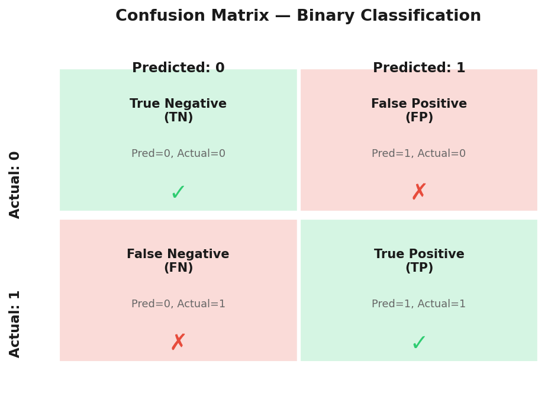
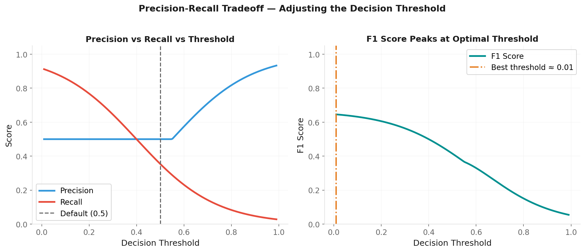
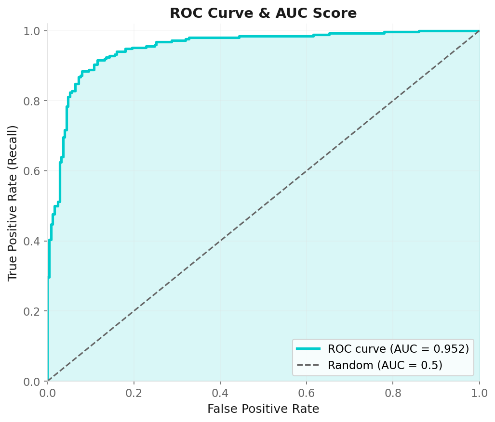

# Metrics & Evaluation

**Applied Machine Learning — Session 2, Chapter 3**

<!--
~50 min. 10 min exercises. Often underestimated — protect time for this chapter.
-->

---

# The Metric Defines Success

> A model can only be as good as your definition of "good."

**Example:** 99% of patients are healthy.  
→ Model that always predicts "healthy" = 99% accurate.  
→ But it catches 0% of sick patients.

**Choosing the wrong metric = optimizing for the wrong thing.**

<!--
~3 min. The accuracy paradox is memorable: 99% accuracy but 0% recall. Open with this.
-->

---

# Regression Metrics

| Metric | Formula | Units | Best |
|--------|---------|-------|------|
| MAE | (1/n)Σ\|yᵢ - ŷᵢ\| | Same as y | Low |
| MSE | (1/n)Σ(yᵢ - ŷᵢ)² | y² | Low |
| RMSE | √MSE | Same as y | Low |
| R² | 1 - SS_res/SS_tot | Unitless | → 1 |

```python
from sklearn.metrics import mean_absolute_error, mean_squared_error, r2_score
```

**RMSE vs MAE:** RMSE penalizes large errors more (because of squaring).  
Use RMSE when big mistakes are costly.

<!--
~8 min. RMSE vs MAE: RMSE penalizes large errors. Use RMSE when big mistakes are costly.
-->

---

# R² Score

**"How much of the variance in y does our model explain?"**

```
R² = 1.0  → perfect predictions
R² = 0.0  → no better than predicting the mean
R² < 0.0  → worse than predicting the mean (very bad!)
```

```python
r2 = r2_score(y_test, y_pred)
print(f'R² = {r2:.3f}')
```

A good R² depends on the domain:
- Finance: R²=0.1 can be impressive
- Physics: R²=0.99 is expected

<!--
A good R² depends on domain: finance R²=0.1 impressive, physics R²=0.99 expected.
-->

---

# The Confusion Matrix



```python
from sklearn.metrics import confusion_matrix, ConfusionMatrixDisplay
cm = confusion_matrix(y_test, y_pred)
ConfusionMatrixDisplay(cm).plot()
```

<!--
~8 min. Spend time here — students MUST be able to read this. Draw it on the board.
-->

---

# Reading the Confusion Matrix

```
Spam filter example:
                Predicted: Ham  |  Predicted: Spam
Actual: Ham        TN=90        |    FP=5    ← "lost" emails ⚠️
Actual: Spam       FN=3         |    TP=2    ← caught spam ✅
```

- **FP (False Positive):** Ham classified as spam → Important email goes to spam folder!
- **FN (False Negative):** Spam not caught → Gets through to inbox

*Different errors have different costs — always think about consequences.*

<!--
Different errors have different costs. FP in spam filter: lost email.
FN in disease detection: missed patient.
-->

---

# Precision, Recall, F1

**Precision:** When I predict positive, how often am I right?
```
Precision = TP / (TP + FP)
```

**Recall:** Of all actual positives, how many did I find?
```
Recall = TP / (TP + FN)
```

**F1 Score:** Balanced summary
```
F1 = 2 × Precision × Recall / (Precision + Recall)
```

<!--
~8 min. Precision: 'When I say positive, am I right?'
Recall: 'Did I find all positives?'
-->

---

# When to Use Which

| Metric | Optimize when... | Example |
|--------|-----------------|---------|
| Precision | FP is costly | Spam filter (don't lose good email) |
| Recall | FN is costly | Disease screening (don't miss sick patients) |
| F1 | Both matter | General classification |
| Accuracy | Classes are balanced | Digit recognition (10 balanced classes) |

<!--
Precision for spam (don't lose good email). Recall for disease (don't miss sick patients).
F1 when both matter.
-->

---

# The Precision-Recall Trade-off



Adjusting the decision threshold:

```
threshold = 0.3 → more positives → higher recall, lower precision
threshold = 0.7 → fewer positives → lower recall, higher precision
```

```python
y_proba = model.predict_proba(X_test)[:, 1]
y_pred_custom = (y_proba > 0.3).astype(int)
```

**Choose threshold based on business requirements, not just 0.5.**

<!--
Moving the threshold: lower → more positives → higher recall, lower precision.
Choose based on business needs.
-->

---

# ROC Curve & AUC

**ROC = plot of True Positive Rate vs False Positive Rate**  
across all possible decision thresholds.



- **AUC = 1.0:** Perfect
- **AUC = 0.5:** Random guessing (the diagonal)

**AUC is threshold-independent** → overall discriminative power.

<!--
~7 min. AUC is threshold-independent — overall discriminative power.
0.5 = random, 1.0 = perfect.
-->

---

# Cross-Validation for Model Comparison

```python
from sklearn.model_selection import cross_val_score

models = {
    'Logistic': LogisticRegression(),
    'KNN': KNeighborsClassifier(5),
    'Random Forest': RandomForestClassifier(100),
}

for name, model in models.items():
    scores = cross_val_score(model, X, y, cv=5, scoring='f1')
    print(f'{name}: {scores.mean():.3f} ± {scores.std():.3f}')
```

Look at both mean AND standard deviation.

<!--
~6 min. Professional standard. Look at both mean AND std — consistency matters.
-->

---

# Now: Exercises!

→ Open `03-exercises/ch06_metrics_exercises.ipynb`

**You will:**
- Compute regression metrics for a diabetes progression model
- Build and read a confusion matrix
- Calculate precision, recall, F1
- Plot an ROC curve

~10 minutes

<!--
~10 min. Both regression and classification metrics.
Students must interpret, not just compute.
-->

---

# Key Takeaways

- Accuracy is misleading for imbalanced data
- Choose metrics that match your real-world cost of errors
- Confusion matrix: understand TP, TN, FP, FN
- Precision vs Recall trade-off — adjust threshold
- AUC: overall model quality, threshold-independent
- Cross-validation: always use it for model comparison

<!--
Transition: 'We've mastered supervised learning. What if we don't have labels?'
-->

---
layout: end
---

# Next: Session 3

## Unsupervised Learning

> _"What if we don't have labels? What can we still learn?"_
