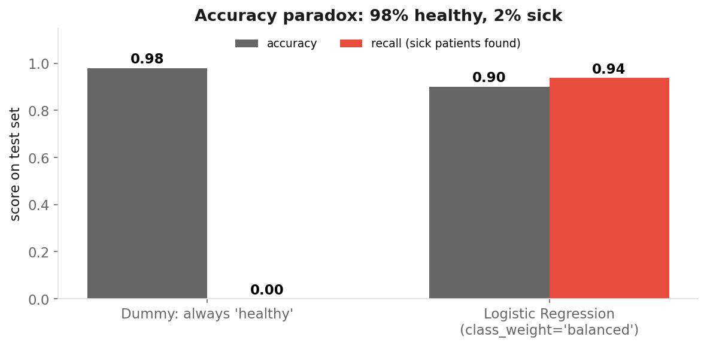
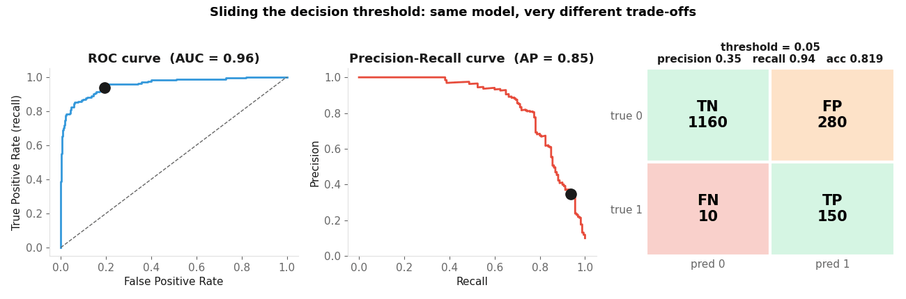
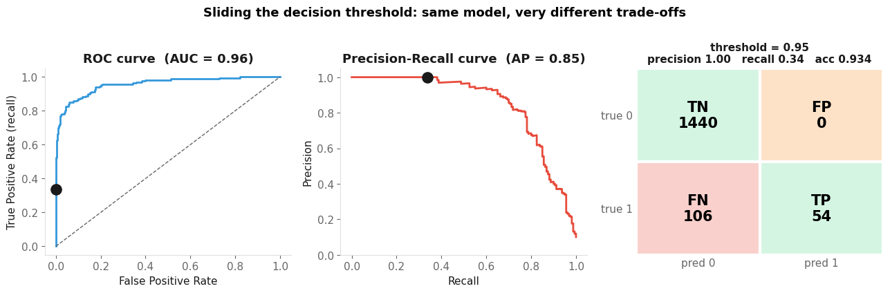
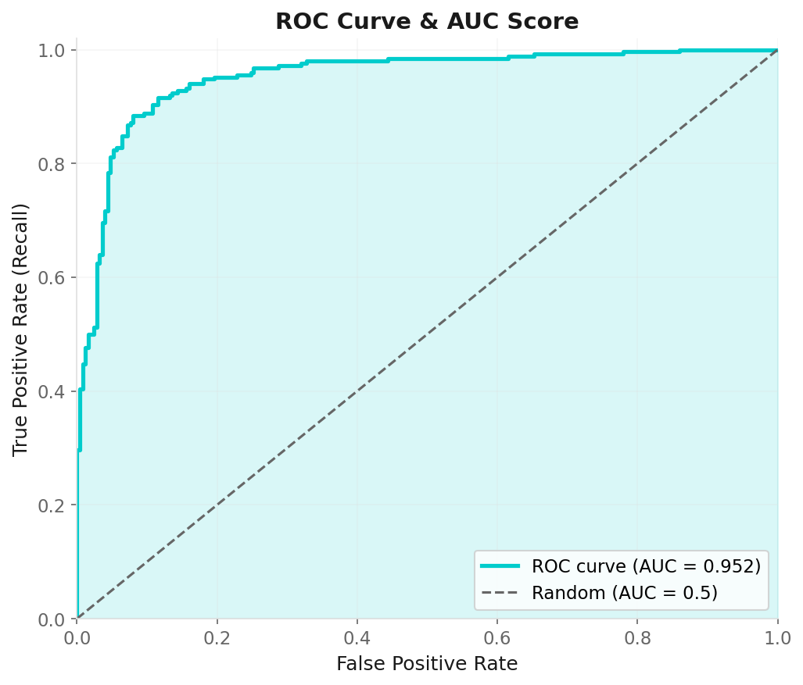
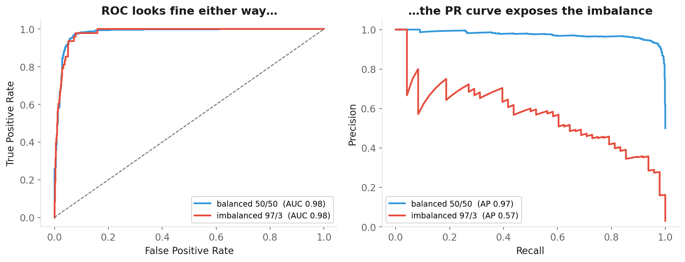

# Metrics & Evaluation

**Applied Machine Learning — Session 2, Chapter 3**

<!--
~50 min total: 32 min slides + demo (interleaved), 2 min quiz, 10 min exercises, ~6 min buffer.
Protect this chapter — metrics are the most under-estimated part of the course.
Demo notebook: 02-examples/ch06_metrics_examples.ipynb — open now, run cell 1.
Positive class in every cancer example = 1 = MALIGNANT (target flipped in the notebooks). Say it out loud once.
-->

---

# The Metric Defines Success

> A model can only be as good as your definition of "good".

**Screening example:** 99 % of patients are healthy.

- Model that always says "healthy" → **99 % accuracy**
- … and finds **0 %** of the sick patients

**Choosing the wrong metric = optimizing for the wrong thing.** Let's see it, not just say it →

<!--
~2 min. Ask first: 'Is 99 % accuracy a good model?' → most say yes. Then reveal the second bullet.
-->

---

# The Accuracy Paradox — For Real



```python
DummyClassifier(strategy='most_frequent')                    # 98 % accuracy, 0 % recall
LogisticRegression(class_weight='balanced')                   # 90 % accuracy, 94 % recall
```

<!--
~3 min. Demo notebook Part B builds this live on a 98/2 synthetic dataset.
The dummy WINS on accuracy and is useless. class_weight='balanced' re-weights the rare class (≈50× here) →
recall jumps, accuracy and precision drop. Neither model is "right" — the metric you choose IS the decision.
Ask: 'Which of the two would you deploy for a screening programme? For a spam filter?'
-->

---

# Regression Metrics

| Metric | Formula | Units | Best |
|--------|---------|-------|------|
| MAE | (1/n) Σ \|yᵢ − ŷᵢ\| | same as y | low |
| MSE | (1/n) Σ (yᵢ − ŷᵢ)² | y² | low |
| RMSE | √MSE | same as y | low |
| R² | 1 − SS_res / SS_tot | none | → 1 |

```python
from sklearn.metrics import mean_absolute_error, root_mean_squared_error, r2_score
```

**RMSE ≥ MAE always.** A big gap = a few *large* errors. Use RMSE when big mistakes are what hurts.

<!--
~3 min. Units matter: 'MAE = 0.53 on California housing' means nothing until you say '$53k'.
root_mean_squared_error replaces the removed squared=False flag (sklearn ≥ 1.4).
Ask: 'Predictions off by 1,1,1,1 vs 0,0,0,4 — same MAE, which has the higher RMSE?' → the second (√4 = 2 vs 1).
-->

---

# R² — "How Much of the Variance Do We Explain?"

```
R² = 1.0  → perfect
R² = 0.0  → no better than always predicting the mean   (= the DummyRegressor!)
R² < 0.0  → worse than the mean — something is broken
```

**A "good" R² depends on the domain:** finance 0.1 can be impressive · physics 0.99 is expected · house prices 0.6–0.8 typical.

Also look at the **residual plot** (demo Part A): errors should be random noise around 0 — any pattern = the model misses something.

<!--
~3 min. Tie back to Ch04 baseline: R² is literally 'how much better than the dummy'.
Residual plot on housing shows the $500k cap as a straight diagonal streak → a data issue, not a modelling issue.
-->

---

# The Confusion Matrix

<div class="flex justify-center"></div>

```python
ConfusionMatrixDisplay.from_predictions(y_test, y_pred, display_labels=class_names)
tn, fp, fn, tp = confusion_matrix(y_test, y_pred).ravel()      # binary only, in this order
```

<!--
~3 min. Recap of the Ch05 mini-slide, now the anchor for everything that follows.
Rows = truth, columns = prediction. Positive = 1 = what you look for — in our notebooks malignant = 1 (flipped!).
The .ravel() order tn, fp, fn, tp trips people up — write it on the board.
-->

---

# Worked Example: A Spam Filter

```
                 predicted ham   predicted spam
actual ham           TN = 90        FP = 5      ← 5 good emails lost in the spam folder
actual spam          FN = 3         TP = 2      ← only 2 of 5 spam caught
```

- **Accuracy** = (90 + 2) / 100 = **0.92** — sounds great
- **Precision** = TP / (TP + FP) = 2 / 7 = **0.29** — when it says "spam", it is wrong 5 times out of 7
- **Recall** = TP / (TP + FN) = 2 / 5 = **0.40** — it catches less than half of the spam

**Different errors, different costs:** a lost real email (FP) is worse than one spam in the inbox (FN) → for a spam filter, optimize **precision**.

<!--
~3 min. Compute the three numbers with the class — do NOT skip the arithmetic; this is where it clicks.
Then flip the scenario: 'cancer screening: which error is worse?' → FN → optimize recall. Same formulas, opposite priority.
-->

---

# Precision, Recall, F1 — When to Use Which

| Metric | Question it answers | Optimize when… | Example |
|--------|--------------------|----------------|---------|
| **Precision** = TP/(TP+FP) | "When I say positive, am I right?" | FP is costly | spam filter |
| **Recall** = TP/(TP+FN) | "Did I find all positives?" | FN is costly | cancer screening |
| **F1** = 2·P·R/(P+R) | balance of both (harmonic mean) | both matter, classes imbalanced | fraud, defect detection |
| **Accuracy** | share correct overall | classes balanced & errors equally bad | digit recognition |

```python
from sklearn.metrics import precision_score, recall_score, f1_score, classification_report
```

<!--
~2 min. Harmonic mean punishes imbalance: P = 1.0, R = 0.1 → F1 = 0.18, not 0.55.
classification_report prints all three per class + averages (next-next slide).
-->

---

# The Threshold Is Yours to Choose

<div class="flex justify-center">
  
  
</div>

```python
y_pred = (model.predict_proba(X_test)[:, 1] >= 0.3).astype(int)   # instead of predict() = 0.5
```

<!--
~3 min. Same model, sliding the cut-off: low threshold → many positives → recall ↑, precision ↓, and vice versa.
Watch the FN cell shrink as the threshold drops. Ask: 'Where would you set it for cancer screening? For spam?'
Every point on the two curves is one threshold → that is what ROC and PR curves ARE (next slide).
Bonus A of the exercise does exactly this on the breast-cancer model.
-->

---

# ROC Curve & AUC



- **ROC:** True Positive Rate (recall) vs. False Positive Rate, one point per threshold
- **AUC** = area under it: 1.0 perfect · 0.5 random (diagonal) · *"P(random positive scores higher than random negative)"*
- Threshold-independent → compares the *ranking quality* of models

<!--
~3 min. Demo Part C draws ROC + PR side by side. AUC interpretation as a probability is the one to remember.
Pitfall: AUC 0.99 with 3 missed cancers is still 3 missed cancers — AUC says nothing about the threshold you deploy.
-->

---

# ROC vs. PR — and Handling Imbalance



- ROC's x-axis divides by the **big** class → looks fine even when positives are rare → use the **PR curve** then
- Toolbox for imbalance: `class_weight='balanced'` · lower threshold · `StratifiedKFold` · report **recall / F1 / PR-AUC**, not accuracy

<!--
~3 min. Left: both AUCs look OK. Right: precision collapses for the 97/3 data — the PR curve exposes what ROC hides.
Rule: rare positives → PR curve + F1/recall. Balanced → ROC is fine.
class_weight was shown on the accuracy-paradox slide; stratify=y in train_test_split is the same idea for splitting.
-->

---

# Multi-Class: `classification_report` Averages

```
(illustrative example — 3 wine cultivars)
              precision  recall  f1-score  support
   class_0        1.00    0.92      0.96       12
   class_1        0.79    1.00      0.88       14
   class_2        1.00    0.90      0.95       10
  macro avg       0.93    0.94      0.93       36   ← plain mean over classes (equal weight)
weighted avg      0.94    0.94      0.94       36   ← weighted by support (big classes dominate)
```

For imbalanced multi-class problems report **macro** F1; `cross_val_score(..., scoring='f1_macro')`.

<!--
~1 min. Students met this table in the wine exercise (Ch05). Just decode the two average rows.
-->

---

# Cross-Validation with the *Right* Metric

```python
from sklearn.model_selection import cross_val_score, StratifiedKFold

models = {
    'Logistic': make_pipeline(StandardScaler(), LogisticRegression(max_iter=1000)),
    'KNN':      make_pipeline(StandardScaler(), KNeighborsClassifier(5)),
    'Forest':   RandomForestClassifier(100, random_state=42),
}
cv = StratifiedKFold(5, shuffle=True, random_state=42)
for name, m in models.items():
    s = cross_val_score(m, X, y, cv=cv, scoring='f1')   # or 'recall', 'roc_auc', 'f1_macro'
    print(f'{name}: {s.mean():.3f} ± {s.std():.3f}')
```

- The **pipeline** goes in → scaling re-fit per fold, no leakage · **stratified** folds keep the class ratio
- Pick `scoring` to match the cost of errors — then compare **mean ± std**

<!--
~3 min. Fixes from the old slide: scalers inside pipelines, max_iter, StratifiedKFold with shuffle.
Ask: 'Two models: F1 0.963 ± 0.024 vs 0.949 ± 0.026 — different?' → not convincingly; within one std.
Demo Part D prints exactly this table.
-->

---

# Quick Check

1. Screening model A: recall 0.98, precision 0.20. Model B: recall 0.80, precision 0.90. Which one for a first-line cancer screen? For deciding on surgery?
2. AUC = 0.99, but 3 of 42 cancers are missed at threshold 0.5. Contradiction?
3. A colleague reports "accuracy 0.97" on a fraud dataset with 1 % fraud. What do you ask?

<v-click>

1. **A** for screening (missing a case is the expensive error; follow-up tests clean up the false alarms) — **B** when the action itself is costly/harmful
2. No — AUC measures ranking across *all* thresholds; the deployed threshold decides FN. Lower it (Bonus A shows 3 → 1)
3. "What is the recall / F1? What does the dummy score?" (0.99 accuracy — so 0.97 is *worse* than nothing)

</v-click>

<!--
~2 min. Pairs, 60 s, reveal. Q3 is the whole chapter in one line.
-->

---

# Now: Exercises!

→ Open `03-exercises/ch06_metrics_exercises.ipynb` — models are pre-trained, you **evaluate and interpret**

| Task | Content |
|------|---------|
| A1 | MAE / RMSE / R² for two diabetes models — better? by how much? (3 min) |
| B1 | accuracy, precision, recall, F1 for the cancer model — which matters? (2 min) |
| B2 | confusion matrix — how many cancers were missed? (2 min) |
| B3 | ROC curve + AUC (3 min) |
| Bonus | threshold tuning · residual plot · dummy baseline |

**Positive class = 1 = malignant** (already flipped in the setup cell).

<!--
~10 min. Most valuable bonus = A (threshold): missed cancers 3 → 1 when going 0.5 → 0.1, false alarms 1 → 5.
Debrief (1 min): 'Who would deploy threshold 0.1? What is the price?' → more follow-up exams, fewer missed cancers.
Common stall: forgetting that recall_score etc. default to pos_label=1 → that is why we flipped the target.
-->

---

# Key Takeaways

- **Accuracy lies on imbalanced data** — always compare with a `DummyClassifier`
- Confusion matrix: rows = truth; positive class = what you look for — check the encoding!
- Precision (FP costly) vs. recall (FN costly) vs. F1 — pick the metric that matches the *cost of errors*
- The 0.5 threshold is a **decision**, not a law — slide it; ROC/PR curves show all thresholds at once
- Rare positives → PR curve, `class_weight`, stratified folds, F1/recall
- Cross-validate with a **pipeline** and the **right `scoring`**; report mean ± std

<!--
Transition: 'We have mastered supervised learning: models, complexity, evaluation. Session 3: what if there are no labels?'
-->

---
layout: end
---

# Next: Session 3

## Unsupervised Learning

> _"What if we don't have labels? What can we still learn?"_
