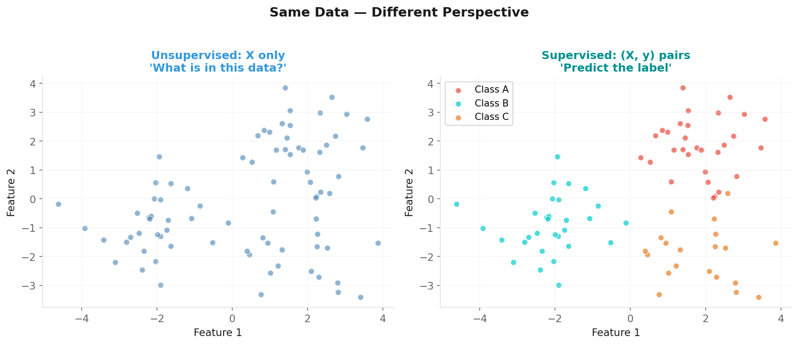

# Introduction to Unsupervised Learning

**Applied Machine Learning — Session 3, Chapter 1**

<!--
~50 min. No formal exercises — this is a conceptual chapter. Lots of discussion.
-->

---

# The Key Difference



No labels. No "right answer." Just data.

<!--
~10 min. Spend time on motivation: WHY does unsupervised learning exist?
-->

---

# Why Does Unlabeled Data Exist?

- Labeling is **expensive** (human annotation costs time + money)
- Labeling is **impossible** for future data
- Labels **don't exist yet** (discovery science)
- We don't know what we're looking for

> Most data in the world is unlabeled.  
> Supervised learning is the exception, not the rule.

<!--
Most data in the world is unlabeled. Labeling is expensive, impossible, or undefined.
-->

---

# The Question Changes

| Paradigm | Question |
|----------|---------|
| Supervised | "What is this?" (classify/predict y) |
| Unsupervised | "What is **in** this?" (find patterns) |

**Analogy:** Sorting mail without knowing the rules.  
You find your own groupings — by sender, size, topic.  
Different people might sort differently. Both can be valid.

<!--
Supervised: 'What is this?' Unsupervised: 'What is IN this?'
Use the mail-sorting analogy.
-->

---

# Three Types of Unsupervised Learning

**1. Clustering** (Ch08)
→ Group similar samples together

**2. Dimensionality Reduction** (Ch09)
→ Compress many features into fewer

**3. Density Estimation**
→ Model the probability distribution of the data

<!--
~8 min. Clustering (Ch08), Dimensionality Reduction (Ch09), Density Estimation (briefly).
-->

---

# Clustering

**Input:** X (no labels)  
**Output:** Cluster assignments {0, 1, 2, ...}

```
Before                   After K-Means
 • •  ○ ○                [0][0] [1][1]
• • •  ○ ○      →       [0][0][0] [1][1]
 • •    ○               [0][0]    [1]
```

Applications:
- Customer segmentation
- Document topic modeling
- Gene expression grouping

<!--
Customer segmentation is the most relatable example.
Ask: 'How would you group these customers?'
-->

---

# Dimensionality Reduction

**Input:** X with many features  
**Output:** X' with fewer features (preserving information)

```
100 features → 2 features → visualize!
```

Applications:
- Visualization (2D or 3D plots of high-dim data)
- Preprocessing (fewer features → faster, less overfitting)
- Noise reduction

<!--
100 features → 2 features → you can plot it! Very powerful for exploration.
-->

---

# The Evaluation Challenge

**Without labels — how do we know if we did a good job?**

**Internal metrics (no labels needed):**
- Silhouette Score: cluster separation quality
- Inertia: within-cluster compactness

**External validation:**
- Does it make business sense?
- Do domain experts agree?
- Does it help a downstream task?

> **Domain knowledge is essential in unsupervised learning.**

<!--
~7 min. No labels = no 'right answer.' Domain knowledge is essential.
-->

---

# Practical Evaluation Approach

**Step 1 — Visualize:** Project to 2D (PCA/t-SNE), look for structure

**Step 2 — Internal metrics:** Silhouette score, inertia elbow

**Step 3 — External validation:** Compare with known labels if available (ARI)

**Step 4 — Downstream task:** Does clustering improve a supervised model?

**Step 5 — Domain expert:** Does this grouping make real-world sense?

> There is no single "correct" answer in unsupervised learning.  
> Multiple valid groupings can exist — choose the most useful.

<!--
5 steps: Visualize → Internal metrics → External validation → Downstream task → Domain expert.
-->

---

# Real-World Applications

| Field | Application | Technique |
|-------|------------|-----------|
| Marketing | Customer segments | Clustering |
| Medicine | Disease subtypes | Clustering |
| NLP | Topic discovery | Clustering |
| Finance | Anomaly detection | Density estimation |
| Vision | Image compression | PCA |
| Any | Data visualization | t-SNE / UMAP |

<!--
~5 min. Ask students which applications surprise them most.
Let it breathe — good discussion moment.
-->

---

# Let's Explore Together

→ Open `02-examples/ch07_unsupervised_intro_examples.ipynb`

We will:
1. Generate and visualize unlabeled data
2. See what "structure" looks like without labels
3. Preview what clustering will find in Chapter 8

<!--
~20 min for the live example. Generate blobs, moons, show clustering preview.
-->

---

# Key Takeaways

- Unsupervised = learning without labels
- Goal: discover structure, patterns, groups
- Three main types: clustering, dim. reduction, density
- Evaluation is hard — domain knowledge matters
- Most real-world data is unlabeled → unsupervised is powerful

<!--
Transition: 'Now let's make the machine actually find the groups — K-Means and friends.'
-->

---
layout: end
---

# Next: Chapter 8

## Clustering Techniques

> _"Let's make the machine find the groups."_
