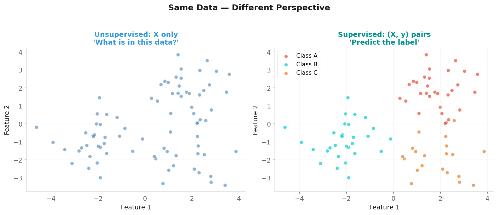
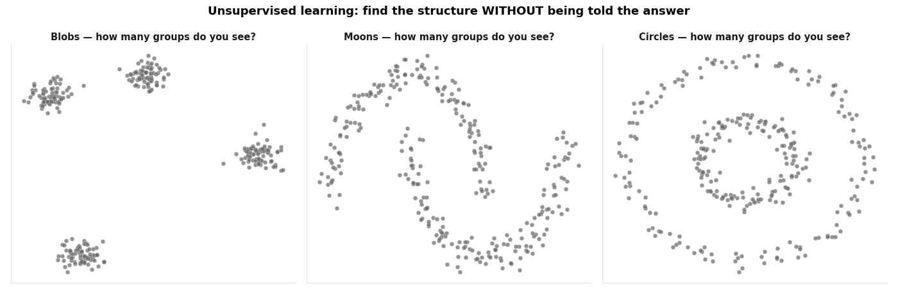
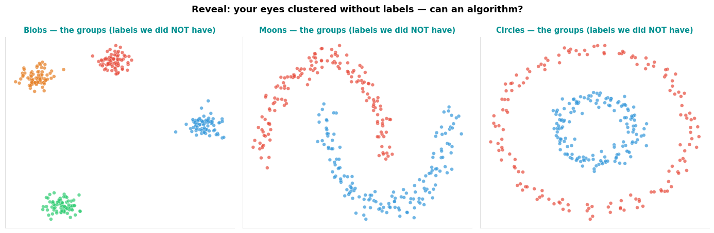
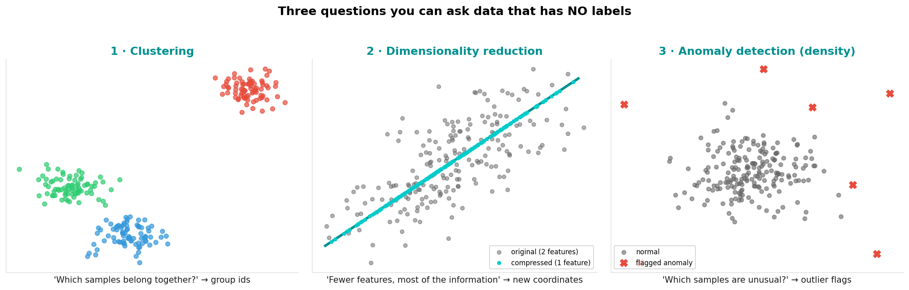
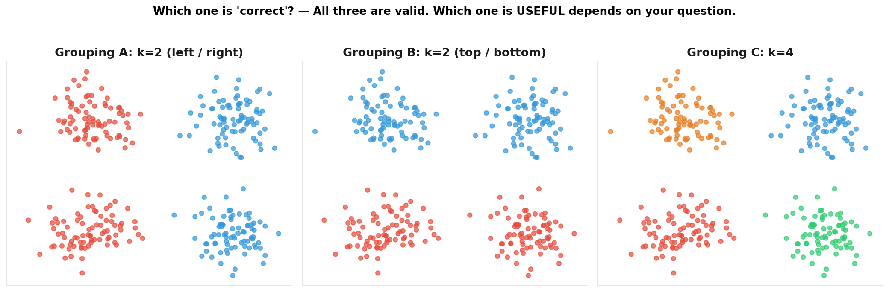

# Introduction to Unsupervised Learning

**Applied Machine Learning — Session 3, Chapter 1**

<!--
~50 min total, planned for ~41 min of content + buffer.
Blocks: What is it (7) → Three tasks (6) → Evaluation challenge (7) → Applications (4)
→ Live demo notebook (12) → Quiz (3) → Wrap-up (2). Optional exercise notebook is a bonus/homework.
Opening question: "What do customer segmentation, gene expression and Spotify's
'Discover Weekly' have in common?" — wait for answers before revealing "no labels".
-->

---

# The Key Difference



No labels. No "right answer." Just data.

<!--
~7 min block starts. Session 2 recap in one sentence: "You always had a y column."
Ask: "What happens if I delete the y column — is the data useless?" Expected: "no, we can still see groups".
That IS the paradigm shift. Note the question changes from "What is this?" to "What is IN this?".
-->

---

# Why Does Unlabeled Data Exist?

- Labeling is **expensive** (human annotation costs time + money)
- Labeling is **impossible** for future data
- Labels **don't exist yet** (discovery science: "are there disease subtypes?")
- We don't know what we're looking for

> Most data in the world is unlabeled.  
> Supervised learning is the exception, not the rule.

**Analogy:** sorting a pile of mail without rules — by sender, size, topic.  
Different people sort differently. **Both can be valid.**

<!--
Ask for a real example from students' own field (lab data, survey data, logs).
Pitfall: students think "unlabeled = worse data". Correct: it's the NORMAL state of data;
labels are the luxury.
-->

---

# Find the Groups!

<div class="flex justify-center">
  
  
</div>

<!--
Let the GIF sit on the grey frame: "How many groups? Shout it out." (4 / 2 / 2).
Then the reveal. Point: your eyes did unsupervised learning. Chapter 8 asks whether an algorithm can.
Teaser: K-Means will nail the blobs and FAIL on moons/circles — remember this picture.
-->

---

# Three Questions You Can Ask Unlabeled Data

<div class="flex justify-center"></div>

| | Question | Output | Chapter |
|---|---|---|---|
| **Clustering** | Which samples belong together? | group id per sample | Ch08 |
| **Dimensionality reduction** | Can I keep the information in fewer features? | new coordinates | Ch09 |
| **Anomaly detection** | Which samples are unusual? | outlier flag | today, 1 line |

<!--
~6 min block. Each panel: input is X only, output is a NEW column we invented.
Density estimation is the family behind anomaly detection (low density = unusual);
Gaussian Mixture Models = "soft K-Means" giving probabilities instead of hard labels — mention, not taught.
Generative models (VAEs, diffusion) also live here but are out of scope.
-->

---

# Clustering & Dimensionality Reduction in One Line Each

```python
from sklearn.cluster import KMeans
labels = KMeans(n_clusters=3, random_state=42).fit_predict(X)   # → array([0, 2, 1, 0, ...])
```

```python
from sklearn.decomposition import PCA
X_2d = PCA(n_components=2).fit_transform(X)                     # → shape (n, 2) — plot it!
```

```python
from sklearn.ensemble import IsolationForest
is_outlier = IsolationForest(random_state=42).fit_predict(X) == -1   # → True for unusual rows
```

Same sklearn grammar as always: `fit` → but there is **no `y`**.

<!--
Point at the missing y in every call — that's the whole difference on the code level.
No new syntax to learn: `fit_predict` / `fit_transform` return the invented column directly.
-->

---

# The Evaluation Challenge

**Without labels — how do we know if we did a good job?**

<div class="flex justify-center"></div>

**Internal metrics (no labels):** Silhouette score, inertia — "are groups compact and separated?"  
**External checks:** compare with labels *if you happen to have some* (ARI) — a sanity check, not the goal  
**Domain sense:** can a person explain each group? Does it help a downstream task?

<!--
~7 min block. Ask: "Which of A, B, C is right?" Let them argue. Answer: depends on the QUESTION
(marketing wants 4 segments; a shipping-cost model may only need left/right).
This picture also motivates Ch08's "how to choose k" — there is no oracle, only tools + judgement.
Session-2 bridge: "In Session 2 we had accuracy. Now we don't. Silhouette/inertia are the replacement — but they never say 'correct'."
Pitfall to name explicitly: when we later colour clusters by known classes (Iris species), that is a
sanity check for teaching. Clusters ≠ classes; a clustering can be useful and still disagree with the labels.
-->

---

# Real-World Applications

| Field | Application | Technique |
|-------|------------|-----------|
| Marketing | Customer segments | Clustering |
| Medicine | Disease subtypes from gene expression | Clustering |
| NLP | Topic discovery | Clustering |
| Finance / IT | Fraud, intrusion, sensor faults | Anomaly detection |
| Vision | Image compression, face "eigen-directions" | PCA |
| Any | Visualising 100-D data in 2-D | PCA / t-SNE / UMAP |
| Recommender systems | Latent user/item factors | Dim. reduction |

<!--
~4 min. Ask which application surprises them most; ask for one from their own study field.
Point at fraud: unusual ≠ fraud — an anomaly detector flags candidates for a human to look at.
-->

---

# Let's Explore Together

→ Open `02-examples/ch07_unsupervised_intro_examples.ipynb`

We will (~12 min):
1. Take Iris, **delete the labels**, look at what remains
2. Look at three kinds of "structure" (blobs, moons, circles)
3. **Anomaly detection in one line** (IsolationForest on customer data)
4. A 30-second teaser of the digits dataset (64 features) — full treatment in Ch09

<!--
Keep this to ~12 min; the notebook is short on purpose. Don't do K-Means/PCA in depth here — Ch08/Ch09 do.
Run the anomaly cell and ask: "Would you block these transactions automatically?" (No — investigate.)
-->

---

# Quick Check

**Q1.** A colleague says: "I ran K-Means with k=3 on our customers and got 3 groups, so we have 3 customer types." What is wrong with that sentence?

<v-click>

→ K-Means returns k groups **whatever** the data looks like. 3 groups came out because 3 was asked for. Check compactness/separation (Ch08) and whether the groups make business sense.

</v-click>

**Q2.** You have 10,000 unlabeled X-ray images and 200 with a radiologist's label. Which paradigm(s) can use which part?

<v-click>

→ Unsupervised (clustering, PCA, anomaly detection) can use all 10,200; supervised only the 200. Combining both (e.g. PCA/clusters as features, or "semi-supervised") is common in practice.

</v-click>

<!--
~3 min. Let students answer aloud before clicking. Q1 is THE misconception of the session
(picked up again in Ch08 with the uniform-noise demo). Q2 shows the two paradigms are complementary.
-->

---

# Key Takeaways

- Unsupervised = learning **without a `y` column** — the normal state of real data
- Three questions: **clustering**, **dimensionality reduction**, **anomaly detection**
- Output is a column we invent: group id / new coordinates / outlier flag
- Evaluation is hard: internal metrics + domain judgement; **clusters ≠ classes**
- Optional exercise: `03-exercises/ch07_unsupervised_intro_exercises.ipynb` (PCA + K-Means on digits, ~15 min, homework)

<!--
Transition: "Now let's make the machine actually find the groups — K-Means and friends."
-->

---
layout: end
---

# Next: Chapter 8

## Clustering Techniques

> _"Let's make the machine find the groups."_
