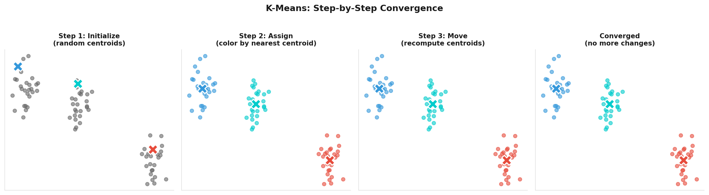
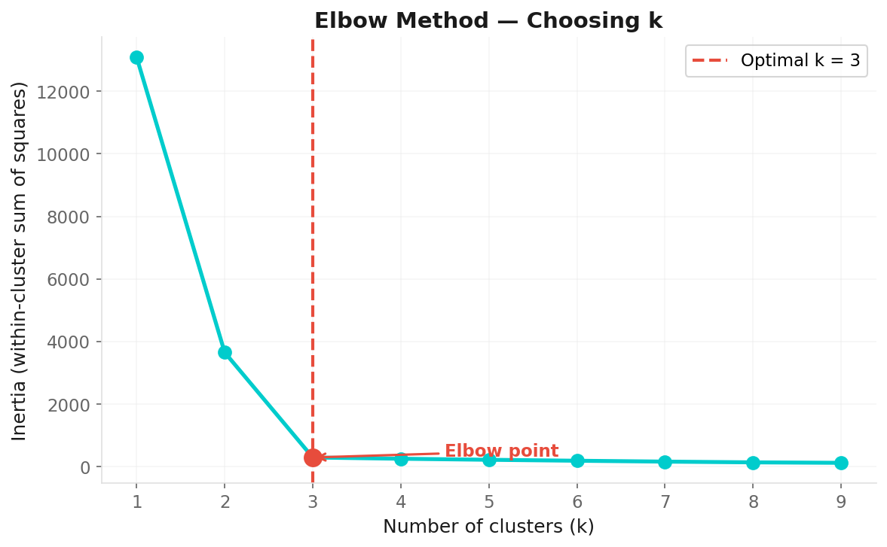
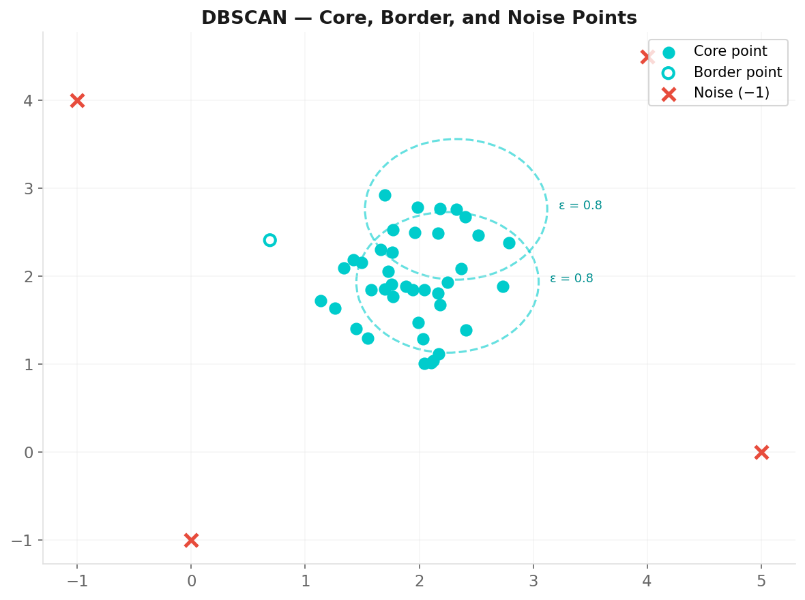

# Clustering Techniques

**Applied Machine Learning — Session 3, Chapter 2**

---

# What Is Clustering?

**Partition data into groups where:**
- Samples within a cluster are similar to each other
- Samples in different clusters are dissimilar

**No labels — no right answer — we discover the groups.**

```python
from sklearn.cluster import KMeans
kmeans = KMeans(n_clusters=3)
labels = kmeans.fit_predict(X)
```

---

# K-Means: The Algorithm

**Step 1:** Choose k random centroids  
**Step 2:** Assign each point to nearest centroid  
**Step 3:** Move centroid to mean of its cluster  
**Step 4:** Repeat until convergence



**Optimizes:** Sum of squared distances from points to their centroid.

---

# K-Means: The Parameters

```python
from sklearn.cluster import KMeans

kmeans = KMeans(
    n_clusters=3,      # ← the most important choice
    init='k-means++',  # smarter initialization (better than random)
    n_init=10,         # run 10 times, take best result
    random_state=42
)
kmeans.fit(X)
```

Access results:
```python
kmeans.labels_             # cluster assignment per sample
kmeans.cluster_centers_    # centroid coordinates
kmeans.inertia_            # within-cluster sum of squares
```

---

# How to Choose k? — Elbow Method

Run K-Means for k = 1 to N, plot inertia:



```python
inertias = [KMeans(k).fit(X).inertia_ for k in range(1, 11)]
plt.plot(range(1, 11), inertias, 'o-')
```

---

# How to Choose k? — Silhouette Score

For each sample:
- **a** = average distance to samples in the same cluster
- **b** = average distance to samples in the nearest other cluster

```
Silhouette = (b - a) / max(a, b)
```

- +1.0 → well clustered
- 0.0 → on the boundary
- -1.0 → in the wrong cluster

```python
from sklearn.metrics import silhouette_score
for k in range(2, 8):
    labels = KMeans(k).fit_predict(X)
    print(k, silhouette_score(X, labels))
```

**Choose k with highest silhouette score.**

---

# K-Means Limitations

⚠️ Assumes **spherical** clusters (equal variance)  
⚠️ **k must be specified** in advance  
⚠️ Sensitive to **outliers** (they pull centroids)  
⚠️ Can get stuck in **local optima** (use `n_init > 1`)

→ Different algorithms solve these limitations!

---

# Hierarchical Clustering

**Build a tree (dendrogram) of merges.**

```
Agglomerative (bottom-up):

  a   b   c   d   e       Start: 5 clusters
  |   |   |   |   |
  \___|   |   \___|        Merge similar
    | |   |     |
    \_|___|_____|           One big cluster
```

```python
from scipy.cluster.hierarchy import dendrogram, linkage
Z = linkage(X, method='ward')
dendrogram(Z)
```

**No k needed!** Cut the dendrogram at any height to get k clusters.

---

# Reading a Dendrogram

```
Height
  ↑
5 |              |
  |          ____|____
3 |      ___|___      |
  |  ___|___  |   |   |
1 | | |  |  | |   |   |
  +--+--+--+-+-+---+---
     a  b  c  d e  f
```

- **Vertical lines:** height at which clusters were merged
- **Long vertical lines:** natural gap — good place to cut
- Cut horizontally to get desired number of clusters

---

# DBSCAN: Density-Based Clustering

**Clusters = dense regions separated by sparse regions.**



```python
from sklearn.cluster import DBSCAN
dbscan = DBSCAN(eps=0.5, min_samples=5)
labels = dbscan.fit_predict(X)

n_clusters = len(set(labels)) - (1 if -1 in labels else 0)
n_noise    = (labels == -1).sum()
print(f'Clusters: {n_clusters} | Noise points: {n_noise}')
```

**DBSCAN advantage:** Finds arbitrary shapes, identifies outliers!

---

# Algorithm Comparison

| Algorithm | Shape | k needed | Outliers | Speed |
|-----------|:-----:|:--------:|:--------:|:-----:|
| K-Means | Spherical | ✅ Yes | ❌ | Fast |
| Hierarchical | Any | ❌ (cut) | ❌ | Slow |
| DBSCAN | Any | ❌ | ✅ Flags them | Moderate |

**Rule of thumb:**
- Unknown k, spherical data → K-Means
- Want hierarchy → Agglomerative
- Non-spherical shapes, outliers → DBSCAN

---

# Now: Exercises!

→ Open `03-exercises/ch08_clustering_exercises.ipynb`

**Task:** Cluster the Iris dataset (without labels) and see how well  
the algorithm recovers the true species groups.

~10 minutes

---

# Key Takeaways

- K-Means: fast, spherical clusters, k required
- Elbow + Silhouette: help choose k
- Hierarchical: no k needed, dendrogram reveals structure
- DBSCAN: density-based, arbitrary shapes, finds outliers
- Always validate clusters with domain knowledge!

---
layout: end
---

# Next: Chapter 9

## Dimensionality Reduction

> _"Sometimes 2 dimensions reveal more than 100."_
