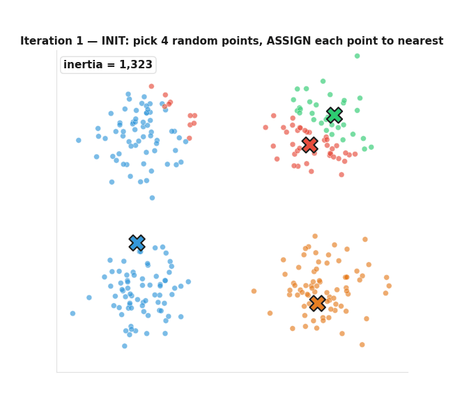
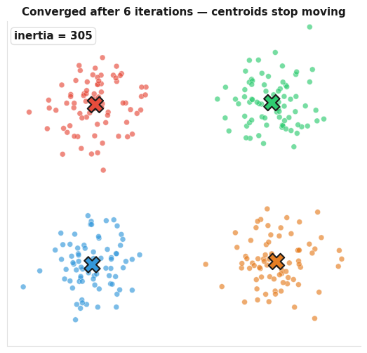
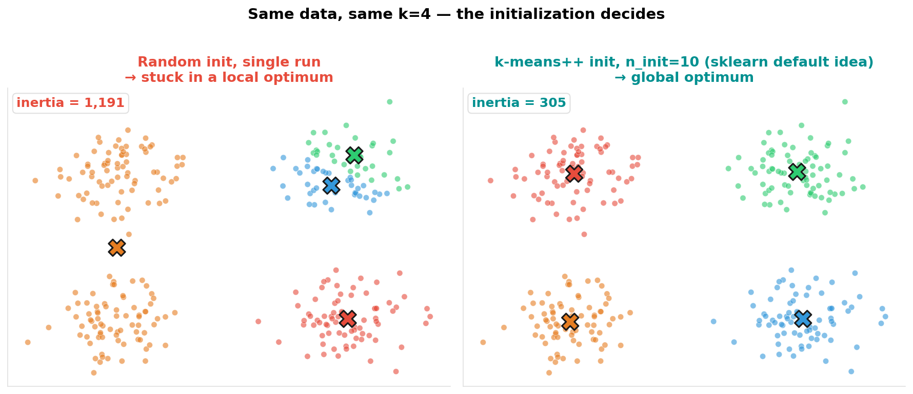
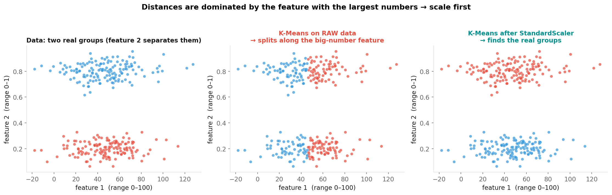
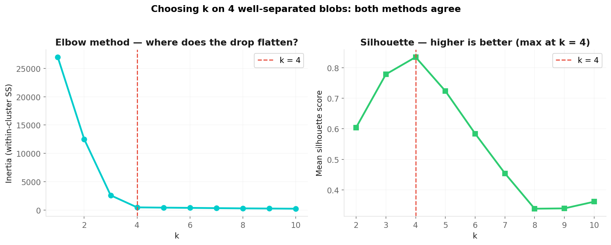
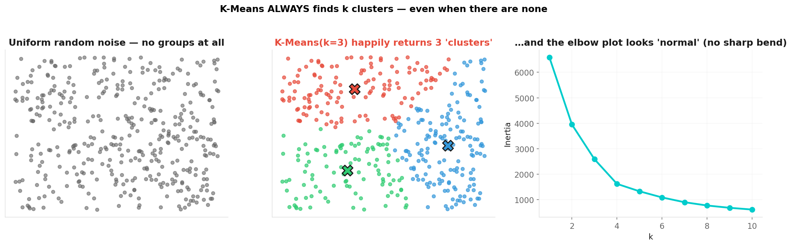
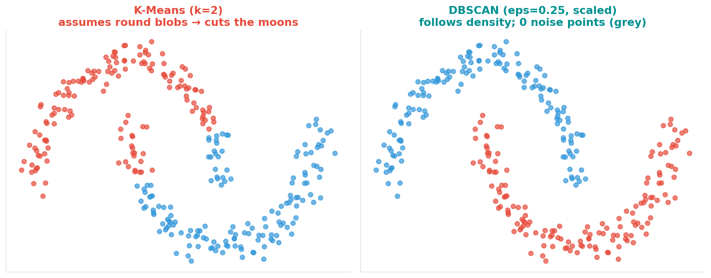
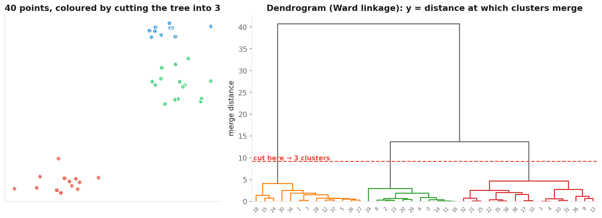

# Clustering Techniques

**Applied Machine Learning — Session 3, Chapter 2**

<!--
~50 min total, planned ~43 min + buffer.
Blocks: K-Means algorithm (7) → parameters & init (3) → scaling (3) → choosing k (6)
→ DBSCAN (4) → quiz (2) → live demo notebook (8) → exercises (10).
Hierarchical clustering is a BONUS appendix slide + bonus task — skip if short on time.
The K-Means GIF replaces the old static 4-panel; 0-animations/01_kmeans_convergence.ipynb is the same idea, interactive.
-->

---

# What Is Clustering?

**Partition data into groups such that:**
- samples **within** a cluster are similar
- samples in **different** clusters are dissimilar

**No labels — we discover the groups.** The output is a new column `labels`.

```python
from sklearn.cluster import KMeans
kmeans = KMeans(n_clusters=3, random_state=42)
labels = kmeans.fit_predict(X)      # array([0, 2, 1, 0, ...]) — no y anywhere
```

<!--
Ask: "Similar according to what?" → distance between feature vectors. Hold that thought — it is why
scaling matters (in 3 slides). Also: 0/1/2 are arbitrary ids, not classes.
-->

---

# K-Means: The Algorithm

<div class="flex justify-center">
  
  
</div>

**1.** pick k random points as centroids → **2.** ASSIGN each point to its nearest centroid → **3.** UPDATE each centroid to the mean of its points → repeat 2–3 until nothing moves.

<!--
~7 min block. Let the GIF run twice. Narrate ASSIGN (colours change) vs UPDATE (crosses move, arrows).
Watch the inertia number: it can only go DOWN — that is why K-Means always converges.
Optional: open 0-animations/01_kmeans_convergence.ipynb and re-run with another seed.
What K-Means minimises: inertia = sum of squared distances point→own centroid.
-->

---

# K-Means: The Parameters

```python
from sklearn.cluster import KMeans

kmeans = KMeans(
    n_clusters=3,       # k — the most important choice (next slides)
    init='k-means++',   # smart spread-out initialization (default)
    n_init=10,          # run 10 times, keep the best (lowest inertia)
    random_state=42,    # reproducible
)
kmeans.fit(X)

kmeans.labels_            # cluster id per sample
kmeans.cluster_centers_   # centroid coordinates
kmeans.inertia_           # within-cluster sum of squares (lower = tighter)
```

<!--
~3 min with the next slide. `n_init` and `init` exist because of the next picture.
sklearn ≥1.4: n_init defaults to 'auto' (=1 for k-means++) — we set 10 explicitly to be safe.
-->

---

# Why `init` and `n_init` Matter



K-Means only finds a **local** optimum. Different starts → different results.  
`k-means++` spreads the initial centroids out; `n_init=10` keeps the best of 10 runs.

<!--
Misconception to kill: "K-Means finds THE clusters." It finds A local optimum of inertia.
Left: two centroids share one blob, one centroid sits between two blobs — inertia 4× worse.
Ask: "How would you detect this in practice?" → compare inertia across runs (n_init does it for you).
-->

---

# Scale First! (Distance-Based = Scale-Sensitive)

<div class="flex justify-center"></div>

```python
from sklearn.pipeline import make_pipeline
from sklearn.preprocessing import StandardScaler
pipe = make_pipeline(StandardScaler(), KMeans(n_clusters=2, n_init=10, random_state=42))
labels = pipe.fit_predict(X)          # scaler fitted inside — same idiom as Session 2
```

Applies to **K-Means, DBSCAN, hierarchical** — anything that computes distances (KNN, Ch03!).

<!--
~3 min. Spiral: same StandardScaler + Pipeline as Ch02/Ch03. Feature 1 in 0–100 dominates Euclidean
distance; feature 2 in 0–1 is invisible → wrong split. Scaling makes both count equally.
Caveat (Ch07 exercise shows it): scaling is not magic — on digits pixels it amplifies near-constant border
pixels and K-Means gets WORSE. Rule: scale by default, but check.
-->

---

# How to Choose k? — Elbow & Silhouette

<div class="flex justify-center"></div>

```python
from sklearn.metrics import silhouette_score
for k in range(2, 9):
    labels = KMeans(n_clusters=k, n_init=10, random_state=42).fit_predict(X_scaled)
    print(k, silhouette_score(X_scaled, labels))   # a = dist to own cluster, b = to nearest
```

**Silhouette** = (b − a) / max(a, b) per sample, averaged: +1 well separated, 0 on a boundary, −1 wrong cluster.

<!--
~6 min block (this + next slide). Elbow: inertia ALWAYS decreases with k (k = n → 0), so look for
where the drop flattens — often ambiguous. Silhouette: pick the max — but it favours few, round clusters.
Exercise spoiler: on Iris, elbow says 3, silhouette says 2. Both are "right" — that's the point.
-->

---

# ⚠️ Clustering Always "Works" — Even When It Shouldn't



Before trusting clusters: **look at the data (PCA 2-D, Ch09)**, check silhouette (≈0.38 here vs. 0.83 for the real blobs), and ask whether the groups mean anything.

<!--
The single most important slide of the chapter. K-Means never says "no structure".
Ask: "Silhouette of the noise clustering?" — 0.38, i.e. weak. The 4 real blobs from the previous slide: 0.83.
Rules of thumb: silhouette < 0.25 → no substantial structure; 0.5+ → reasonable.
-->

---

# DBSCAN: Density-Based Clustering



`labels = DBSCAN(eps=0.25, min_samples=5).fit_predict(X_scaled)` — **core point** = ≥ `min_samples` neighbours within `eps`; chains of core points form a cluster; the rest is **noise (−1)** → built-in outlier detection.

<!--
~4 min. Clusters = dense regions separated by sparse regions. No k needed, arbitrary shapes,
flags outliers (label -1). Price: eps is hard to tune (scale first!) and DBSCAN struggles when
clusters have very DIFFERENT densities (one eps for all) — HDBSCAN/OPTICS fix that, out of scope.
Rule of thumb: min_samples ≈ 2 × n_features; eps from the k-distance "knee".
-->

---

# Which Algorithm?

| Algorithm | Cluster shape | k needed | Outliers | Notes |
|-----------|:-----:|:--------:|:--------:|-------|
| **K-Means** | round, similar size | yes | pulled by them | fast, default first try |
| **DBSCAN** | any (density) | no | flagged as −1 | eps tuning; struggles with mixed densities |
| Hierarchical *(bonus)* | any | no (cut tree) | no | dendrogram, O(n²) — small data |
| GMM *(mention)* | ellipses, soft | yes | no | probabilities instead of hard labels |

**Rule of thumb:** K-Means first → check silhouette + plot → DBSCAN if shapes are odd or you want outliers.

<!--
No algorithm is universally best. Cheap workflow: K-Means with elbow+silhouette; if the 2-D plot
(PCA) shows non-round shapes → DBSCAN. Hierarchical: appendix slide + bonus task.
-->

---

# Quick Check

**Q1.** Your elbow plot suggests k=3, the silhouette score is highest at k=2. What do you do?

<v-click>

→ Neither is an oracle. Look at both clusterings (plot!), ask which is more *useful* for your question; report that the 3-cluster solution splits one of the two big groups. Both are legitimate answers.

</v-click>

**Q2.** You cluster customers by `age` (18–80) and `income` (20 000–200 000) without scaling. What will K-Means effectively cluster on?

<v-click>

→ Almost only on income — its differences are ~1000× larger, so it dominates the distance. Scale first (Pipeline with StandardScaler).

</v-click>

<!--
~2 min. Q1 previews the exercise. Q2: ask before clicking; expected "income".
-->

---

# Live Demo

→ Open `02-examples/ch08_clustering_examples.ipynb` (~8 min)

1. Elbow + silhouette on blobs — and on **pure noise**
2. K-Means vs DBSCAN on moons
3. Customer segmentation: scale → K-Means → **profile** the segments → name them from the numbers

<!--
Section 4 (customer profiles) is the "so what" — segment names must be READ from the profile table, never
assumed from the cluster id (ids are arbitrary and change with the seed).
Bonus section at the end: hierarchical clustering dendrogram — show only if time.
-->

---

# Now: Exercises!

→ Open `03-exercises/ch08_clustering_exercises.ipynb`

**Task:** Cluster the Iris flowers **without** the species labels:  
elbow → silhouette → decide k (they disagree!) → fit in a Pipeline → plot → *sanity-check* against species.

~10 minutes · Bonus: DBSCAN, hierarchical clustering

<!--
~10 min. Walk around. Expected: elbow ≈3, silhouette max at 2 — Task 2 asks them to explain why both are fine.
Task 4 uses species labels: frame it as "sanity check", not "accuracy" — clusters ≠ classes.
-->

---

# Key Takeaways

- K-Means: assign → update → repeat; finds a **local** optimum → `k-means++`, `n_init`
- **Scale first** — every distance-based method
- Choosing k: elbow + silhouette + **plot** + domain sense — no oracle
- K-Means always returns k clusters — check whether the structure is real
- DBSCAN: density, no k, arbitrary shapes, outliers = −1
- Clusters ≠ classes: label agreement is a sanity check, not the objective

<!--
Transition: "Sometimes 2 dimensions reveal more than 100 — next: PCA and t-SNE."
-->

---

# Bonus / Appendix: Hierarchical Clustering

<div class="flex justify-center"></div>

```python
from scipy.cluster.hierarchy import linkage, dendrogram, fcluster
Z = linkage(X_scaled, method='ward')          # bottom-up merges: closest clusters first
dendrogram(Z)                                 # y-axis = distance at which two clusters merged
labels = fcluster(Z, t=3, criterion='maxclust') - 1   # cut the tree into 3 clusters
```

Long vertical branches = natural gaps → good places to cut. Ward linkage minimises within-cluster variance (K-Means' cousin). O(n²) memory → small datasets only.

<!--
Appendix — only if time. Bonus task in the exercise notebook uses exactly this code.
Linkages: ward (default choice), complete, average, single (chains).
-->

---
layout: end
---

# Next: Chapter 9

## Dimensionality Reduction

> _"Sometimes 2 dimensions reveal more than 100."_
