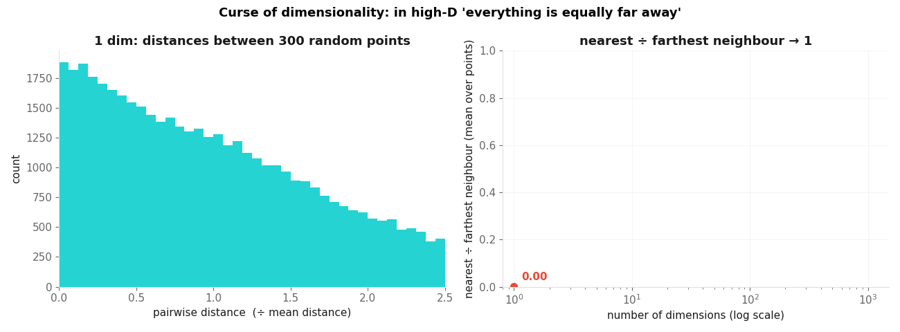
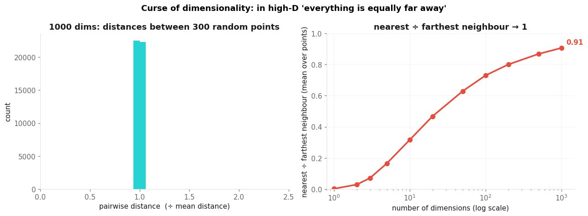
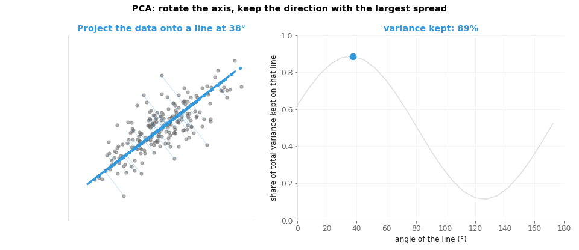
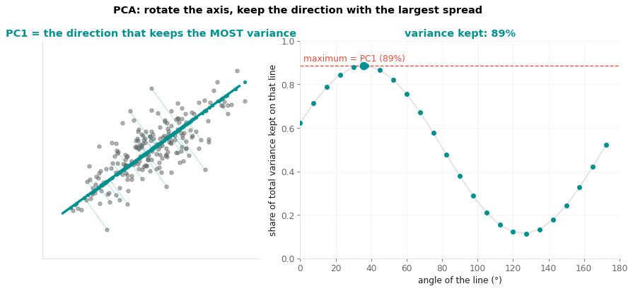
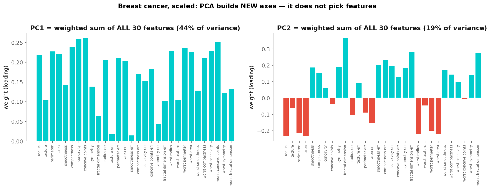
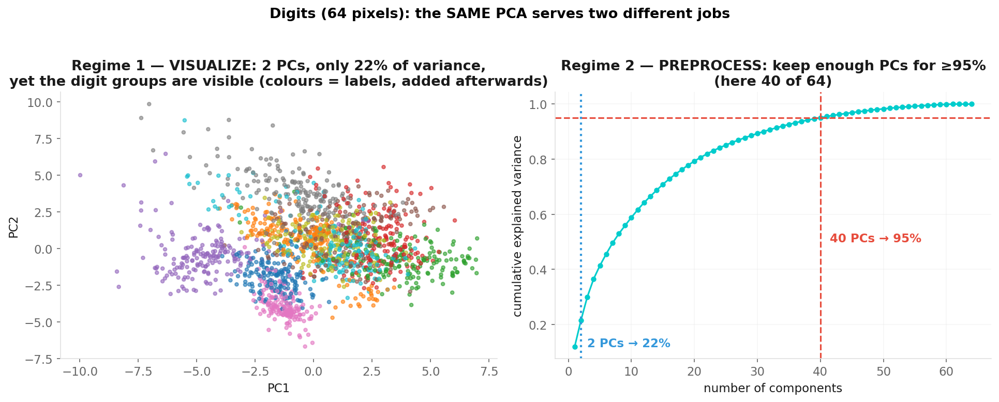
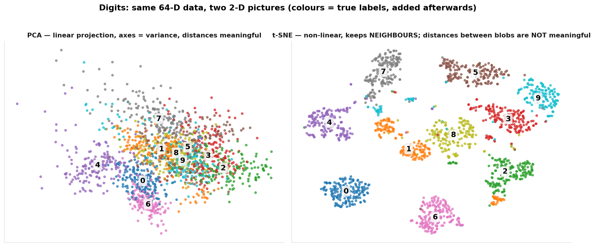

# Dimensionality Reduction

**Applied Machine Learning — Session 3, Chapter 3**

<!--
~50 min total, planned ~45 min incl. demo + exercises.
Blocks: curse of dimensionality (5) → PCA intuition + code (8) → PCA ≠ feature selection (3)
→ how many components / two regimes (4) → PCA as preprocessing + leakage (4) → t-SNE (4)
→ quiz (2) → live demo (5) → exercises (10).
Kernbotschaft: PCA builds NEW axes (combinations of features) — it does not select features.
-->

---

# The Curse of Dimensionality

<div class="flex justify-center">
  
  
</div>

As dimensions grow, random points become **equally far from each other** → distance-based methods (KNN, K-Means, DBSCAN) lose their signal; more data is needed; overfitting risk grows; plotting is impossible beyond 3-D.

<!--
~5 min. Left: histogram of pairwise distances gets NARROWER as d grows. Right: nearest ÷ farthest → 1.
Ask: "What does 'nearest neighbour' mean when every neighbour is at the same distance?" → nothing.
Counterpoint (manifold hypothesis): real high-D data usually lives near a low-D structure
(face photos: millions of pixels, but a few dozen meaningful directions) — that is what PCA exploits.
-->

---

# PCA: Find the Direction With the Most Spread

<div class="flex justify-center">
  
  
</div>

**PC1** = direction of maximum variance · **PC2** = max remaining variance, ⊥ PC1 · … keep the top ones, drop the rest.

<!--
~8 min block (this + next slide). Narrate: we rotate a line, project the points, measure their spread.
The line with the biggest spread is PC1 (89% here). Rotating a coordinate system loses nothing —
DROPPING the low-variance axes is the compression. PCA never looks at y — it is unsupervised.
-->

---

# PCA in Code — Always in a Pipeline With Scaling

```python
from sklearn.decomposition import PCA
from sklearn.preprocessing import StandardScaler
from sklearn.pipeline import make_pipeline

pca_pipe = make_pipeline(StandardScaler(), PCA(n_components=2))   # scale first!
X_2d = pca_pipe.fit_transform(X)                                 # no y — unsupervised

pca = pca_pipe['pca']
pca.explained_variance_ratio_        # e.g. [0.44, 0.19] → share of variance per component
pca.explained_variance_ratio_.sum()  # how much of the total spread the 2-D picture keeps
pca.components_                      # the directions: one row of weights per PC (next slide)
```

Without scaling, the feature with the biggest numbers *is* PC1 (same lesson as K-Means).

<!--
Same Pipeline idiom as Ch02/04/08. Ask: "Which feature would dominate PC1 in the breast-cancer data
if we skip the scaler?" → 'mean area' / 'worst area' (values in the hundreds/thousands).
-->

---

# PCA ≠ Feature Selection



Each PC is a **weighted sum of ALL original features** (`components_`). PCA does not pick "the best 2 columns" — it builds 2 new axes. Consequence: PCs are harder to interpret; if you need "which raw features matter", use feature selection / model importances instead.

<!--
~3 min. Kernbotschaft slide. Read PC1: nearly all weights positive & similar → "overall tumour size/irregularity".
PC2 contrasts size features (negative) with texture/fractal features (positive).
Ask: "Can I say 'the model uses radius'? " → no, it uses a mix.
-->

---

# How Many Components? — Two Different Jobs



**Visualise:** 2 PCs — the % is whatever it is (22 % here); judge the picture, not the number.  
**Preprocess:** keep enough PCs for ≈ 90–95 % → `PCA(n_components=0.95)` (float = variance share; here 40 of 64).

<!--
~4 min. Code: cumvar = PCA().fit(X_scaled).explained_variance_ratio_.cumsum() → plot = scree/cumulative plot.
Common misreading: "only 22% → PCA failed". No: 22% is what a 2-D shadow of 64-D data keeps;
judge the picture by whether structure of interest is visible. See 0-material/pca_low_variance_microbiome.ipynb
for a 500-feature example. Colours in the left panel are the true labels added AFTERWARDS — PCA never saw them.
-->

---

# PCA as Preprocessing (Inside the Pipeline!)

```python
from sklearn.ensemble import RandomForestClassifier
from sklearn.model_selection import cross_val_score

pipe = make_pipeline(StandardScaler(), PCA(n_components=0.95),
                     RandomForestClassifier(random_state=42))
scores = cross_val_score(pipe, X, y, cv=5)          # scaler+PCA re-fitted on each training fold
pipe.fit(X_train, y_train); pipe['pca'].n_components_   # how many PCs were kept
```

- ✅ PCA is fitted **only on the training part** of each fold → no leakage (same rule as imputation/scaling in Ch02)
- Helps when features are many & correlated, or for speed/denoising; a tree model on 30 clean features often does **not** improve — always compare with the no-PCA pipeline and a **DummyClassifier baseline**

<!--
~4 min. Fitting PCA on ALL data before splitting = leakage (the components have seen the test rows).
Expected result on digits/breast-cancer: accuracy roughly equal or slightly LOWER with PCA, fewer features.
Say "trade-off", not "free lunch". Cross-validation appears again here — spiral from Ch04/06.
-->

---

# t-SNE: Non-Linear Visualisation



```python
from sklearn.manifold import TSNE
X_tsne = TSNE(n_components=2, perplexity=30, random_state=42).fit_transform(X_scaled)
```

<!--
~4 min (this + next slide). t-SNE keeps NEIGHBOURS: points close in 64-D stay close in 2-D.
It does not keep distances between groups or group sizes. Perplexity (~5–50) = "how many neighbours matter";
change it and the picture changes. Barnes-Hut version is O(n log n) — fine for ~10k points, slow beyond.
-->

---

# t-SNE: What You Can and Cannot Conclude

✅ "These samples sit together → they are similar in the original space"  
✅ "This island looks isolated → maybe a distinct group — verify with clustering/domain knowledge"

❌ "Cluster A is 3× farther from B than from C" — inter-cluster distances are **not** meaningful  
❌ "The plot shows 5 clusters → the data has 5 groups" — perplexity and seed change the picture  
❌ Using t-SNE coordinates as model features: **there is no `.transform()`** for new data → cannot go into a train/test pipeline

Different `random_state` → different picture. **Visualisation only.** (UMAP: similar idea, faster, has `transform`, `pip install umap-learn`.)

<!--
Students WILL over-interpret t-SNE. The `.transform()` argument is the practical killer: PCA can map new
rows into the same space, t-SNE cannot. Ask: "Would you report a t-SNE silhouette score?" → no (it inflates it by design).
-->

---

# Quick Check

**Q1.** Your 2-D PCA of a 500-feature dataset shows 18 % explained variance, but the two patient groups separate nicely. Good or bad?

<v-click>

→ Fine for a picture: 18 % is normal for 500 features; judge the plot by the structure you see. For *preprocessing* you would keep many more PCs (≈90–95 %).

</v-click>

**Q2.** A colleague fits PCA on the full dataset, then splits train/test and reports 97 % accuracy. What is the problem?

<v-click>

→ Leakage: the components were computed using test rows. Put PCA in the Pipeline so it is fitted per training fold. (Often a small effect for PCA — but the same rule as scaling/imputation.)

</v-click>

<!--
~2 min. Both questions are the exercise's Task 1/3 in disguise.
-->

---

# Live Demo

→ Open `02-examples/ch09_dimensionality_reduction_examples.ipynb` (~5 min)

1. Digits: scree plot → how many PCs for 80/90/95 %?
2. 2-D PCA vs t-SNE side by side
3. PCA inside a classification pipeline (with baseline) — does it help?

<!--
Keep short — the slides already showed the pictures; the point is the CODE pattern.
Section 3: expect a small drop with PCA (≈0.98 → 0.965, 40 of 64 features); phrase it as trade-off, read the numbers live.
-->

---

# Now: Exercises!

→ Open `03-exercises/ch09_dimensionality_reduction_exercises.ipynb`

**Task (breast cancer, 30 features):** scree plot → 2-D picture → PCA inside a classifier pipeline vs. no-PCA vs. dummy baseline.  
Bonus: t-SNE comparison · read the PC1 loadings

~10 minutes

<!--
~10 min. Positive class: we flip the sklearn target so malignant = 1 (as in Ch05/06) — point it out.
Expected: 10 PCs for 95 %; RF ≈ 0.95–0.96 with or without PCA; dummy ≈ 0.63.
-->

---

# Key Takeaways

- High-D → distances lose meaning → reduce dimensions
- PCA: **new axes** = weighted combinations of all features, ordered by variance; scale first; unsupervised
- 2 PCs for pictures (whatever %); ≈ 95 % for preprocessing — inside the Pipeline (no leakage)
- PCA ≠ feature selection
- t-SNE: neighbours only, no distances, no `.transform()` → visualisation only

<!--
Transition: "What if the machine learns by trial and error — like us? → Reinforcement Learning."
-->

---
layout: end
---

# Next: Session 4

## Reinforcement Learning

> _"What if the machine learns by trial and error — like us?"_
