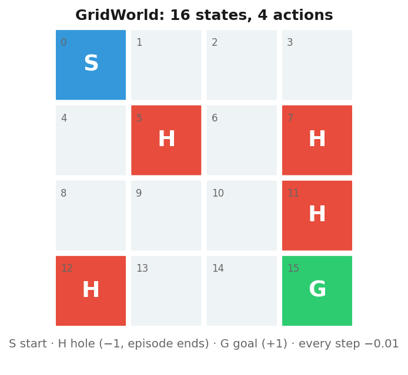
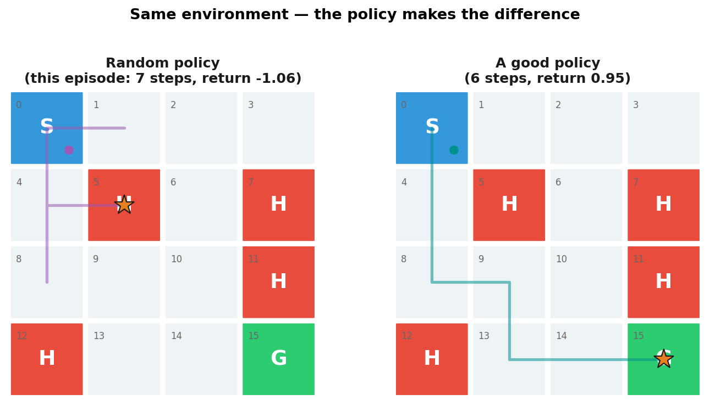
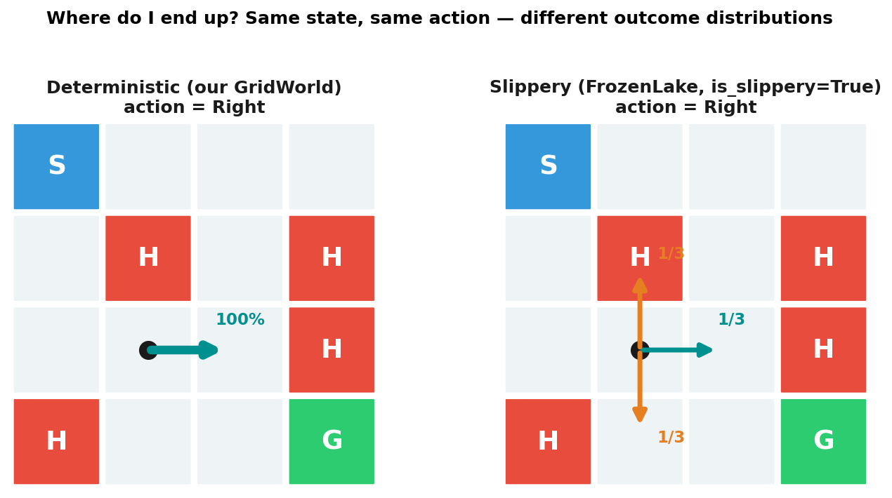
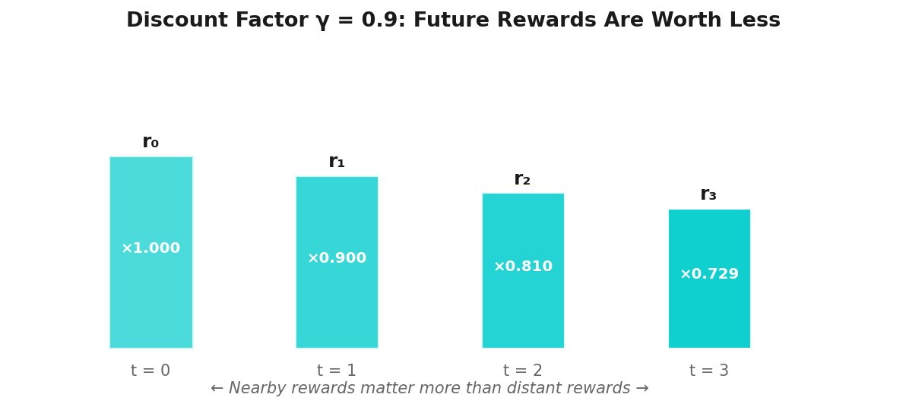
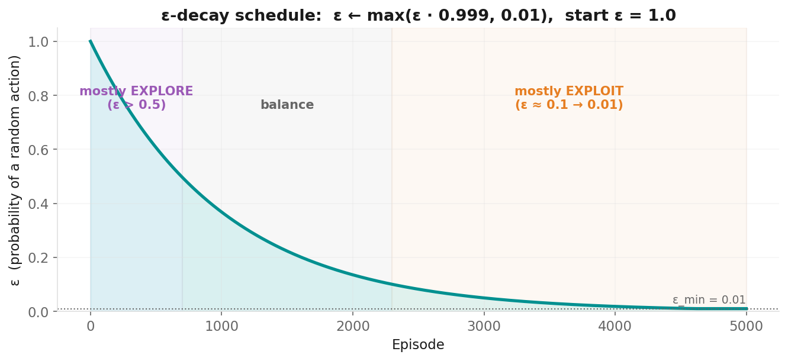
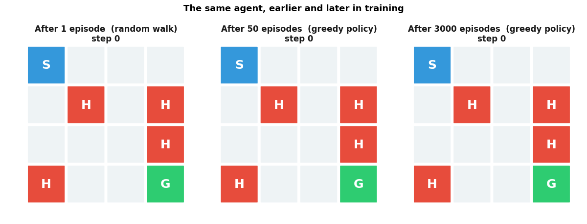

# Introduction to Reinforcement Learning

**Applied Machine Learning — Session 4, Chapter 1**

<!--
~45 min chapter, blocks sum to ~39 min (buffer 6). No exercise phase — the Ch10 exercise
notebook is a BONUS (reward shaping with a learning agent; do it after Ch11 or at home).
Session 4 plan: Ch10 ~45 · Ch11 ~45 (incl. 10 min exercise) · Ch12 65 (5 intro + 50 work + 10 debrief).
Opening question: "How does a dog learn a trick?" → treats → learning from feedback, not from labels.
-->

---

# The Third Paradigm

| Paradigm | What the data gives you | Example |
|----------|---------|---------|
| Supervised | inputs **and** the right answer (X, y) | predict house price |
| Unsupervised | inputs only (X) | find customer groups |
| **Reinforcement** | **no data set at all — only rewards for actions you try** | **learn to play a game** |

**RL:** an *agent* acts, the *environment* answers with a new situation and a reward. The agent learns from that feedback loop.

<!--
~3 min (paradigm + loop = 5). Key contrast to draw out: in supervised learning someone tells you the right answer.
In RL nobody does — you only get a score, often late. Ask: "Where does the data come from in RL?"
Expected: the agent generates it by acting. That is the whole difference.
-->

---

# The RL Loop


**Goal:** maximise the **total** reward over an episode — not the next reward.

<!--
~2 min. Walk the loop with the dog: state = "owner says sit", action = sit / bark / run,
reward = treat or nothing, new state. Emphasise "total": sometimes a bad step now buys a big reward later.
-->

---

# Everyday Analogies

| | State | Action | Reward |
|---|---|---|---|
| Training a dog | command + situation | sit / bark / run | treat (or nothing) |
| Learning to ride a bike | lean angle, speed | steer, pedal | stay up (+) / fall (−) |
| Video game | screen | controller input | score |
| Chess | board position | legal move | win / lose at the **end** |

**Ask yourself:** who tells the chess agent which of its 40 moves was the mistake?
→ Nobody. That is the **credit assignment problem** — the core difficulty of RL.

<!--
~2 min. Ask students for their own examples (learning to cook, negotiating, ...).
The chess row sets up credit assignment; come back to it in Ch11 when γ propagates value backwards.
-->

---

# Core Vocabulary — on a GridWorld

<div class="grid grid-cols-2 gap-6">
<div>

| Term | Meaning | GridWorld |
|------|---------|-----------|
| **State** s | the situation | cell id 0–15 |
| **Action** a | what the agent can do | ← ↓ → ↑ |
| **Reward** r | feedback | +1 goal, −1 hole, −0.01 per step |
| **Episode** | one run | start → hole or goal |
| **Return** | sum of rewards in an episode | e.g. 6 steps to G: 0.95 |
| **Policy** π | strategy: state → action | a table with 16 entries |

</div>
<div>



</div>
</div>

<!--
~4 min. This grid is used in the demo, in Ch11, in the exercise and in the animation.
Ask: "What is the return of the shortest path?" (5 steps × −0.01 + 1 = 0.95).
"Why the −0.01?" → without it, a 6-step and a 60-step path score the same.
-->

---

# Same World, Different Policy



**The learning problem:** find a policy that maximises the expected return — *without* being told the map.

<!--
~1 min. Left: a random walker (this one falls into a hole). Right: a good policy.
The demo notebook measures both: random reaches the goal in ~1–2% of episodes.
-->

---

# Markov Decision Process (MDP)

**The formal frame:** (S, A, P, R, γ)

- **S** states, **A** actions
- **P(s' | s, a)** transition probabilities: where do I land?
- **R(s, a)** reward function
- **γ** discount factor (0 … 1)

**Markov property:** *the future depends only on the current state, not on how you got there.*
→ Like GPS: to plan the route, it needs to know where you are — not where you were an hour ago.

<!--
~2 min. Keep the math light. Only P and γ are new: P will matter in the next slide (slippery ice),
γ in the one after. Ask: "Is chess Markov?" (yes: the board is the state) "Is poker?" (no: hidden info).
-->

---

# Deterministic vs Stochastic Environments



- Our GridWorld is **deterministic**: `Right` always moves right.
- FrozenLake (Ch11, `is_slippery=True`): intended direction with prob. **1/3**, else it slips sideways.
- P(s' | s, a) captures exactly this. The learning algorithm stays the same — only the numbers get harder.

<!--
~2 min. This slide is here so that Ch11's slippery results are not a surprise.
Ask: "On slippery ice next to a hole — is walking along the hole a good idea?" → No, better to bump the wall.
-->

---

# The Discount Factor γ



- **γ = 0:** only the immediate reward counts (short-sighted)
- **γ → 1:** far-away rewards count almost fully (far-sighted)
- **γ = 0.9 … 0.99:** typical — we use **0.99** in Ch11

**Intuition:** €100 today > €100 next year. Same in RL — but γ also lets value *flow backwards* from the goal to earlier states.

<!--
~2 min. Two jobs of γ: (1) impatience, (2) mathematically keeps the total finite for endless tasks.
Preview: in Ch11 the goal reward "leaks" backwards through the grid at rate γ per step — that is how the agent
solves credit assignment.
-->

---

# Exploration vs Exploitation

**The dilemma every learner faces:**

- **Exploit:** do what you already know works best
- **Explore:** try something new — it might be better (or worse)

```
Restaurant analogy:
  exploit → your favourite restaurant   (safe, but you never discover a better one)
  explore → the new place on the corner (risky, but maybe amazing)
```

If you only exploit you may be stuck with a mediocre policy forever.
If you only explore you never *use* what you learned.

<!--
~2 min. Ask: "How do you personally decide when to try a new restaurant?" — most answers are ε-greedy in disguise:
"most of the time my favourite, sometimes something new".
-->

---

# ε-Greedy and ε-Decay

<div class="grid grid-cols-2 gap-6">
<div>

```python
if rng.random() < epsilon:
    action = random_action()        # explore
else:
    action = argmax(Q[state])       # exploit

# after every episode:
epsilon = max(epsilon * 0.999, 0.01)
```

- start **ε = 1** (know nothing → explore everything)
- decay towards **ε = 0.01** (know the world → exploit it)
- too fast: stops exploring before it has learned
- too slow: wastes episodes on random walks

</div>
<div>



</div>
</div>

<!--
~3 min. These are the exact numbers used in the Ch11 code (α=0.1, γ=0.99, ε 1→0.01 with 0.999 per episode).
Point at the curve: at episode ~700 ε≈0.5, at ~2300 ε≈0.1.
-->

---

# Value: how good is an action in a state?

**Q(s, a)** = expected total (discounted) reward if I take action *a* in state *s* and act well afterwards.

```
Q-table (16 states × 4 actions)
          ←      ↓      →      ↑
state 0:  0.90   0.92   0.88   0.90
state 1:  0.90   0.10   0.83   0.88
...
state 14: 0.96   0.98   1.00   0.95   ← next to the goal: → is worth ≈ 1
```

**If you know Q, the policy is trivial:** `π(s) = argmax_a Q(s, a)`

→ Chapter 11: **learn** this table from experience (Q-Learning).

<!--
~3 min. The numbers are illustrative but plausible for our GridWorld with γ=0.99 and step cost −0.01.
Ask: "Why is Q(14, →) ≈ 1 and Q(0, ↓) ≈ 0.9?" → the goal is 1 step vs 6 steps away; value shrinks with distance.
-->

---

# Quick Check

**1.** A robot vacuum gets +1 for every square metre cleaned and −5 for falling down the stairs.
State? Action? Reward? Episode?

**2.** ε = 0 during the whole training. What goes wrong?

**3.** γ = 0. Which action does the GridWorld agent prefer in state 14 (next to the goal) — and in state 0?

<v-click>

- **1.** state = position + dirt map (+ battery), action = move direction / suck, reward as given, episode = one cleaning run until docking.
- **2.** it never explores: it repeats the first action that ever got a non-zero Q (or action 0 forever) → stuck with a bad policy.
- **3.** state 14: → (immediate +1). State 0: every action gives −0.01 now → indifferent, it cannot "see" the goal.

</v-click>

<!--
~3 min. Give 60 s to think, then click. Q3 is the important one: with γ=0 there is no credit assignment.
-->

---

# Real-World Applications

| Domain | Agent | Environment | Reward |
|--------|-------|------------|--------|
| Games | AI player | board / screen | win / lose / score |
| Robotics | controller | physical world | task done, no damage |
| Recommender systems | ranking policy | users | clicks, watch time |
| Data-centre cooling | controller | temperatures, load | energy saved |
| LLM fine-tuning (RLHF) | language model | human raters | preference score |

**Milestones:** Atari from pixels (2013) · AlphaGo (2016) · AlphaStar (2019) · RLHF for ChatGPT (2022)

<!--
~2 min. Ask which one surprises them. RLHF is the one they use daily — worth 30 seconds:
the "reward" is a model of human preferences, the "action" is the next token.
-->

---

# Now: Live Demo (~8 min)

<div class="grid grid-cols-2 gap-4">
<div>

→ `02-examples/ch10_rl_intro_examples.ipynb`

1. Build the GridWorld (16 states, 4 actions, rewards)
2. Random agent — success rate ≈ 1–2 %
3. Hand-craft a good policy — 100 %, return 0.95
4. Sanity-check the policy for *every* state

**Teaser for Ch11:** the same agent after 1 / 50 / 3000 training episodes →

</div>
<div>



</div>
</div>

<!--
~8 min. Run the notebook top to bottom, talk while it runs. Stop at the hand-crafted policy:
"Writing this table by hand for 16 cells is fine. For chess it is impossible — the agent has to LEARN it. That is Ch11."
The GIF (episode 1 → 50 → 3000 of a Q-learning agent) is the teaser for the next chapter.
-->

---

# Key Takeaways

- RL = learning from **rewards** by trial and error — the agent creates its own data
- Loop: state → action → reward + next state; **episode**, **return**, **policy**
- MDP (S, A, P, R, γ): P = "where do I land?", γ = "how much is the future worth?"
- **Explore vs exploit** — ε-greedy with decay
- **Q(s, a)** = long-term value of an action; know Q → policy is `argmax`
- Reward design decides what you get (Bonus exercise: reward shaping)

<!--
Transition: "The whole trick of Ch11 is how to fill the Q-table from experience."
Bonus exercise 03-exercises/ch10_rl_intro_exercises.ipynb: students change rewards and watch a learning agent
farm step rewards or jump into holes — do it after Ch11 or as homework.
-->

---
layout: end
---

# Next: Chapter 11

## Q-Learning

> _"Now let's teach the agent to fill in the table itself."_
