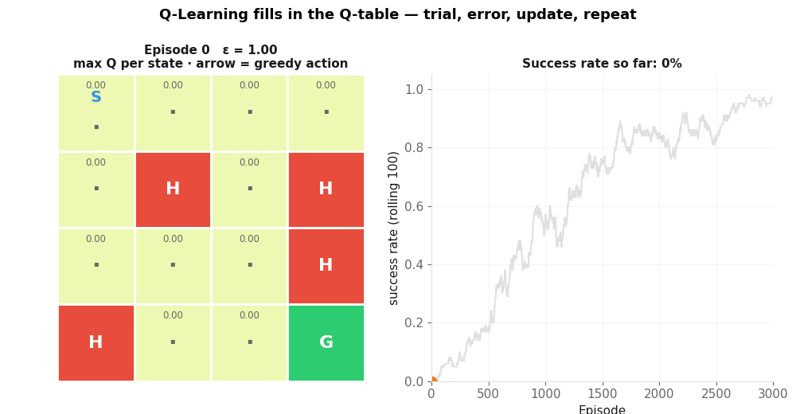
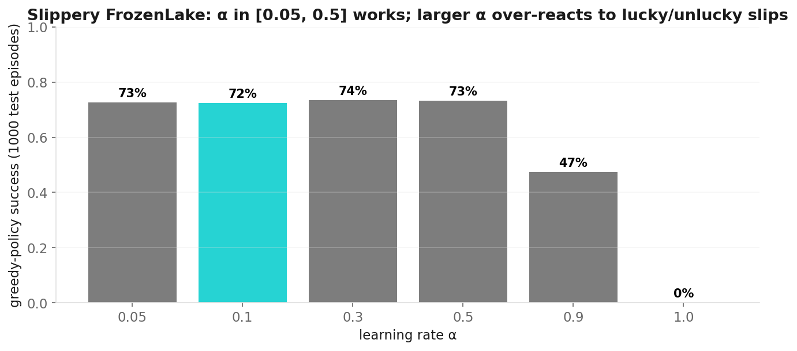
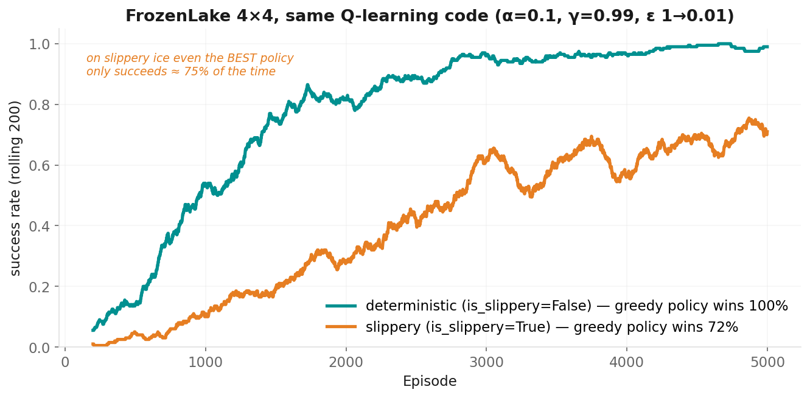

# Q-Learning

**Applied Machine Learning — Session 4, Chapter 2**

<!--
~45 min chapter: blocks sum to ~34 min + 10 min exercise = 44 (buffer ~1–6 min depending on demo length).
Focus: ONE algorithm (tabular Q-learning) done properly. SARSA / policy gradient / model-based are a
"further reading" slide only (bonus task B in the exercise implements SARSA).
Show the qtable_learning.gif early — it carries the whole chapter.
-->

---

# From Ch10 to Ch11

**Ch10:** if we *know* Q(s, a) for every state and action, the policy is trivial: `argmax`.

**Ch11:** how do we **learn** Q from experience — without knowing the map, the transition probabilities or the reward function?

**Answer:** start with Q = 0 everywhere, act (ε-greedy), and after *every step* nudge Q(s, a) toward what we just observed.



<!--
~3 min. Let the GIF loop once in silence. Left: max Q per cell + greedy arrow ("·" = never updated).
Right: success rate. Ask: "Where does knowledge appear first?" → next to the goal, then it spreads backwards.
That backwards spread is the whole idea; the formula on the next slide just makes it precise.
-->

---

# The Q-Table

```
Q-table (16 states × 4 actions) — all zeros at the start
           ←      ↓      →      ↑
state 0:   0.00   0.00   0.00   0.00
state 1:   0.00   0.00   0.00   0.00
...
state 14:  0.00   0.00   0.00   0.00
state 15:  0.00   0.00   0.00   0.00   ← goal (never left)
```

- One number per (state, action): *"how good is it to do a in s?"*
- **Policy** = `argmax` per row
- **Learning** = updating these numbers from experience

<!--
~2 min. In numpy: Q = np.zeros((16, 4)). Ties in argmax → action 0 (Left): the untrained greedy agent
bumps the left wall forever — that is why ε starts at 1.
-->

---

# The TD Update (1/2): the idea

After one step (s, a) → r, s' we have **new information**:

```
what we thought:   Q(s, a)
what we just saw:  r  +  γ · max_a' Q(s', a')          ← "target"
                   ^        ^
             reward now     best we believe we can still get from s'
```

**Move the estimate a little toward the target:**

```
Q(s, a)  ←  Q(s, a)  +  α · ( target − Q(s, a) )
                              └──── TD error ────┘
```

α = learning rate (how big a step). If the episode ended at s', there is no future: target = r.

<!--
~4 min. Go SLOWLY, one term at a time. Name it correctly: this is a temporal-difference (TD) update
derived from the Bellman optimality equation Q*(s,a) = E[r + γ max Q*(s',a')] — the equation is the fixed
point, the update is how we get there. Students may hear "Bellman equation" for the update in blogs; fine,
but know the difference.
-->

---

# The TD Update (2/2): a worked step

GridWorld, α = 0.1, γ = 0.99, Q all zeros. The agent stands in state 14 and steps **→** into the goal:

```
target  = 1.0 + (episode ended → no future) = 1.0
TD err  = 1.0 − 0.0 = 1.0
Q(14,→) = 0.0 + 0.1 · 1.0 = 0.10
```

Next episode: from state 13 it steps **→** into 14 (reward −0.01):

```
target  = −0.01 + 0.99 · max Q(14, ·) = −0.01 + 0.99 · 0.10 = 0.089
Q(13,→) = 0.0 + 0.1 · (0.089 − 0.0)   = 0.0089
```

→ Value **flows backwards** from the goal, one cell per successful visit. Small numbers, but the *ordering* of actions is what matters for `argmax`.

<!--
~4 min. This is the credit-assignment answer from Ch10: nobody says "step 3 was good", but the goal
reward propagates back through γ. Ask: "How many successful passes until state 0 has a non-zero Q?" (≥ 6).
The exercise's Task 3 check uses exactly these two numbers (0.1 and 0.0089).
-->

---

# The Full Algorithm

```python
Q, epsilon = np.zeros((n_states, n_actions)), 1.0
for episode in range(n_episodes):
    state = env_reset()
    for step in range(max_steps):
        # ε-greedy
        if rng.random() < epsilon:  action = rng.integers(n_actions)      # explore
        else:                       action = np.argmax(Q[state])          # exploit

        next_state, reward, done = env_step(state, action)   # Gymnasium: obs, r, terminated, truncated, info
        target = reward + (0 if done else gamma * np.max(Q[next_state]))  # TD target
        Q[state, action] += alpha * (target - Q[state, action])           # TD update

        state = next_state
        if done: break
    epsilon = max(epsilon * 0.999, 0.01)                                  # decay
```

<!--
~3 min. Three building blocks — Q-table, ε-greedy, TD update — plus a loop. That is the exercise.
Point out the Gymnasium 5-tuple (terminated vs truncated) — old tutorials show 4 values, that API is gone.
-->

---

# Hyperparameters (the ones we use)

<div class="grid grid-cols-2 gap-4">
<div>

| Parameter | Symbol | Ours | Typical |
|-----------|--------|------|---------|
| learning rate | α | **0.1** | 0.05 – 0.5 |
| discount | γ | **0.99** | 0.9 – 0.99 |
| exploration | ε | **1 → 0.01** | ×0.999 / episode |
| episodes | | **3 000 – 5 000** | 10³ – 10⁵ |

- α: step size of each update
- γ: how far value flows backwards
- more episodes = better, slower

</div>
<div>



</div>
</div>

<!--
~2 min. Same numbers in the demo, the exercise and the animation notebook. The bar chart is REAL
(slippery FrozenLake, greedy success after 5000 episodes): α up to 0.5 all fine, α ≥ 0.9 collapses because
each lucky/unlucky slip overwrites the estimate. Deterministic worlds tolerate large α; stochastic ones do not.
-->

---

# FrozenLake (Gymnasium) — same map, two difficulty levels

<div class="grid grid-cols-2 gap-6">
<div>

```
SFFF      S start (0)
FHFH      F frozen
FFFH      H hole → episode ends, reward 0
HFFG      G goal (15) → reward +1
```

- 16 states, 4 actions (←0 ↓1 →2 ↑3)
- reward **only** at the goal → sparse signal
- `is_slippery=True`: intended move with p = 1/3, else sideways

</div>
<div>



</div>
</div>

**Same code, two worlds:** deterministic → ~100 %; slippery → ~70 %. On slippery ice even the *optimal* policy only wins ≈ 3 of 4 episodes.

<!--
~3 min. Curves are real (α=0.1, γ=0.99, 5000 episodes). Two messages: (1) sparse reward + stochasticity =
slower learning, (2) the ceiling comes from the ENVIRONMENT, not the algorithm — an important habit:
ask "what is the best achievable score?" before judging a model.
-->

---

# Why is RL hard? (and why does it still work?)

**Sparse rewards** — FrozenLake: one +1 at the very end, zeros everywhere else. Random exploration must stumble into the goal first.

**Stochasticity** — same state, same action, different outcome. Estimates need many samples (→ small α).

**Credit assignment** — which of the 20 earlier moves caused the success? Answer: γ propagates value backwards, one step per success.

**It still works because:** tabular Q-learning provably converges to Q* if every (s, a) is visited infinitely often and α decreases suitably. In practice: enough episodes + ε-decay.

<!--
~2 min. Keep it short; the "still works" line answers the natural question "then how does it ever learn?".
-->

---

# Quick Check

**1.** α = 1 in a deterministic world. What happens? And on slippery ice?

**2.** γ = 0. Which Q-values ever become non-zero in FrozenLake (reward only at the goal)?

**3.** After training, ε is still 0.05. Is the "success rate during training" the success rate of the *learned policy*?

<v-click>

- **1.** Deterministic: fine — the target is exact, so overwrite it. Slippery: each slip overwrites the estimate; Q jumps around and never settles (see the α bar chart: 0 % at α = 1).
- **2.** Only entries whose step lands *in* the goal — essentially Q(14, →) (on slippery ice also slips from 14). Nothing flows backwards → the agent cannot find the goal from the start.
- **3.** No — 5 % of the actions are random. Evaluate the greedy policy separately (`evaluate_greedy` in the demo).

</v-click>

<!--
~2 min. 60 seconds thinking, then click. Q3 is a subtle but very practical point (train vs eval, like train vs test).
-->

---

# Now: Live Demo (~8 min)

→ `02-examples/ch11_rl_algorithms_examples.ipynb`

1. Wrap Gymnasium's FrozenLake in our `reset / step` interface
2. Q-Learning in ~25 lines — train on solid ice
3. **Same code** on slippery ice → compare success rates
4. Q-table heatmaps + greedy policy arrows: read what the agent learned

<!--
~8 min. Run all; while training (a few seconds) explain the loop. On the slippery policy plot, point at
arrows that go "into a wall": that is the safe move next to a hole when you may slip sideways.
If gymnasium is missing the notebook falls back to the GridWorld — say so.
-->

---

# Now: Exercise (~10 min)

→ `03-exercises/ch11_rl_algorithms_exercises.ipynb`

**Tasks 1–4 (10 min):** Q-table → ε-greedy → TD update → fill three lines in the given training loop.
Each task has a ▶ check cell with the expected numbers.

**Bonus A:** run *your* loop on slippery FrozenLake (Gymnasium) — why not 100 %?
**Bonus B:** SARSA — change one line, compare learning curves.

<!--
~10 min. Walk around. Typical bugs: forgetting `0 if done`, updating Q[next_state] instead of Q[state],
using max over the wrong axis. Fast students → Bonus A/B or the Ch10 reward-shaping bonus notebook.
-->

---

# Further Reading (not needed for the capstone)

| Idea | One line | Where |
|---|---|---|
| **SARSA** (on-policy) | target uses the action you *actually* take next: `r + γ Q(s', a')` — learns the value of the ε-greedy behaviour → more cautious near cliffs | Bonus B |
| **Deep Q-Network (DQN)** | replace the table by a neural network Q(s, a; θ) — Atari from pixels (2013) | |
| **Policy gradient / PPO** | learn π(a\|s) directly; needed for continuous actions (robot joints); PPO is the workhorse behind RLHF | |
| **Model-based RL** | learn P and R, then plan (AlphaZero uses a known model + search) | |
| **Off- vs on-policy** | Q-learning learns the *greedy* policy while behaving ε-greedy (off-policy); SARSA learns the policy it follows (on-policy) | |

<!--
~1 min. Just so the words are not new when they meet them. Do not teach these now.
-->

---

# Key Takeaways

- Q-Learning: **Q-table + ε-greedy + TD update**, repeated over many episodes
- Target `r + γ · max Q(s', ·)`; TD error = target − estimate; move by α
- Value flows **backwards** from the reward — that solves credit assignment
- Same code works on deterministic and stochastic worlds; the **environment** sets the ceiling
- Evaluate the **greedy** policy, not the training run (train ≠ test — again)

<!--
Transition: "Time to put everything from Sessions 1–3 together — the Titanic capstone.
Warning ahead: the next 50 minutes are self-work; nobody talks at the front."
-->

---
layout: end
---

# Next: Chapter 12

## Capstone: End-to-End ML Workflow

> _"Time to put everything together."_
