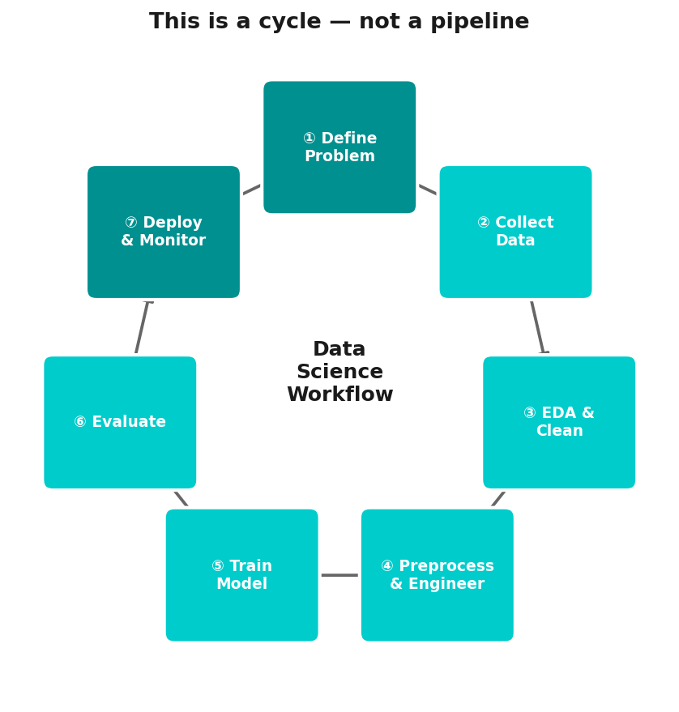

# Chapter 12
## Capstone: End-to-End ML Workflow

**Session 4 | Final Chapter**
Putting it all together

<!--
~50 min total. 35 min hands-on coding.
This is the climax of the course.
-->

---

## Today's Mission

April 15, 1912.
RMS Titanic strikes an iceberg.
1,502 of 2,224 passengers die.

**Can we predict who survived?**

<!--
~5 min framing. The historical context creates real engagement.
1,502 of 2,224 died.
-->

---

## The Full ML Workflow



① Define → ② Explore → ③ Clean → ④ Engineer → ⑤ Train → ⑥ Evaluate → ⑦ Interpret → back to ①

<!--
This IS the workflow from Ch01. Students have now done every step
individually — now all together.
-->

---

## The Dataset

| Feature | Type | Notes |
|---------|------|-------|
| `Pclass` | ordinal | 1st, 2nd, 3rd class |
| `Sex` | categorical | gender |
| `Age` | numeric | **many missing** |
| `SibSp` | numeric | siblings/spouses aboard |
| `Parch` | numeric | parents/children aboard |
| `Fare` | numeric | ticket price |
| `Embarked` | categorical | C, Q, S |
| `Cabin` | text | **mostly missing** |

**Target:** `Survived` (0 = No, 1 = Yes)

<!--
Mention: Age has many missing values, Cabin is mostly missing (drop it).
Real messiness.
-->

---

## What Does "Success" Mean?

- We want to **correctly identify survivors** → high recall
- We also want **predictions to be reliable** → high precision
- **F1-score** balances both

A False Negative here = predicted dead, actually survived

<!--
F1-score balances precision and recall.
A False Negative = predicted dead, actually survived.
-->

---

## Step 1 — Explore

- `df.shape`, `df.dtypes`, `df.isnull().sum()`
- Survival rate by gender, class, age
- **The "women and children first" signal is in the data**

<!--
Let students discover the 'women and children first' pattern
themselves through visualization.
-->

---

## Step 2 — Clean

- `Age` → impute with median **per class** (not global median!)
- `Embarked` → fill with mode (only 2 missing)
- Drop: `Cabin` (too sparse), `Name`, `Ticket`, `PassengerId`
- Encode: `Sex` → 0/1, `Embarked` → one-hot

<!--
Impute Age by class (not global median!) — this is a good
feature engineering insight.
-->

---

## Step 3 — Feature Engineering

```python
df['FamilySize'] = df['SibSp'] + df['Parch'] + 1
df['IsAlone'] = (df['FamilySize'] == 1).astype(int)
```

**Why?** Solo travelers had different survival odds
**Domain knowledge + creativity = better features**

<!--
FamilySize and IsAlone: creativity meets domain knowledge.
Solo travelers had different odds.
-->

---

## Step 4 — Train Multiple Models

| Model | Idea |
|-------|------|
| Logistic Regression | Linear boundary in probability space |
| Random Forest | Ensemble of decision trees |
| Gradient Boosting | Sequential error correction |

Cross-validate all → compare F1 + accuracy

<!--
3 models minimum. Cross-validate all. ~12 min for this block.
-->

---

## Step 5 — Interpret

- Which features matter most? (Random Forest importances)
- Confusion matrix: where does the model fail?
- What does Sex importance tell us about history?

<!--
Feature importances: Sex and Pclass dominate.
Ask: 'What does this tell us about history?'
-->

---

## Typical Results on Titanic

| Model | Accuracy | F1-Score |
|-------|---------|---------|
| Logistic Regression | ~80% | ~75% |
| Random Forest | ~82% | ~78% |
| Gradient Boosting | ~83% | ~79% |

**What this tells us:**
- All models substantially beat the "always predict majority" baseline (~62%)
- Tree ensembles tend to win on tabular data with categorical features
- The gap between models is small → feature engineering matters more than algorithm choice
- Sex + Pclass are consistently the top features across all models

<!--
~80-83% accuracy. The gap between models is small —
feature engineering matters more than algorithm choice.
-->

---

## What We've Covered

| Chapter | Topic |
|---------|-------|
| Ch01 | Data Science workflow — **this is it** |
| Ch02 | Cleaning and encoding — **most of the work** |
| Ch03–06 | Fit / predict / evaluate / cross-validate |
| Ch07–09 | Clustering and dimensionality reduction |
| Ch10–11 | Reinforcement learning — a different paradigm |

<!--
~5 min reflection. Connect every chapter back to what students just did.
-->

---

## You Can Now

- Load and explore **any** dataset
- Clean and preprocess data correctly
- Train, evaluate, and compare ML models
- Understand clustering and dimensionality reduction
- Know what reinforcement learning is

<!--
This should feel empowering. Students have real skills now.
-->

---

## What Comes Next

- **Deep Learning** — neural networks
- **Hyperparameter tuning** — GridSearchCV, Optuna
- **Model deployment** — serving predictions in production
- **MLOps** — monitoring, retraining, pipelines

<!--
Deep learning, hyperparameter tuning, deployment, MLOps.
The journey continues.
-->

---

## Keep Going

- **Kaggle** — real competitions, real data
- **Fast.ai** — practical deep learning
- **"Hands-On ML"** — Aurélien Géron (the book)

<!--
Kaggle, Fast.ai, Geron's book. Concrete next steps.
-->

---
layout: end
---

# Now — open the notebook

`03-exercises/ch12_capstone_exercises.ipynb`

**35 minutes. Full workflow. You've got this.**

<!--
35 minutes. Do NOT interrupt during the exercise phase. Walk around, help,
but no frontal teaching. Debriefing in last 5-10 minutes: compare results,
discuss what helped most.
-->
