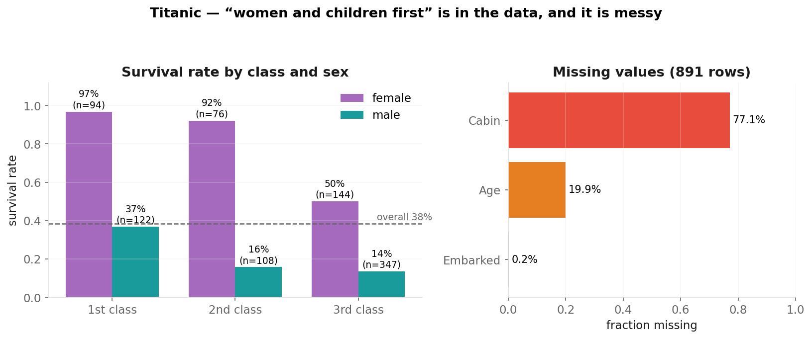
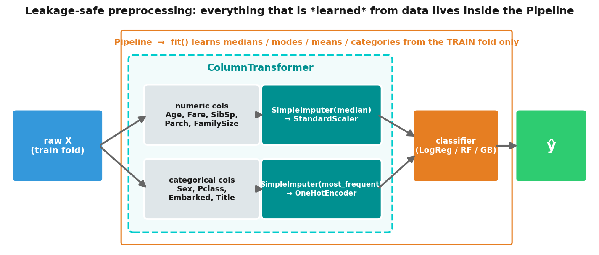
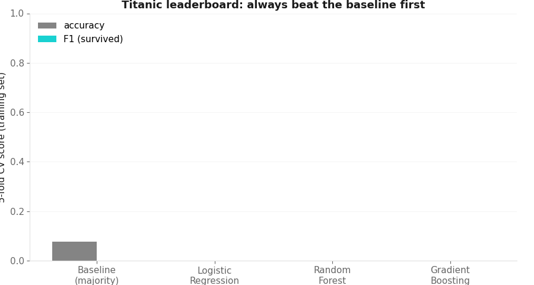
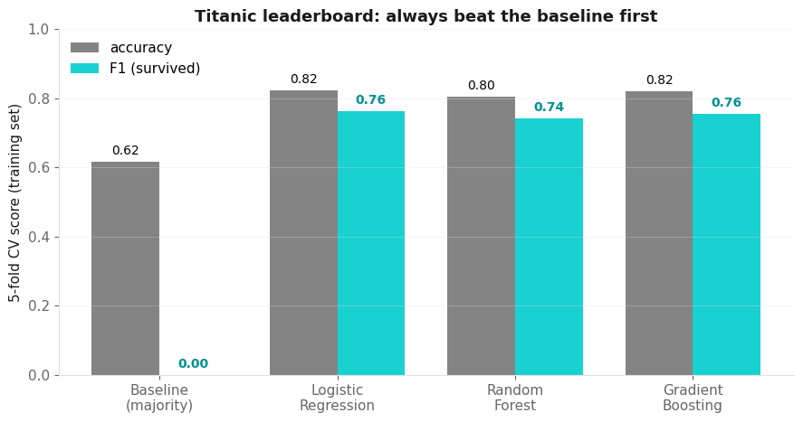

# Chapter 12
## Capstone: End-to-End ML Workflow

**Session 4 | Final Chapter**
Putting it all together

<!--
65 min total: ~5 min intro (slides 2–7), 50 min self-work (slide 8 stays on the screen),
~10 min debrief (slides 9–15). Do NOT talk at the front during the 50 minutes — walk around and help.
-->

---

## Today's Mission

April 15, 1912. RMS Titanic strikes an iceberg. 1,502 of 2,224 people on board die.

**Can we predict who survived — from passenger characteristics?**

<!--
~1 min. The picture says it all: "women and children first" is in the data (97 % vs 14 %), and the data is
messy (Cabin 77 % missing, Age 20 %). Real historical stakes create engagement — keep it respectful.
-->

---

## The Dataset (Kaggle Titanic, `0-datasets/titanic.csv`, 891 rows)

| Column | Type | Notes |
|--------|------|-------|
| `Pclass` | ordinal 1/2/3 | ticket class — socio-economic proxy |
| `Sex` | categorical | |
| `Age` | numeric | **20 % missing** → impute (inside the pipeline!) |
| `SibSp`, `Parch` | numeric | siblings/spouses, parents/children aboard → `FamilySize` |
| `Fare` | numeric | ticket price |
| `Embarked` | categorical C/Q/S | 2 missing |
| `Name` | text | → extract `Title` (Mr / Mrs / Miss / Master / Rare) |
| `Cabin`, `Ticket`, `PassengerId` | | 77 % missing / noisy / id → **drop** |

**Target:** `Survived` (1 = yes). 38 % survived → majority baseline = 62 % accuracy, F1 = 0.

<!--
~1 min. Note the baseline right away: any model must beat 62 % accuracy — and F1 makes the baseline's
uselessness visible (0.0). That is why F1 for the class "survived" is our primary metric.
-->

---

## The Plan — and where each chapter shows up

| Step | What | Chapter |
|---|---|---|
| ① Load & explore | EDA is given — read it | Ch01 |
| ② **Split first** | `train_test_split(stratify=y)`, test set locked away | Ch02 |
| ③ Feature engineering | `FamilySize`, `IsAlone`, `Title` from `Name` (row-wise, no fitting) | Ch02 |
| ④ **Preprocessing pipeline** | `SimpleImputer` + `StandardScaler` / `OneHotEncoder` in a `ColumnTransformer` | Ch02 |
| ⑤ Baseline + 3 models | `DummyClassifier`, LogReg, RandomForest, GradientBoosting — 5-fold CV | Ch03–06 |
| ⑥ Final test evaluation | best-by-CV model, **one** look at the test set, report + confusion matrix | Ch06 |
| ⑦ Interpret & reflect | permutation importance, error analysis, fairness question | Ch06 |
| Bonus | `GridSearchCV`, `joblib`, PCA of the passengers | Ch09 |

<!--
~1 min. Point at ②/④: "This is the rule you have heard since Session 1 — split, then learn everything
inside a Pipeline. Today you build the real thing." Everything else they have done before.
-->

---

## Leakage-safe preprocessing — the core of today

`cross_validate(pipe, X_train, y_train, cv=5)` re-fits imputers, scaler and encoder in **every fold** on the training part only.

<!--
~1 min. Ask: "What would leak if we imputed Age with the median BEFORE the split?" → the test rows'
ages influence the median. Small here, but the habit is what matters (and with target encoding it is huge).
-->

---

## One new model: Gradient Boosting in one slide

- Random Forest (Ch05): many deep trees **in parallel**, each on a bootstrap sample → average
- **Gradient Boosting:** many *shallow* trees **in sequence**; each new tree fits the **errors** of the previous ones
- Strong default on tabular data; more sensitive to hyperparameters than a forest
- `GradientBoostingClassifier(random_state=42)` — same `fit / predict` interface as everything else

<!--
~1 min. That is all the theory they need. In the notebook it is one more entry in the models dict.
-->

---

## What does "success" mean here?

- We want to **find the survivors** → recall for class 1
- and to be **right when we say "survived"** → precision for class 1
- **F1** balances both → primary metric; accuracy reported alongside

A **false negative** = predicted "died", actually survived.

**Rules of the game (50 min):** work in order · TODO cells are yours, ▶ cells are given · use the ▶ check cells · bonus only if done · solutions afterwards.

<!--
~1 min. Then switch to the next slide and stop talking.
-->

---
layout: end
---

# Now — open the notebook

`03-exercises/ch12_capstone_exercises.ipynb`

**50 minutes. Split first → features → pipeline → baseline → CV → one test evaluation → interpret.**

You've got this.

<!--
50 min. Leave this slide up. Walk around. Common sticking points: forgetting `stratify=y`; putting the
imputer outside the pipeline; the `clf__` prefix in the bonus grid; permutation_importance on the RAW
frame (X_test_fe), not on the transformed matrix. Give a 10-minute and a 2-minute warning.
Debrief starts on the next slide.
-->

---

## Debrief (1/3): the leaderboard

  
  

**Poll:** which model won on *your* CV? What F1 on the test set?

<!--
~3 min. (PDF export shows only the first GIF frame — the static final frame is titanic_leaderboard.png.) The GIF numbers are computed with the same pipeline (train-set CV, seed 42): baseline 0.62 acc / 0 F1,
the three real models within ~0.02 F1 of each other. Expected: LogReg ≈ GB ≥ RF — the ORDER can flip with
another seed; the point is that they are close. Ask who beat the baseline (everyone) and by how much.
-->

---

## Debrief (2/3): what did the model learn?

- **Permutation importance:** `Sex` and `Title` on top, then `Pclass` / `Fare` (compare with the EDA plot!)
- Impurity-based importances (Ch05) would have ranked `Age`/`Fare` higher — continuous columns get an unfair bonus. Permutation importance is the honest version.
- **Error analysis:** the misclassified passengers are the "surprising" cases — 3rd-class men who survived, 1st-class women who did not. No feature we have explains them.
- Models are close → **features + clean evaluation** matter more than the algorithm.

<!--
~3 min. Ask 2–3 students to name their top feature and one misclassified passenger. If a student got a
different top feature (possible with another split), that is a great moment: importance is an ESTIMATE too.
-->

---

## Debrief (3/3): fairness — the uncomfortable question

- The best signal is `Sex` — and `Title` is a proxy for it (plus age and status).
- Predicting **history** is fine. Using the same recipe **today** (loans, triage, insurance) would mean deciding by a protected attribute — directly or via proxies.
- Before deployment you would check: error rates **per group**, proxies for protected attributes, whether the target itself encodes past discrimination.

**Question to the room:** which of *your* features are proxies for something you would not be allowed to use?

<!--
~2 min. Do not moralise; make it a technical checklist. Point out that dropping `Sex` would NOT fix it —
`Title` (and `Fare`, `Pclass`) would carry the signal. This is why "just remove the sensitive column" fails.
-->

---

## What We've Covered

| Chapter | Topic — and where you used it today |
|---------|-------|
| Ch01 | the workflow — **this is it** |
| Ch02 | split first, impute/encode/scale inside a Pipeline — **the core of today** |
| Ch03–06 | fit / predict, baseline, cross-validation, F1, confusion matrix |
| Ch07–09 | (bonus) PCA of the passengers |
| Ch10–11 | a different paradigm — learning from rewards |

<!--
~1 min. Connect explicitly; students should notice they did every step themselves.
-->

---

## You Can Now

- Load and explore **any** tabular dataset
- Split first and preprocess **without leakage** — as a Pipeline
- Beat a baseline, compare models honestly with cross-validation
- Evaluate once on the test set and read the confusion matrix
- Explain what a model learned — and ask whether it *should* have learned it
- Explain what reinforcement learning is and how Q-learning fills its table

<!--
~30 s. This should feel empowering.
-->

---

## What Comes Next · Keep Going

- **Hyperparameter tuning** — `GridSearchCV` / `RandomizedSearchCV` / Optuna (bonus A today)
- **Deep learning** — neural networks for images, text, audio
- **Deployment & MLOps** — `joblib`-saved pipelines (bonus B), monitoring, retraining
- **Practice:** Kaggle (start with this very dataset), fast.ai, Géron *Hands-On ML*

<!--
~30 s. Concrete next steps. Kaggle's Titanic competition is exactly this notebook — encourage a submission.
-->

---
layout: end
---

# Thank you

## Applied Machine Learning — done.

> _"Split first. Beat the baseline. Evaluate once. Ask what the model learned."_
